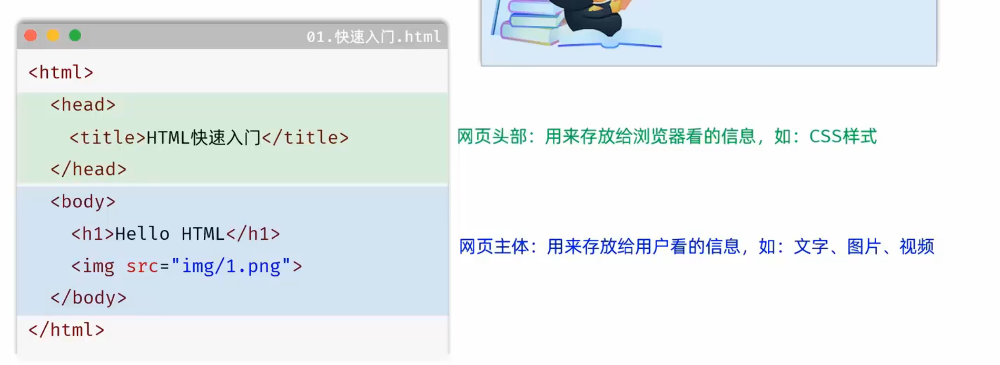
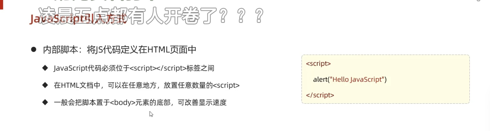
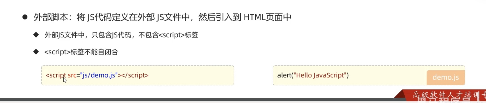
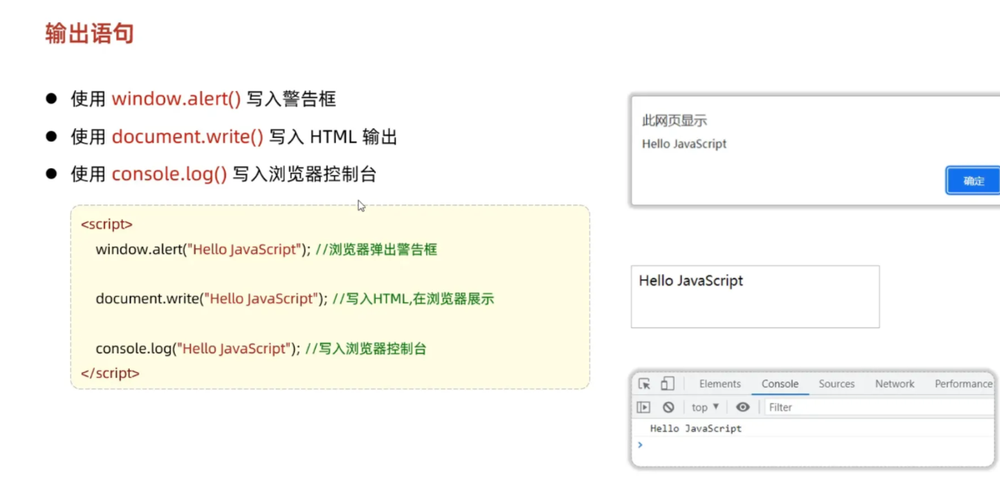
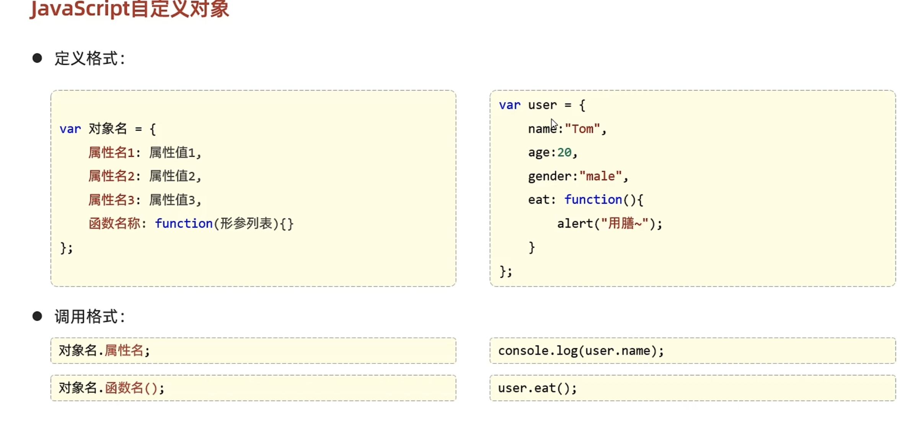
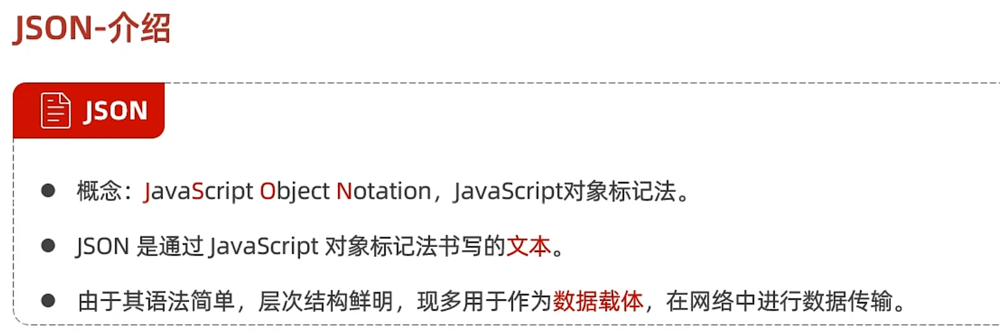
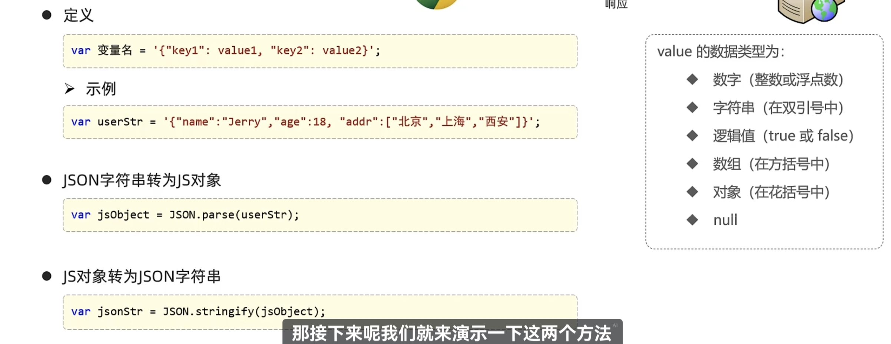

---
notion-id: 2f5ed169-4aba-806f-a159-ddd330d51132
---


## 查阅文档

[w3school 在线教程](https://www.w3school.com.cn/)

# **HTML**   *HyperText markup language *超文本标记语言(主要负责网页结构)


## 如何编写一个html？

首先我们要理解html 的运作方式，可以把他理解成模块来看，如下图，在html的模块里，有一个head模块和一个body模块，而head模块里面又有一个title模块，body模块里有一个h1和img模块。**



## HTML标签特点

- html标签不区分大小写，建议小写
- html标签的属性值使用单引号/双引号都可以
- html语法结构松散，但是建议规范书写

## div标签

div标签用于区分一个区域，独占一行，可以打包很多其他的元素

```html
<div class="user-card">
    <h2>我的个人简介</h2>
    <p>我是一名前端开发者。</p>
    
</div>
```

## ul&li标签
`ul` 和 `li` 是 HTML 中用于创建列表的核心标签，它们的缩写都来自于完整的英文术语：

- `ul` → **U**nordered **L**ist（无序列表）
- `li` → **L**ist **I**tem（列表项）


## figure标签
`<figure>` 是 HTML5 引入的语义化标签，用来表示**一段独立的内容**，通常与 `<figcaption>` 搭配使用。
### 典型用途

- 包裹图片、插图、代码片段、图表、表格、视频等。
- 为这些内容提供一个**标题/说明**（`<figcaption>`）。
### 与div写法的对比
目标效果是一样的——一张图片 + 一段描述文字。

#### ❌ 纯 `<div>` 写法

```html
<div class="user-card">
  
  <p class="user-desc">张三，前端工程师</p>
</div>
```

- **语义缺失**：浏览器不知道这个 `<div>` 里的图片和文字是一体的。对屏幕阅读器来说，就是一张图片后紧跟着一段普通段落，没有逻辑关联。
- **样式依赖类名**：必须靠 `class="user-card"` 和 `class="user-desc"` 来定位，层次不清晰。

#### ✅ `<figure>` + `<figcaption>` 写法

```html
<figure class="user-card">
  
  <figcaption>张三，前端工程师</figcaption>
</figure>
```

#### 对比例子的好处说明

1. **语义明确**
    
    - 搜索引擎和无障碍工具会自动识别：这是一个“带说明的插图/内容块”。
    - 屏幕阅读器会读出：“图：用户头像，说明：张三，前端工程师”，而不是两张不相关的内容。
2. **结构自动关联**
    
    - `<figcaption>` 天生就是 `<figure>` 的标题，不需要额外加 `aria-*` 属性。
    - 用 `<div>` 时，如果你想让残障用户知道“这段文字是描述这张图的”，还得手动加 `aria-describedby` 等复杂属性，而 `<figure>` 原生就做到了。
3. **排版灵活**
    
    - 你可以用 `figure` 选择器直接控制整个组件，用 `figcaption` 选择器控制标题样式。
    
    ```css
    figure.user-card {
      display: flex;
      align-items: center;
      gap: 10px;
    }
    figcaption {
      font-size: 14px;
      color: #555;
    }
    ```
    
    - 如果用 `<div>`，很可能需要额外写 `div.user-card p` 等更深的选择器，结构一变动员容易被覆盖。

所以 `<figure>` 并非只是在代码上少写几个字母，而是把“图片+说明”这个模式变成了浏览器原生的语义组件，代码更干净，对人和机器都更友好。


## form 标签

`<form>` 是 HTML 中用于**创建用户输入表单**的容器，负责将用户在页面填写的各类数据（用户名、密码、选择项、文件等）收集打包，发送给服务器。

> 没有 `<form>`，输入框和按钮无法知道数据要往哪传、怎么传，点击不会有任何提交行为。

### 关键属性

| 属性 | 作用 | 举例 |
|------|------|------|
| `action` | 数据发送的目标 URL | `action="/login"` |
| `method` | 发送方式：`GET`（数据附在 URL 后，适合搜索）或 `POST`（数据放在请求体，适合登录、注册等） | `method="POST"` |
| `enctype` | 数据编码方式，上传文件时必须设为 `multipart/form-data` | `enctype="multipart/form-data"` |

---

## 表单元素

> 专门用来收集用户输入信息的 HTML 标签。

**比喻**：普通元素（`h1`、`p`、`img`）像餐厅的菜单和装潢，只展示；表单元素则像服务员递来的点菜单，让你打勾、写字、选择，最后交回后厨（服务器）。

前端中所有“填东西”的场景（登录、注册、搜索、发帖、问卷）都离不开表单。

---

### 1. `<input>` — 最百变的元素

通过 `type` 属性切换为不同输入形态：

| type 值     | 效果                      | 示例                                                       |
| ---------- | ----------------------- | -------------------------------------------------------- |
| `text`     | 普通单行文本                  | `<input type="text" placeholder="请输入用户名">`               |
| `password` | 密码框（显示为圆点）              | `<input type="password" placeholder="密码">`               |
| `radio`    | 单选按钮（同组 `name` 相同只能选其一） | `<input type="radio" name="gender" value="male"> 男`      |
| `checkbox` | 复选框（可多选）                | `<input type="checkbox" name="hobby" value="coding"> 编程` |

> **注意**：`radio` 和 `checkbox` 通常配合 `<label>` 使用，提升点击体验。

### 2. `<select>` & `<option>` — 下拉菜单

点击弹出选项列表，常用于选择省份、城市、出生年份等。

```html
<select name="city">
  <option value="beijing">北京</option>
  <option value="shanghai">上海</option>
  <option value="guangzhou">广州</option>
</select>
```

### 3. `<textarea>` — 多行文本域

支持多行文字输入，适合个人简介、评论、文章正文。

```html
<textarea rows="4" cols="50" placeholder="请填写您的简介"></textarea>
```

- `rows` / `cols` 控制可见行数和列数，更多尺寸调整应使用 CSS。

### 4. `<button>` — 按钮

将填好的数据打包提交，或触发交互。

```html
<button type="submit">提交</button>
```

- `type="submit"`：提交表单（在表单内是默认行为）。
- `type="reset"`：重置表单所有字段。
- `type="button"`：纯交互按钮，由 JavaScript 驱动。

---

## 完整表单示例

```html
<form action="/login" method="POST">
  <label>用户名：<input type="text" name="username"></label><br>
  <label>密码：<input type="password" name="password"></label><br>
  性别：
  <label><input type="radio" name="gender" value="male"> 男</label>
  <label><input type="radio" name="gender" value="female"> 女</label><br>
  城市：
  <select name="city">
    <option>北京</option>
    <option>上海</option>
  </select><br>
  简介：<br>
  <textarea name="bio" rows="3" cols="30"></textarea><br>
  <button type="submit">登录</button>
</form>
```

**记忆口诀**：输入框 input 变脸王，下拉 select 列选项；多行文字 textarea，提交按钮 button 忙。

---

## `<button>` 标签详解

### 一、基本语法

```html
<button type="button">点我</button>
```

### 二、`type` 属性（最关键）

| type 值 | 行为 | 使用场景 |
|---------|------|----------|
| `submit` | 提交所在表单的数据（**默认值**） | “登录”“注册”“保存”等提交按钮 |
| `reset` | 将表单所有输入框重置为初始值 | “清空”按钮 |
| `button` | 无默认行为，纯按钮，靠 JavaScript 驱动 | 弹窗、切换内容、滚动等交互 |

> ⚠️ 如果 `<button>` 不写 `type`，在表单内**默认就是 `submit`**，容易误触发表单提交。

```html
<form>
  <!-- 会提交表单 -->
  <button>提交默认</button>

  <!-- 显式声明 -->
  <button type="submit">提交</button>

  <!-- 重置表单 -->
  <button type="reset">清空</button>

  <!-- 纯 JS 按钮 -->
  <button type="button" onclick="alert('你好')">打个招呼</button>
</form>
```

### 三、`<button>` vs `<input type="button">`

| 对比维度 | `<button>` | `<input type="button/submit/reset">` |
|----------|------------|----------------------------------------|
| 内容 | 可放文字、图片、其他标签（更丰富） | 仅能通过 `value` 设置纯文本 |
| 样式自由度 | 高，可用 CSS 轻松控制内嵌元素 | 低，只能控制输入框本身 |
| 默认 type | `submit` | 取决于写的 type 值 |

**推荐**：需要图标等丰富内容时优先用 `<button>`；极简纯文本按钮两者均可。

### 四、常用属性

| 属性 | 说明 | 示例 |
|------|------|------|
| `disabled` | 禁用按钮 | `<button disabled>不可用</button>` |
| `name` | 提交时的参数名（`type="submit"` 时有效） | `<button name="action" value="save">保存</button>` |
| `value` | 提交时传递的值 | 同上 |
| `form` | 将按钮关联到页面上任一表单（即使按钮不在表单内部） | `<button form="form1" type="submit">提交</button>` |
| `autofocus` | 页面加载后自动获取焦点 | `<button autofocus>自动聚焦</button>` |

### 五、与 JavaScript 配合

```html
<button type="button" id="myBtn">点击切换背景</button>

<script>
  document.getElementById('myBtn').addEventListener('click', function() {
    document.body.style.background = 
      document.body.style.background === 'lightblue' ? 'white' : 'lightblue';
  });
</script>
```

### 六、在技术栈中的位置

`<button>` 是**结构 + 行为**的连接点：

- HTML 提供按钮容器
- CSS 美化样式
- JavaScript 赋予交互逻辑

学完表单提交与事件监听，即可实现完整的登录框、计算器、待办列表等小项目。

## label标签
`<label>` 标签的作用是**为表单控件提供说明文字，并把文字和输入框绑定在一起**。

---

### 一、核心功能：扩大点击区域

没有 `<label>` 时，你只能点到那个小小的圆圈（单选按钮）或方框（复选框）才能选中。

有了 `<label>` 包裹或关联后，**点文字也能选中**，对手机上手指粗的用户尤其友好。

---

### 二、两种绑定方式

#### 方式 1：直接包裹（隐式关联，推荐）

```html
<label>
  <input type="radio" name="gender" value="male"> 男
</label>
```

- 点击“男”这个字，单选按钮就会被选中。
- 写法简洁，不需要额外的 id。

#### 方式 2：用 `for` + `id` 对应（显式关联）

```html
<input type="checkbox" id="agree">
<label for="agree">我同意用户协议</label>
```

- `label` 的 `for` 属性值 = `input` 的 `id` 值。
- 适合标签和输入框分开写的复杂布局。

---

### 三、有 `label` vs 没有 `label` 的效果对比

```html
<!-- ❌ 没有 label，只能点小方框 -->
<input type="checkbox"> 我同意条款

<!-- ✅ 有 label，点“我同意条款”也能勾选 -->
<label><input type="checkbox"> 我同意条款</label>
```

---

### 四、辅助功能（无障碍）

屏幕阅读器遇到 `<label>` 会自动朗读对应的说明文字，盲人用户也能知道这个输入框是干什么的。

```html
<label for="username">用户名</label>
<input type="text" id="username">
```

屏幕阅读器会播报：“用户名，编辑文本”——而不是“编辑文本”让用户猜。

---

### 五、总结一句话

> **`<label>` 就是表单控件的“说明书”**：把文字和控件绑在一起，让交互更友好，让代码更规范。

---

和你刚学的单选按钮 `name` 属性配合使用时，最标准的写法就是把 `<input type="radio">` 放进 `<label>` 里，既实现互斥（靠 `name`），又能点文字选中（靠 `label`）。

# CSS cascading style sheet 层叠样式表（主要负责网页表现)


### 颜色表示方法


### css的选择模式

在html文件中，除了h1，img等各式各样的标签，还有一些纯文本

我们如果相对于这些纯文本划分，就要使用一个无意义的标签`<span>`
1. 通过元素选择：


2. 通过id选择


3. 通过类选择


优先级:  id>类>元素

### **后代选择器 (Descendant Selector)**

  CSS 中最基础也非常强大的一种选择器。顾名思义，它用来选择某个特定元素的**所有后代元素

你可以用“家族族谱”或者“俄罗斯套娃”来理解它：只要元素 B 嵌套在元素 A 的内部，无论嵌套了多少层（是直接的“儿子”，还是隔代的“孙子”、“重孙子”），B 统统都是 A 的后代。

后代选择器的标志就是两个选择器中间的**“空格”**。

- **语法形式**：`祖先选择器 后代选择器 { 样式 }`
- **例如**：`div p { color: red; }`
- **翻译成大白话**：“请找到页面上所有的 `div`，然后把包裹在它们**内部**的每一个 `p` 标签文字变成红色。”

我们来看一个具体的例子。注意看哪些 `span` 变红了，哪些没有：

HTML

``` html
<!DOCTYPE html>
<html>
<head>
    <meta charset="utf-8" />
    <title>后代选择器练习</title>
    <style>
        /* 这里就是后代选择器：
           选中 class 为 "container" 的元素内部的 所有 span 标签 */
        .container span {
            color: #FF5722;    /* 设置亮橙红色 */
            font-weight: bold; /* 字体加粗 */
        }
    </style>
</head>
<body>
    
    <div class="container">
        <p>这是容器里的第一段话，包含一个 <span>直接后代 span (儿子)</span>。</p>
        
        <div>
            <p>这是容器内部嵌套的段落，里面也有一个 <span>深层后代 span (重孙子)</span>。</p>
        </div>
    </div>

    <hr>

    <p>这是外面的段落，包含一个 <span>普通的 span</span>。</p>

</body>
</html>
```

4. **无视层级深度**：在上面的例子中，第二个 `span` 被嵌套在 `div` -> `div` -> `p` 里面，藏得很深，但因为最外层是 `.container`，所以它依然被后代选择器精准抓取到了。
5. **非常灵活**：前后的选择器可以是标签、类名、ID的任意组合。比如 `#header ul li a`（选中头部导航里的所有链接），你可以串联很多个空格来精确定位。

---

### **子代选择器 (Child Selector)** 


是后代选择器的“严格版”。它用来选择某个元素的**直接子元素**。

如果说后代选择器（空格）是寻找家族里所有的后代（儿子、孙子、重孙），那么**子代选择器只认“亲儿子”**，不管孙子和更深层的后代。

子代选择器的标志是两个选择器中间的**大于号 **`**>**`。

- **语法形式**：`父元素 > 子元素 { 样式 }`
- **例如**：`div > p { color: blue; }`
- **翻译成大白话**：“请找到页面上所有的 `div`，然后**只把**直接包裹在它下一层的 `p` 标签文字变成蓝色，如果 `p` 标签被嵌套得更深，就不管它。”

### **UI 伪类选择器 (UI Pseudo-class Selectors)** 

是 CSS 中专门用来根据 HTML 元素（主要是表单元素）的**当前交互状态**来设置样式的一种选择器。

#### 伪”在哪里

**伪类**并不依赖 `class` 属性，它表示的是元素的一种**特殊状态、条件或位置**，这种“类”是由浏览器在运行时自动识别并挂载的“虚拟类”。  
例如：

- `:hover` —— 鼠标悬停状态（你不可能提前写一个 `class="hover"` 然后让鼠标移上去自动切换，而是由浏览器动态匹配）
- `:first-child` —— 根据元素在父元素中的位置自动匹配（不需要手动加 `class="first"`）
- `:checked` —— 选中状态（由用户操作决定，而非固定的 class）

因此，**“伪”** 表示它不是由开发者通过 HTML 中的 `class` 属性手动声明，而是浏览器根据特定规则**伪装成一个类**来让你书写选择器。它长得像类，使用方式也像类，但本质上是一种**状态过滤器**。

#### 常用伪类

- `:enabled` (可用状态)**：选中当前处于可用状态的表单元素。
- `:disabled` (禁用状态)**：选中被禁用的表单元素（通常呈现为灰色，无法点击或输入）。
- `:checked` (选中状态)**：选中被勾选的单选框 (Radio) 或复选框 (Checkbox)。
- `:focus` (获取焦点状态)**：选中当前被鼠标点击或通过键盘 Tab 键选中的元素（比如你正在输入文字的输入框）。

伪类的标志是选择器后面的**冒号 **`**:**`。

**语法形式**：`选择器:伪类 { 样式 }`

**例如**：`input:focus { border-color: blue; }`

**翻译成大白话**：“当这个输入框被鼠标点中、准备输入内容时，把它的边框变成蓝色。”

### **结构性伪类选择器 (Structural Pseudo‑class Selectors)**

这一类伪类不像 `:hover` 或 `:focus` 那样依赖用户的“交互”，而是根据元素在父元素里的**位置或结构关系**来匹配，同样用冒号 `:` 表示。

#### 常用结构性伪类

- **`:first-child`**：匹配父元素中的**第一个子元素**。  
  比如 `ul li:first-child` 选中列表的第一项。

- **`:last-child`**：匹配父元素中的**最后一个子元素**。  
  比如 `ul li:last-child` 选中列表的最后一项。

- **`:nth-child(n)`**：匹配父元素中的**第 n 个子元素**。  
  `n` 可以是具体数字（如 `:nth-child(2)` 选第 2 个），也可以是公式（例如 `2n` 选偶数项、`2n+1` 选奇数项），还支持关键字 `odd`（奇数）和 `even`（偶数）。

- **`:not(selector)`**：**否定伪类**，排除符合括号内选择器的元素。  
  比如 `div:not(.active)` 会选中所有 **没有** `active` 类的 `div`。


<a href="[https://www.bilibili.com/video/BV1m84y1w7Tb?spm_id_from=333.788.player.switch&vd_source=85c7eded1b912a4160c0a8261f81415f&p=9](https://www.bilibili.com/video/BV1m84y1w7Tb?spm_id_from=333.788.player.switch&vd_source=85c7eded1b912a4160c0a8261f81415f&p=9)" target="_blank">教学视频</a>


### 排版和内容美化


## CSS 显示模型：块级、行内与行内块

### 1. 块级元素（Block）— “包场大佬”

- **特点**：独占一整行，即使内容只有一点点，也会霸占整行空间。
- **特权**：可以自由设置 `width`、`height`、`margin`（上下左右都有效）。
- **常见标签**：`<div>`、`<p>`、`<h1>`~`<h6>`、`<ul>`、`<li>`、`<section>`、`<article>` 等。

> **一句话理解**：自己占一整行，可以调宽高。

---

### 2. 行内元素（Inline）— “拼桌散客”

- **特点**：和和气气地挤在同一行里，从左往右排列，排满了才换行。
- **限制**：
    - 无法设置 `width` 和 `height`（浏览器会忽略）。
    - `margin-top` 和 `margin-bottom` 不会推开其他元素，只有左右的 `margin` 生效。
- **常见标签**：`<span>`、`<a>`、`<strong>`、`<em>`、`<code>` 等。

> **一句话理解**：宽度由内容决定，不能设置宽高，并排显示。

---

### 3. 行内块元素（Inline-Block）— “完美结合”

- **特点**：
    - 和行内元素一样 **可以和其他元素并排同行**。
    - 和块级元素一样 **可以自由设置宽高、上下外边距**。
- **常见标签**：``、`<input>`、`<button>`、`<select>` 等（这些替换元素默认就是 `inline-block`）。

> **一句话理解**：既能并排走，又能设宽高。

---

### 4. 三者对比一览表

|类型|是否独占一行|能否设宽高|盒模型|常见标签|
|---|---|---|---|---|
|**Block**|是|能|完整盒模型（margin/padding/border 全部有效）|`div`, `p`, `h1-h6`, `ul`, `li`|
|**Inline**|否（共享一行）|否|宽度由内容决定，上下 margin 失效|`span`, `a`, `strong`, `em`|
|**Inline-Block**|否（共享一行）|能|完整盒模型|`img`, `input`, `button`|

---

### 5. 如何切换显示模式？

用 CSS 的 `display` 属性可以强制改变元素的显示行为：

```css
/* 让行内元素变成块级 */
span.block-like {
  display: block;
}

/* 让块级元素变成行内 */
div.inline-like {
  display: inline;
}

/* 让元素兼具两者特性 */
a.btn {
  display: inline-block;
  width: 100px;
  height: 40px;
  text-align: center;
}
```
## 盒模型
CSS 盒模型是页面布局的基石——**每个 HTML 元素在页面上都是一个矩形盒子**。理解它就是理解元素尺寸、间距和排列方式的关键。

---

### 一、一个盒子由哪几层构成？

可以从里到外拆成四层：

```
外边距 (margin)
  边框 (border)
    内边距 (padding)
      内容 (content)
```

用一个具体的 CSS 规则来看：

```css
div {
  width: 200px;
  height: 100px;
  padding: 20px;
  border: 5px solid black;
  margin: 30px;
}
```
---

### 二、两种盒模型：`content-box` 与 `border-box`

浏览器的默认计算方式不同，直接决定元素实际占多少空间。

#### 1. 标准盒模型（`content-box`，默认）

- `width` / `height` **只指内容区的宽高**。
- 元素真实占空间 = `width` + `padding` + `border`。

以上面那个 `div` 为例：
- 设定 `width: 200px`
- 实际总宽度 = 200 + 20左+20右 (padding) + 5左+5右 (border) = **250px**
- 总高度同理。

**常见困扰**：明明设了宽度 200px，为什么有时一行放不下三个？多出来的就是 padding 和 border 吃掉的。

#### 2. 替代（IE）盒模型（`border-box`）

- `width` / `height` **已经包含了内容、内边距和边框**。
- 设置 `width: 200px` 后，浏览器会从这 200px 里减掉 border 和 padding，剩下的给内容。

同样代码，如果启用 `border-box`：
- 盒子总宽度恒为 200px
- 内容区自动被压缩为 200 − 40 − 10 = 150px

**几乎所有的现代 CSS 重置都会写：**
```css
*, *::before, *::after {
  box-sizing: border-box;
}
```
这样做布局时更直观，不用来回计算。

---

### 三、四个方向的单独控制

每一层都可以分方向设置：

```css
div {
  margin-top: 10px;
  padding-right: 15px;
  border-bottom: 2px dashed red;
  /* 等等 */
}
```

缩写规则和之前学过的颜色、字体类似，顺序是**上 右 下 左**（顺时针）：
```css
margin: 10px 20px 30px 40px; /* 上10 右20 下30 左40 */
padding: 10px 20px;          /* 上下10 左右20 */
```

---

### 四、外边距的特殊行为：合并与折叠

- **相邻块级元素的上下 margin 会合并**，取较大的一个，而不是相加。
- **父元素和第一个/最后一个子元素的 margin 也会发生传递**，可以用 `overflow: auto` 或 `padding` 来阻断。

了解一下即可，实战遇到时再去微调，不必一次性死记。

---

### 五、与你的前端笔记关联

你在笔记里已经用过 `div`、`span`、类选择器和颜色等。盒模型就是把那些 `<div>` 真正“摆放”在页面上的尺寸原理。以后你写任何布局（比如自己做一个申请表单或个人主页），都会反复和它打交道。

```html
<div class="card">
  <h2>标题</h2>
  <p>一些内容</p>
</div>
```

```css
.card {
  width: 300px;
  padding: 20px;
  border: 1px solid #ccc;
  margin: 10px auto;
  box-sizing: border-box; /* 推荐 */
}
```

**速记口诀：内容在最里，padding 是内衬，border 是外框，margin 是和其他盒子的距离。想省心就用 `border-box`。**

## CSS 优先级

在浏览器眼中，决定一个元素最终长什么样的核心逻辑是一场“权重比赛”。当多条规则发生冲突时，遵循以下三大定律：

### 定律一：权重等级排位赛（从高到低）


1. **绝对霸主 (`!important`)**

    - 写法：`color: red !important;`
        
    - 无论写在哪里，无视一切规则强制生效（开发时尽量少用，容易导致代码难以维护）。
        
2. **内联样式 (Inline Style)**
    
    - 写法：写在 HTML 标签内部，如 `<div style="color: yellow;">`。
        
    - 权重极高，仅次于 `!important`。
        
3. **ID 选择器**
    
    - 写法：`#one { ... }`
        
    - 针对网页中唯一的元素，权重很高。
        
4. **类选择器 / 伪类 / 属性选择器**
    
    - 写法：`.red { ... }` 或 `:hover` 或 `[type="text"]`
        
    - 最常用的样式规则，权重中等。
        
5. **元素（标签）选择器**
    
    - 写法：`div { ... }` 或 `p { ... }`
        
    - 针对某一类标签的泛指，权重最低。


### 定律二：“后来居上”原则（同级冲突）

当两个**权重完全相同**的选择器（比如都是类选择器，或者都是标签选择器）发生冲突时，看**它们在 CSS 代码中声明的先后顺序**。

- **核心考点：** 优先级取决于 CSS 代码里的物理顺序，**而不是** HTML 标签 `class` 属性里写的先后顺序。
    
- **规则：** 写在 `<style>` 或 `.css` 文件里最下面（最后面）的规则会覆盖上面的规则。
    

```CSS
/* CSS 代码段 */
.red { color: red; }
.green { color: green; } /* 写在后面，它赢了 */
```

```HTML
<div class="red green">测试文字</div>
```

### 定律三：亲生的 > 继承的

有些样式（如字体大小、颜色等）具有**继承性（Inheritance）**，子元素会自动继承父元素的样式。

但是，继承来的样式是**没有底气的（权重为 0）**。

- 只要子元素身上有**任何自己专属的规则**（哪怕只是一个最低级的标签选择器 `div { color: black; }`），都会立刻无视从父元素那里继承来的豪华样式（哪怕父元素用的是内联样式）。
    

### 🔍 易错概念区：HTML 中的空格

- `class="red green"` 中的空格是**分隔符**。
    
- 它代表这个元素同时拥有**两个独立的类**（`red` 类和 `green` 类）。
    
- 这种机制是为了实现**组件化组合**（把不同的样式碎片像拼积木一样拼在同一个元素上），而不是创造了一个带有空格的“新类”。类名本身绝对不能包含空格。


## CSS 定位
## z-index属性
`z-index` 是 CSS 中控制**元素堆叠顺序**的属性。简单说，它决定了当元素重叠时，**谁盖在谁上面**。

---

### 一、核心规则

#### 1. 只对定位元素生效

必须同时设置有 `position` 属性（`relative` / `absolute` / `fixed` / `sticky`），`z-index` 才会起作用。  
静态定位（`position: static`，默认值）下的 `z-index` 会被忽略。

#### 2. 数值越大，越靠前（越靠近用户眼睛）

```css
z-index: 1;   /* 在下面 */
z-index: 10;  /* 在上面 */
```

#### 3. 默认堆叠顺序

没有 `z-index` 时，默认的堆叠规则是：
- 后来的 HTML 元素盖住先来的元素。
- 定位元素盖住非定位元素。

---

### 二、基础例子：让一个元素盖住另一个

```html
<style>
  .box {
    width: 150px;
    height: 150px;
    position: absolute;
  }
  .red {
    background: red;
    left: 20px;
    top: 20px;
    z-index: 1;
  }
  .blue {
    background: blue;
    left: 70px;
    top: 70px;
    z-index: 2;
  }
</style>

<div class="box red">红（z-index:1）</div>
<div class="box blue">蓝（z-index:2）</div>
```

> **效果**：蓝色方块会遮住红色方块的一部分，因为它的 `z-index` 更高。

---

### 三、常见实战场景

#### 场景 1：固定导航栏不被内容遮挡

```css
.nav {
  position: fixed;
  top: 0;
  left: 0;
  width: 100%;
  background: #333;
  z-index: 1000; /* 确保导航栏盖住下面滚动的所有内容 */
}
```

#### 场景 2：弹窗 / 模态框盖住背景遮罩

```css
.overlay {
  position: fixed;
  top: 0; left: 0;
  width: 100%; height: 100%;
  background: rgba(0,0,0,0.5);
  z-index: 999;   /* 遮罩层 */
}
.modal {
  position: fixed;
  top: 50%; left: 50%;
  transform: translate(-50%, -50%);
  background: white;
  z-index: 1000;  /* 弹窗本身比遮罩更高 */
}
```

#### 场景 3：下拉菜单盖住下方内容

```css
.dropdown-menu {
  position: absolute;
  top: 100%;
  left: 0;
  z-index: 10; /* 让菜单浮在页面其他元素之上 */
}
```

---

### 四、层叠上下文陷阱

`z-index` 不是全局比较，而是**在同一“层叠上下文”中比较**。  
创建层叠上下文的条件包括：元素设置了 `position` 且 `z-index` 不为 `auto`，或者 `opacity` 小于 1，`transform` 不为 `none` 等。

**看一个陷阱例子：**

```html
<style>
  .parent1 {
    position: relative;
    z-index: 1;
  }
  .parent2 {
    position: relative;
    z-index: 0;
  }
  .child1 {
    position: absolute;
    z-index: 999; /* 数字很大，但没用 */
    background: yellow;
  }
</style>

<div class="parent1">
  父1
  <div class="child1">子1（z-index:999）</div>
</div>
<div class="parent2">父2</div>
```

> **结果**：`child1` 依然可能被 `parent2` 盖住。  
> 因为 `child1` 的 `z-index:999` 只在 `parent1` 内部有效，而 `parent1`（z-index:1）整体与 `parent2`（z-index:0）比较时，`parent1` 如果因为其他原因层级不够，子元素跟着一起被遮挡。

**解决方案**：提升父元素的 `z-index`，或者把子元素抽离到更高层级（如使用 `position: fixed` 或放在 `body` 下）。

---

### 五、实用建议

- 使用整数 `z-index`，避免小数或负数造成混乱。
- 为不同模块预留区间，比如：
  - 基础内容：1–10
  - 下拉菜单/悬浮卡片：100–200
  - 遮罩层：500
  - 弹窗/通知：1000
- 尽量保持 `z-index` 值简单，不要动不动就 `9999`，便于后期维护。

需要我用某个具体项目场景（比如你正在做的笔记页面）来演示设计 z-index 层级吗？

# Javascript （脚本语言，主要负责网页行为）







- **ECMAScript（核心语法）**： 这是 JavaScript 的大脑和灵魂。你前面学过的所有的变量声明（`let/const`）、数据类型、`if/for` 控制语句、函数、对象、数组的高阶用法等，全都属于 ECMAScript。它规定了这门语言“怎么写”。
    
- **DOM（文档对象模型）**： 这是 JS 用来**操控网页内容**的手和脚。它把 HTML 页面映射成一棵树结构。你之前写的 `document.querySelector("#btn")`、修改 `innerText`、或者创建新元素 `document.createElement("li")`，全都是在操作 DOM。
    
- **BOM（浏览器对象模型）**： 这是 JS 用来**和浏览器软件本身打交道**的接口。它独立于网页内容。比如：
    
    - 弹出一个系统提示框：`window.alert("警告")`
        
    - 获取当前页面的 URL 并实现跳转：`window.location.href = "..."`
        
    - 设置一个定时器：`setTimeout()`
        
    - 获取用户屏幕的分辨率等。

## 定义变量

### var关键字

定义不限类型，但相应的你需要用双引号包裹字符串等等

- 是全局变量
- 可以重复定义

### let关键字
- 局部变量
- 不能重复定义

### const定义常量

## 定义对象



里面的定义函数的`: function()`可以直接缩写为()，即`eat(){   …   }`

## 对象标记法json




# 🖱️ JavaScript 鼠标事件

在前端开发和网页交互中，鼠标事件（Mouse Events）是用户与网页进行交互时最频繁触发的事件类型。无论是点击按钮、拖拽拼图验证码、还是绘制战车轨迹，都离不开对鼠标事件的精准监听和数据捕获。

## 一、 常用鼠标事件速查表

在 JavaScript 中，我们通过给元素添加事件监听器来捕获鼠标的行为：

| 事件类型              | 触发时机                     | 常用场景              |     |
| ----------------- | ------------------------ | ----------------- | --- |
| **`click`**       | 鼠标左键点击时触发（一次完整的按下与松开）    | 按钮点击、链接跳转、菜单展开    |     |
| **`dblclick`**    | 鼠标左键双击时触发                | 双击放大图片、双击编辑文本     |     |
| **`mousedown`**   | 任意鼠标按键被**按下**时触发         | 拖拽效果的起始点、画板落笔     |     |
| **`mouseup`**     | 任意鼠标按键被**松开**时触发         | 拖拽效果的结束点、画板起笔     |     |
| **`mousemove`**   | 鼠标在元素上方**移动**时持续触发（高频事件） | 鼠标轨迹跟踪、拖拽过程、放大镜效果 |     |
| **`contextmenu`** | 鼠标右键点击（弹出上下文菜单）时触发       | 自定义右键菜单、禁用默认右键菜单  |     |

## 二、 核心考点 1：滑入滑出事件的区别（面试高频）

在 JS 中，有两组用于监听鼠标“移入”和“移出”的事件。它们在**事件冒泡机制**上的表现完全不同，这是考试和面试中极其容易被挖坑的重难点。

### 1. 传统组（带冒泡）：`mouseover` 和 `mouseout`

- **`mouseover`**：鼠标移入元素时触发。
    
- **`mouseout`**：鼠标移出元素时触发。
    
- **🚨 致命物理特性：它们会冒泡。**
    
    - 如果一个父元素绑定了 `mouseover`，当鼠标移入该父元素内部的**子元素**时，事件会冒泡传递给父元素，从而再次触发父元素的 `mouseover`。这在做复杂的悬浮菜单时，经常会导致频繁闪烁或重复执行 Bug。
        

### 2. 现代组（不冒泡，推荐）：`mouseenter` 和 `mouseleave`

- **`mouseenter`**：鼠标指针穿过元素边界进入时触发。
    
- **`mouseleave`**：鼠标指针穿过元素边界离开时触发。
    
- **💡 物理特性：它们不冒泡。**
    
    - 只有当鼠标**真正跨越**被绑定元素的物理边界时才会触发一次。进入该元素内部的子元素时，**绝对不会**重复触发。开发悬浮菜单、下拉框显示隐藏时，应**无脑首选**这一组。
        

## 三、 核心考点 2：四大鼠标坐标系（位置捕获）

当鼠标事件触发时，事件处理函数会收到一个事件对象参数 `e`（Event）。通过 `e`，我们可以拿到鼠标当前在空间中的坐标。

根据参照物的不同，坐标系分为以下四种：

### 1. 浏览器视口坐标：`clientX` 和 `clientY`

- **参照物**：当前浏览器可视窗口（Viewport）的左上角 $(0, 0)$ 点。
    
- **特点**：坐标值完全取决于鼠标在浏览器窗口里的位置，**不受页面滚动条滚动的影响**。
    
- **公式**：
    
    $$clientX = \text{鼠标到浏览器左侧边缘的距离}$$

### 2. 页面文档坐标：`pageX` 和 `pageY`

- **参照物**：整个**HTML页面文档**的左上角 $(0, 0)$ 点。
    
- **特点**：**受页面滚动条的影响**。如果页面向下滚动了，即使鼠标在屏幕上的物理位置没动，`pageY` 也会变大。
    
- **换算公式**（若浏览器不支持 `pageX` 时的兼容计算）：
    
    $$pageX = clientX + \text{水平滚动距离} (scrollLeft)$$$$pageY = clientY + \text{垂直滚动距离} (scrollTop)$$

### 3. 显示器屏幕坐标：`screenX` 和 `screenY`

- **参照物**：用户物理电脑的整个**显示器屏幕**左上角 $(0, 0)$ 点。
    
- **特点**：只跟鼠标在物理屏幕上的绝对位置有关，哪怕你把浏览器窗口缩小、拖到屏幕右下角，它依然按照屏幕物理像素计算。
    

### 4. 触发元素坐标：`offsetX` 和 `offsetY`

- **参照物**：**当前触发事件的元素自身**的左上角 $(0, 0)$ 点。
    
- **特点**：非常适合用来做局部定位（例如：点击图片上的具体某个位置进行标注，或者画板内落笔点的相对位置）。
    

## 四、 实战场景与经典代码片段

### 1. 禁用网页默认的右键菜单（防复制/防破解）

在展示重要资源或保护版权的页面中，经常需要阻止浏览器自带的右键菜单。

```
// 监听全局的右键菜单事件
document.addEventListener('contextmenu', function(e) {
    // 阻止默认行为（不弹出浏览器默认的菜单）
    e.preventDefault(); 
    console.log('默认右键已被禁用！可在此处弹出自建的 UI 菜单');
});
```

### 2. 禁止用户在页面上鼠标划线选中文字

```
// 监听鼠标开始选中的事件
document.addEventListener('selectstart', function(e) {
    // 阻止默认的选中高亮行为
    e.preventDefault();
});
```

### 3. 经典案例：实现一个跟随鼠标移动的“提示悬浮框”

```
<div id="tip-box" style="position: absolute; width: 100px; height: 30px; background: black; color: white; display: none;">
  我是悬浮框
</div>

<script>
  const tip = document.getElementById('tip-box');
  
  // 监听鼠标在文档上的移动
  document.addEventListener('mousemove', function(e) {
      tip.style.display = 'block';
      // 利用 pageX 和 pageY 实时给绝对定位的元素赋值
      // 加上 15px 的偏移量是为了防止鼠标直接压在悬浮框上，导致频繁触发移入移出 Bug
      tip.style.left = e.pageX + 15 + 'px';
      tip.style.top = e.pageY + 15 + 'px';
  });
</script>
```


# 关于e

在 JavaScript 中，每当事件（如点击、鼠标移动、键盘按下等）发生时，浏览器都会自动创建一个**事件对象（Event Object）**，通常我们在回调函数中用 **`e`** 或 **`event`** 来接收它。

这个 `e` 包含了大量与当前事件相关的属性和方法。其中，最核心、最常用的**三大方法**如下：

### 1. `e.preventDefault()` —— 阻止默认行为

- **作用**：告诉浏览器，不要执行该元素默认的、天生的行为。
    
- **经典应用场景**：
    
    - 阻止点击 `<a>` 标签时发生页面跳转。
        
    - 阻止表单 `<form>` 提交时自动刷新页面。
        
    - 阻止右键弹出默认菜单（我们在鼠标事件笔记里用过这个！）。
        
- **代码示例**：
    
    JavaScript
    
    ```
    const link = document.querySelector('a');
    link.addEventListener('click', function(e) {
        e.preventDefault(); // 页面不会跳转，而是执行我们自己的 JS 逻辑
        console.log('链接被点击了，但被阻止了跳转！');
    });
    ```
    

### 2. `e.stopPropagation()` —— 阻止事件冒泡

- **作用**：切断事件向上传播的通道。当你在子元素上触发事件时，它不会再触发父级元素上的同类事件。
    
- **经典应用场景**：
    
    - 点击网页中的“弹窗内部”时，不希望触发“点击弹窗外部背景关闭弹窗”的事件。
        
- **代码示例**：
    
    JavaScript
    
    ```
    const parent = document.querySelector('.parent');
    const child = document.querySelector('.child');
    
    parent.addEventListener('click', () => {
        console.log('点击了父盒子');
    });
    
    child.addEventListener('click', function(e) {
        e.stopPropagation(); // 💥 斩断冒泡！
        console.log('点击了子盒子，但父盒子的点击事件不会被触发');
    });
    ```
    

### 3. `e.stopImmediatePropagation()` —— 阻止冒泡 + 阻止后续监听器

- **作用**：不仅能阻止事件向父级冒泡，还能**阻止当前元素身上绑定的其他同类型事件监听器执行**。
    
- **物理特性（考点）**：
    
    - 在 JS 中，你可以给同一个按钮绑定多个 `click` 事件。
        
    - 如果你在第一个 `click` 事件里调用了 `e.stopPropagation()`，第二个 `click` 依然会执行（它只是不往上冒泡了）。
        
    - 但如果你调用了 `e.stopImmediatePropagation()`，后面的 `click` 监听器会被**彻底拦截，不再执行**。
        
- **代码示例**：
    
    JavaScript
    
    ```
    const btn = document.querySelector('button');
    
    btn.addEventListener('click', function(e) {
        console.log('我是第一个监听器');
        e.stopImmediatePropagation(); // 拦截一切后续同类事件
    });
    
    btn.addEventListener('click', () => {
        console.log('我是第二个监听器'); // ❌ 这行代码不会被执行了！
    });
    ```
    

### 💡 极易混淆的补充：不要把“属性”当成“方法”

很多同学在写代码时，容易把 `e` 身上的一些重要**属性**（Property）误记成方法。请记住，**属性是不加小括号 `()` 的**：

- **`e.target`**（属性）：指向真正触发事件的那个最底层源头元素（如点击的那个具体 `<li>`）。
    
- **`e.currentTarget`**（属性）：指向绑定了事件监听器的那个容器元素（等同于 `this`，如 `<ul>`）。
    
- **`e.type`**（属性）：返回当前事件的类型字符串（如 `'click'`、`'mousemove'`）。
    

### 📝 总结复习速记：

- 想让浏览器**别自作多情（不跳转、不提交）**：用 `e.preventDefault()`
    
- 想让事件**到此为止（不影响老爸）**：用 `e.stopPropagation()`
    
- 想让周围的同伴**都闭嘴（不触发其他同类监听器）**：用 `e.stopImmediatePropagation()`
