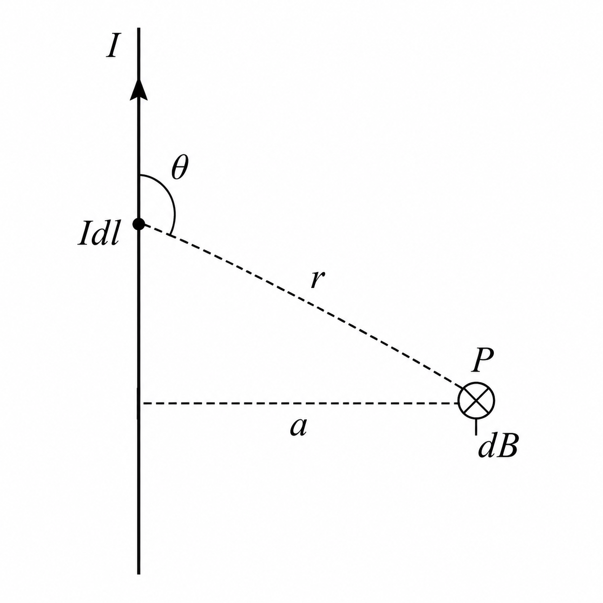
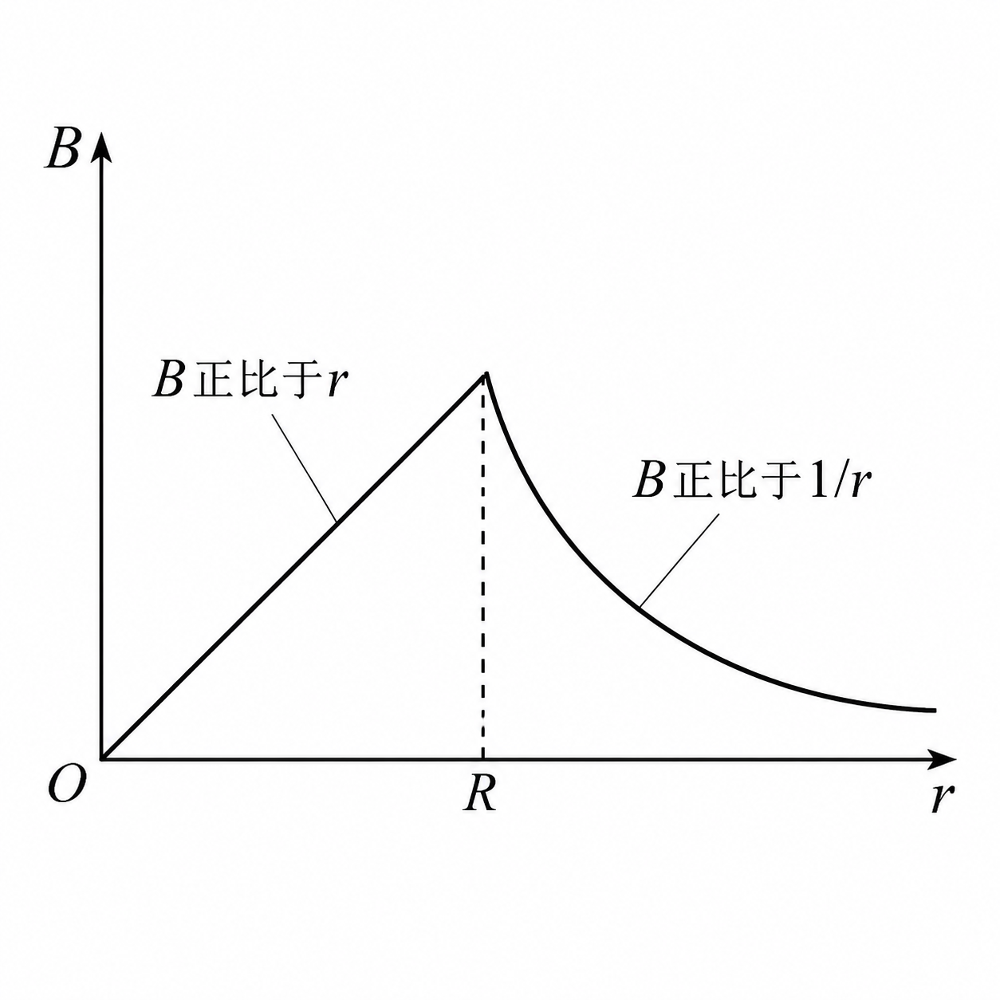

# 第十一章 恒定磁场 — 复习笔记

> **教材**：马文蔚《物理学教程（第4版）》下册  
> **章节**：第十一章 恒定磁场（§11-1 ~ §11-9）

---

## 📌 章节导航

| 节号 | 标题 | 核心内容 |
|:---:|------|---------|
| 11-1 | 恒定电流 电流密度 | $I = \int_S \boldsymbol{j}\cdot\mathrm{d}\boldsymbol{S}$，电流连续性方程 |
| 11-2 | 电源 电动势 | $\mathcal{E} = \oint_l \boldsymbol{E}_k\cdot\mathrm{d}\boldsymbol{l}$ |
| 11-3 | 磁场 磁感应强度 | $\boldsymbol{F} = q\boldsymbol{v}\times\boldsymbol{B}$，磁场定义 |
| 11-4 | 毕奥-萨伐尔定律 | $\mathrm{d}\boldsymbol{B} = \frac{\mu_0}{4\pi}\frac{I\mathrm{d}\boldsymbol{l}\times\boldsymbol{\hat{r}}}{r^2}$ |
| 11-5 | 磁通量 磁场的高斯定理 | $\oint_S \boldsymbol{B}\cdot\mathrm{d}\boldsymbol{S}=0$ |
| 11-6 | 安培环路定理 | $\oint_l \boldsymbol{B}\cdot\mathrm{d}\boldsymbol{l} = \mu_0\sum I$ |
| 11-7 | 带电粒子在磁场中的运动 | 洛伦兹力、回旋运动、霍尔效应 |
| 11-8 | 载流导线在磁场中所受的力 | 安培力、磁力矩 |
| 11-9 | 磁场中的磁介质 | $\boldsymbol{H}$矢量、磁化、铁磁质 |

---

## §11-1 恒定电流 电流密度

### 一、电流强度

$$
I = \frac{\mathrm{d}q}{\mathrm{d}t}
$$

单位：安培（A），$1\,\text{A} = 1\,\text{C}/\text{s}$

> [!note]+ 恒定电流（直流）
> 电流强度 $I$ 不随时间变化的电流称为**恒定电流**（直流）。本章讨论的磁场均由恒定电流激发，故称**恒定磁场**。

### 二、电流密度矢量 $\boldsymbol{j}$

电流密度 $\boldsymbol{j}$ 是描述电流在导体截面内分布细节的矢量：

- **大小**：等于通过垂直于电流方向单位面积的电流强度，$j = \frac{\mathrm{d}I}{\mathrm{d}S_\perp}$
- **方向**：正电荷运动方向

$$
I = \int_S \boldsymbol{j} \cdot \mathrm{d}\boldsymbol{S}
$$

> [!note]+ 电流密度与漂移速度的关系
> 设导体中载流子数密度为 $n$，电荷为 $q$，漂移速度为 $\boldsymbol{v}_\mathrm{d}$，则：
> $$\boldsymbol{j} = nq\boldsymbol{v}_\mathrm{d} \tag{11-4}$$
> 电流强度：$I = nqv_\mathrm{d}S$

### 三、电流的连续性方程

$$
\oint_S \boldsymbol{j} \cdot \mathrm{d}\boldsymbol{S} = -\frac{\mathrm{d}q}{\mathrm{d}t}
$$

对恒定电流：$\displaystyle\oint_S \boldsymbol{j} \cdot \mathrm{d}\boldsymbol{S} = 0$，即恒定电流的电路必须是闭合的。

---

## §11-2 电源 电动势

### 一、电源

要在导体中维持恒定电流，必须有**非静电力**不断做功，将正电荷从低电势处送回高电势处。提供非静电力的装置叫**电源**。

### 二、电动势 $\mathcal{E}$

$$
\mathcal{E} = \oint_l \boldsymbol{E}_k \cdot \mathrm{d}\boldsymbol{l} \tag{11-6}
$$

其中 $\boldsymbol{E}_k$ 为非静电电场强度，表示单位正电荷所受的非静电力。

- **物理意义**：电动势等于把单位正电荷绕闭合回路一周时非静电力所做的功
- **方向**：电源内部从负极指向正极（低电势 → 高电势）
- **单位**：伏特（V）

> [!warning]- 电动势 ≠ 电势差
> 电动势描述**非静电力**做功，电势差描述**静电力**做功。电源开路时，端电压 = 电动势；有电流时，端电压 < 电动势（内阻压降）。

---

## §11-3 磁场 磁感应强度

### 一、磁场

运动电荷（或电流）在其周围空间激发**磁场**。磁场对运动电荷有力的作用。

### 二、磁感应强度 $\boldsymbol{B}$

磁感应强度 $\boldsymbol{B}$ 是描述磁场强弱和方向的物理量，通过运动电荷在磁场中所受的力来定义：

$$
\boldsymbol{F} = q\boldsymbol{v} \times \boldsymbol{B} \tag{11-17}
$$

- $\boldsymbol{F} \perp \boldsymbol{v}$，$\boldsymbol{F} \perp \boldsymbol{B}$（即 $\boldsymbol{F}$ 垂直于 $\boldsymbol{v}$ 和 $\boldsymbol{B}$ 构成的平面）
- 大小：$F = qvB\sin\theta$，$\theta$ 为 $\boldsymbol{v}$ 与 $\boldsymbol{B}$ 的夹角
- 方向：右手螺旋定则（$\boldsymbol{v} \to \boldsymbol{B}$，拇指指向正电荷受力方向）
- 单位：特斯拉（T），$1\,\text{T} = 1\,\text{N}/(\text{A}\cdot\text{m})$

> [!note]+ 磁场与电场的根本区别
> | 特性 | 静电场 | 恒定磁场 |
> |------|--------|----------|
> | 场源 | 静止电荷 | 运动电荷/电流 |
> | 对电荷作用力 | $\boldsymbol{F} = q\boldsymbol{E}$（与速度无关） | $\boldsymbol{F} = q\boldsymbol{v}\times\boldsymbol{B}$（与速度有关） |
> | 场线特征 | 始于正电荷，终于负电荷 | 闭合曲线，无起点无终点 |
> | 高斯定理 | $\oint_S \boldsymbol{E}\cdot\mathrm{d}\boldsymbol{S} = \sum q/\varepsilon_0$ | $\oint_S \boldsymbol{B}\cdot\mathrm{d}\boldsymbol{S} = 0$ |
> | 环路定理 | $\oint_l \boldsymbol{E}\cdot\mathrm{d}\boldsymbol{l} = 0$（保守场） | $\oint_l \boldsymbol{B}\cdot\mathrm{d}\boldsymbol{l} = \mu_0\sum I$（涡旋场） |

---

## §11-4 毕奥-萨伐尔定律 ⭐



### 一、毕奥-萨伐尔定律

电流元 $I\mathrm{d}\boldsymbol{l}$ 在空间某点 $P$ 处产生的磁感应强度：

$$
\boxed{\mathrm{d}\boldsymbol{B} = \frac{\mu_0}{4\pi} \frac{I\mathrm{d}\boldsymbol{l} \times \boldsymbol{\hat{r}}}{r^2}} \tag{11-9}
$$

- $\mu_0 = 4\pi \times 10^{-7}\,\text{N}\cdot\text{A}^{-2}$（真空磁导率）
- $\boldsymbol{\hat{r}}$：电流元指向场点 $P$ 的单位矢量
- 大小：$\mathrm{d}B = \frac{\mu_0}{4\pi}\frac{I\mathrm{d}l\sin\theta}{r^2}$，$\theta$ 为 $I\mathrm{d}\boldsymbol{l}$ 与 $\boldsymbol{\hat{r}}$ 夹角
- 方向：垂直于 $I\mathrm{d}\boldsymbol{l}$ 与 $\boldsymbol{\hat{r}}$ 所在平面，右手定则

> [!danger]- 关键理解
> 毕奥-萨伐尔定律是磁场计算的基础（类似静电场中的库仑定律）。磁场满足**叠加原理**：
> $$\boldsymbol{B} = \int \mathrm{d}\boldsymbol{B} = \frac{\mu_0}{4\pi}\int \frac{I\mathrm{d}\boldsymbol{l} \times \boldsymbol{\hat{r}}}{r^2}$$

### 二、三种标准形状的磁场公式（必背！）

#### 1. 载流长直导线的磁场

```
        P (场点)
        ×  ← r₀ (垂直距离)
        |
========●========→ I (电流)
        |
  θ₁   /|
      / |
     /  |
```

$$
B = \frac{\mu_0 I}{4\pi r_0}(\cos\theta_1 - \cos\theta_2)
$$

- **无限长**直导线（$\theta_1=0$，$\theta_2=\pi$）：
  $$\boxed{B = \frac{\mu_0 I}{2\pi r_0}}$$
- **半无限长**直导线端点外（$\theta_1=\pi/2$，$\theta_2=\pi$）：
  $$B = \frac{\mu_0 I}{4\pi r_0}$$

#### 2. 载流圆形线圈轴线上磁场

```
         ← B 方向沿轴线 →
    ●───────●───────●
   /         |         \
  ●    R     |     ●    ← 圆环半径 R
   \         |         /
    ●───────●───────●
         ←── x ──→ P
```

$$
\boxed{B = \frac{\mu_0 I R^2}{2(R^2 + x^2)^{3/2}}}
$$

- **圆心处**（$x=0$）：$\displaystyle B = \frac{\mu_0 I}{2R}$
- 若为 $N$ 匝线圈：$B = \frac{\mu_0 N I R^2}{2(R^2+x^2)^{3/2}}$
- **一段圆弧**（圆心角 $\varphi$）：$B = \frac{\mu_0 I}{2R}\cdot\frac{\varphi}{2\pi}$

#### 3. 载流直螺线管轴线上磁场

```
╔══════════════════════════════╗
║  n匝/米  ┌─────────────┐   ║
║  →→→→→→→ │   均匀磁场   │ →→→║  B = μ₀nI
║  →→→→→→→ └─────────────┘ →→→║  (管内中部)
╚══════════════════════════════╝
   端口处: B = (1/2)μ₀nI
```

$$
B = \frac{\mu_0 nI}{2}(\cos\beta_2 - \cos\beta_1) \tag{11-3}
$$

其中 $n = N/l$ 为单位长度匝数。

| 位置             | 条件                          | 结果                                |
| -------------- | --------------------------- | --------------------------------- |
| **管内中点**（无限长）  | $\beta_1=\pi,\;\beta_2=0$   | $\boxed{B = \mu_0 nI}$            |
| **管端口处**（半无限长） | $\beta_1=\pi/2,\;\beta_2=0$ | $\boxed{B = \frac{1}{2}\mu_0 nI}$ |


> [!warning]- 注意
> 螺线管端口处的磁感强度只有管内中点的一半！管内中部可视为**均匀磁场**。

---

## §11-5 磁通量 磁场的高斯定理


### 一、磁感线（$\boldsymbol{B}$ 线）

> [!note]+ 磁感线的性质
> 1. **不相交**：磁场中每一点的 $\boldsymbol{B}$ 方向唯一确定
> 2. **闭合曲线**：无起点、无终点（与电场线根本不同！）
> 3. 方向：与电流方向满足**右手螺旋定则**
>    - 直导线：右手握导线，拇指→电流，四指→$\boldsymbol{B}$ 方向
>    - 螺线管：右手握螺线管，四指→电流，拇指→管内 $\boldsymbol{B}$ 方向

### 二、磁通量 $\Phi$

$$
\Phi = \int_S \boldsymbol{B} \cdot \mathrm{d}\boldsymbol{S} \tag{11-14}
$$

- 均匀磁场中平面：$\Phi = BS\cos\theta$
- 单位：韦伯（Wb），$1\,\text{Wb} = 1\,\text{T}\cdot\text{m}^2$

### 三、磁场的高斯定理

$$
\boxed{\oint_S \boldsymbol{B} \cdot \mathrm{d}\boldsymbol{S} = 0} \tag{11-15}
$$

**物理意义**：通过任意闭合曲面的净磁通量恒为零——不存在磁单极子！

> [!danger]- 与静电场高斯定理的本质区别
> 
> | | 静电场 | 恒定磁场 |
> |---|--------|---------|
> | 高斯定理 | $\oint_S \boldsymbol{E}\cdot\mathrm{d}\boldsymbol{S} = \sum q/\varepsilon_0$ | $\oint_S \boldsymbol{B}\cdot\mathrm{d}\boldsymbol{S} = 0$ |
> | 物理含义 | 电场线有头有尾（电荷是源） | 磁感线闭合（无磁单极） |
> | 可以不为零？ | ✅ 可以 | ❌ 恒为零 |

---

## §11-6 安培环路定理 ⭐


### 一、定理表述

在真空的恒定磁场中，磁感应强度 $\boldsymbol{B}$ 沿任意闭合路径的线积分，等于该闭合路径所包围的电流代数和的 $\mu_0$ 倍：

$$
\boxed{\oint_l \boldsymbol{B} \cdot \mathrm{d}\boldsymbol{l} = \mu_0 \sum_{i=1}^{n} I_i} \tag{11-16b}
$$

### 二、符号约定

- 电流方向与积分路径绕行方向满足**右手螺旋关系**时，$I$ 取**正**
- 反之取**负**

```
    绕行方向 ↺
       |
   ┌───●───┐
   │   |   │
   │ ⊙ I₁  │  ← I₁ 穿出纸面，与绕向右手关系 → 正
   │   |   │
   └───────┘
   
   ┌───●───┐
   │   |   │
   │ ⊗ I₂  │  ← I₂ 穿入纸面，与绕向右手关系 → 负
   │   |   │
   └───────┘
```

### 三、应用举例（对称性分析是关键！）

#### 例1：无限长载流圆柱体

| 区域 | 公式 | $B$-$r$ 关系 |
|------|------|-------------|
| 柱外 ($r > R$) | $B = \frac{\mu_0 I}{2\pi r}$ | $B \propto 1/r$（与线电流相同） |
| 柱内 ($r < R$) | $B = \frac{\mu_0 I r}{2\pi R^2}$ | $B \propto r$（线性增大） |

> 柱表面 ($r=R$) 处 $B$ 最大：$B_{\max} = \frac{\mu_0 I}{2\pi R}$



#### 例2：载流螺绕环

环内中心线上：
$$
\boxed{B = \mu_0 \frac{NI}{2\pi r} = \mu_0 nI}
$$


其中 $n = N/(2\pi r)$ 为单位长度匝数。本来和$(2\pi r)$ 有关但是如果 当环直径 ≫ 线圈直径时，环内近似为均匀磁场    ${\mu_0 nI}$

#### 例3：无限长载流直螺线管（管内部）

$$
\boxed{B = \mu_0 nI}
$$

管外 $B \approx 0$（密绕时）。

> [!note]+ 安培环路定理 vs 静电场环路定理
> | | 静电场 | 恒定磁场 |
> |---|--------|---------|
> | 环路积分 | $\oint_l \boldsymbol{E}\cdot\mathrm{d}\boldsymbol{l} = 0$ | $\oint_l \boldsymbol{B}\cdot\mathrm{d}\boldsymbol{l} = \mu_0\sum I$ |
> | 场的类型 | **保守场**（有势场） | **涡旋场**（非保守场） |
> | 类比定理 | 静电场高斯定理求 $\boldsymbol{E}$ | 安培环路定理求 $\boldsymbol{B}$ |

---

## §11-7 带电粒子在磁场中的运动 ⭐


### 一、洛伦兹力

$$
\boxed{\boldsymbol{F}_m = q\boldsymbol{v} \times \boldsymbol{B}} \tag{11-17}
$$

- 大小：$F_m = qvB\sin\theta$
- 方向：右手四指从 $\boldsymbol{v}$（经 <180°）弯向 $\boldsymbol{B}$，拇指为 $+q$ 受力方向
- **不做功**：$\boldsymbol{F}_m \perp \boldsymbol{v}$ 恒成立，故洛伦兹力只改变速度方向，不改变速率

> [!warning]- 普遍情况（电场+磁场）
> $$\boldsymbol{F} = q\boldsymbol{E} + q\boldsymbol{v} \times \boldsymbol{B}$$

### 二、带电粒子在均匀磁场中的运动

#### 情形1：$\boldsymbol{v} \perp \boldsymbol{B}$ → 匀速圆周运动

```
    × × × × × × × (B垂直纸面向里)
    ×   ○──→v  ×
    ×  /    \  ×
    × |  ×  | ×
    ×  \    /  ×
    ×   ←──○  ×
    × × × × × × ×
```

| 物理量 | 公式 | 说明 |
|--------|------|------|
| **回旋半径** | $R = \dfrac{mv}{qB}$ | $R \propto v$，$R \propto 1/B$ |
| **回旋周期** | $T = \dfrac{2\pi m}{qB}$ | 与 $v$ 无关！ |
| **回旋频率** | $f = \dfrac{qB}{2\pi m}$ | 与 $v$ 无关！ |

#### 情形2：$\boldsymbol{v}$ 与 $\boldsymbol{B}$ 成任意角 $\theta$ → 螺旋运动

```
     B方向 →
    ════════════════════
       /╲    /╲    /╲
      /  ╲  /  ╲  /  ╲
     /    ╲/    ╲/    ╲
    ·     ·     ·     ·
    |← d →| (螺距)
```

- $v_\parallel = v\cos\theta$：沿 $\boldsymbol{B}$ 方向匀速直线运动
- $v_\perp = v\sin\theta$：垂直 $\boldsymbol{B}$ 方向匀速圆周运动
- 回旋半径：$R = \dfrac{mv_\perp}{qB} = \dfrac{mv\sin\theta}{qB}$
- **螺距**：$\boxed{d = v_\parallel T = \dfrac{2\pi m v\cos\theta}{qB}}$

> [!note]+ 磁聚焦
> 当 $\theta$ 很小时，$v_\parallel \approx v$（近似相等），不同 $\theta$ 的粒子螺距近似相等，经同一距离 $d$ 后汇聚于同一点。这就是**磁聚焦**原理，应用于电子显微镜。

### 三、霍尔效应

```
     ┌─────────────────┐
  ↑  │  + + + + + +   │  ← A' 侧积累电荷
  B  │  →→→ I →→→    │  
  ↓  │  - - - - - -   │  ← A 侧积累电荷
     └─────────────────┘
      |←── b ──→|
```

霍尔电压：
$$
\boxed{U_\mathrm{H} = R_\mathrm{H}\frac{IB}{d} = \frac{IB}{nqd}} \tag{11-21, 11-23}
$$

霍尔系数：
这里面都是未知量
$$
R_\mathrm{H} = \frac{1}{nq} \tag{11-24}
$$

> [!note]+ 霍尔效应的应用
> 1. 判断载流子类型（$R_\mathrm{H}>0$ → 空穴导电/P型；$R_\mathrm{H}<0$ → 电子导电/N型）
> 2. 测量磁场强度（霍尔探头）
> 3. 测量载流子数密度 $n$
> 4. 磁流体发电

---

## §11-8 载流导线在磁场中所受的力 ⭐


### 一、安培力（安培定律）

电流元 $I\mathrm{d}\boldsymbol{l}$ 在磁场中所受的力：

$$
\boxed{\mathrm{d}\boldsymbol{F} = I\mathrm{d}\boldsymbol{l} \times \boldsymbol{B}} \tag{11-26}
$$

有限长载流导线：
$$
\boldsymbol{F} = \int_l I\mathrm{d}\boldsymbol{l} \times \boldsymbol{B}
$$

- **均匀磁场中直导线**：$F = BIl\sin\varphi$（$\varphi$ 为导线与 $\boldsymbol{B}$ 夹角）
- 方向：右手定则或左手定则

> [!note]+ 安培力的微观本质
> 安培力是洛伦兹力的宏观表现。电流元中所有载流子所受洛伦兹力的合力 → 传递到导体晶格 → 宏观安培力。

### 二、两平行载流直导线间的相互作用

```
  I₁ →         I₂ →
  ═══════      ═══════
     ←── d ──→
     F₁₂ ↑      ↓ F₂₁
```

单位长度受力：
$$
\frac{F}{l} = \frac{\mu_0 I_1 I_2}{2\pi d}
$$

- 同向电流 → **相吸**
- 反向电流 → **相斥**

> **国际单位制中"安培"的定义**即基于此：真空中相距 1m 的两无限长平行导线，通以相同电流，每米长度上受力 $2\times10^{-7}\,\text{N}$ 时，电流为 1A。

### 三、磁场对载流线圈的磁力矩

$$
\boxed{\boldsymbol{M} = \boldsymbol{m} \times \boldsymbol{B}} \tag{11-29b}
$$

其中 **磁矩**：
$$
\boldsymbol{m} = NIS\boldsymbol{e}_n
$$

- $N$：匝数，$S$：面积，$\boldsymbol{e}_n$：线圈平面正法向（与电流方向右手关系）
- $M = NISB\sin\theta$，$\theta$ 为 $\boldsymbol{e}_n$ 与 $\boldsymbol{B}$ 的夹角

> [!note]+ 三种平衡状态
> | $\theta$ | 磁通量 | 磁力矩 | 状态 |
> |:---:|------|:---:|------|
> | $0^\circ$ | 正向最大 | $M=0$ | **稳定平衡** |
> | $90^\circ$ | 零 | $M_{\max}=NBIS$ | 力矩最大 |
> | $180^\circ$ | 负向最大 | $M=0$ | **不稳定平衡** |

磁力矩总是驱使线圈转到 $\boldsymbol{m} \parallel \boldsymbol{B}$（$\theta=0$）的稳定平衡位置。

---

## §11-9 磁场中的磁介质

### 一、磁介质的分类

| 类型 | $\boldsymbol{B}'$ 方向 | 相对大小 | $\mu_r$ | 实例 |
|------|----------------------|---------|--------|------|
| **顺磁质** | 与 $\boldsymbol{B}_0$ 同向 | $B' \ll B_0$ | $\gtrsim 1$ | 铝、氧、锰 |
| **抗磁质** | 与 $\boldsymbol{B}_0$ 反向 | $B' \ll B_0$ | $\lesssim 1$ | 铜、铋、氢 |
| **铁磁质** | 与 $\boldsymbol{B}_0$ 同向 | $B' \gg B_0$ | $\gg 1$ ($10^2\sim10^4$) | 铁、镍、钴 |

总磁场：$\boldsymbol{B} = \boldsymbol{B}_0 + \boldsymbol{B}'$

### 二、磁化强度 $\boldsymbol{M}$

$$
\boldsymbol{M} = \frac{\sum \boldsymbol{m}_i}{\Delta V} \tag{11-30}
$$

单位：$\text{A}\cdot\text{m}^{-1}$

### 三、磁场强度 $\boldsymbol{H}$ 与安培环路定理

$$
\boxed{\boldsymbol{H} = \frac{\boldsymbol{B}}{\mu_0} - \boldsymbol{M}} \tag{11-32}
$$

**有磁介质时的安培环路定理**：

$$
\boxed{\oint_l \boldsymbol{H} \cdot \mathrm{d}\boldsymbol{l} = \sum I} \tag{11-33}
$$

> [!danger]- 关键理解
> $\boldsymbol{H}$ 的环流**只与传导电流有关**，与磁化电流无关。这就是引入 $\boldsymbol{H}$ 的目的——简化磁介质中磁场的计算！

### 四、$\boldsymbol{B}$ 与 $\boldsymbol{H}$ 的关系

对各向同性线性磁介质：
$$
\boldsymbol{M} = \chi_m \boldsymbol{H}
$$

$$
\boxed{\boldsymbol{B} = \mu_0(\boldsymbol{H} + \boldsymbol{M}) = \mu_0(1+\chi_m)\boldsymbol{H} = \mu_0\mu_r\boldsymbol{H} = \mu\boldsymbol{H}} \tag{11-34}
$$

| 符号 | 名称 | 关系 |
|------|------|------|
| $\chi_m$ | 磁化率 | 顺磁质 $\chi_m>0$，抗磁质 $\chi_m<0$ |
| $\mu_r = 1+\chi_m$ | 相对磁导率 | 顺磁质 $\mu_r>1$，抗磁质 $\mu_r<1$ |
| $\mu = \mu_0\mu_r$ | 绝对磁导率 | |

### 五、铁磁质

#### 磁畴理论

铁磁质内部存在自发磁化的小区域——**磁畴**。无外场时磁畴取向杂乱；外场作用下磁畴转向并扩大，产生极强的附加磁场。

#### 磁滞回线

```
      B ↑
        |    ┌── B_m (饱和)
        |   /│\
        |  / │ \______
  B_r ──|─/──│─────────→ H
        |/   │        \
        |\   │        /
 -B_r ──|─\──│────────
        |  \ │      /
        |   \│/    /
        |    └── -B_m
        |
   -H_c |     H_c (矫顽力)
```

| 特征点 | 含义 |
|--------|------|
| $B_m$ | 饱和磁感强度 |
| $B_r$ | **剩磁**（$H=0$ 时的 $B$） |
| $H_c$ | **矫顽力**（使 $B=0$ 所需反向 $H$） |

#### 软磁 vs 硬磁

| 特性 | 软磁材料 | 硬磁材料 |
|------|---------|---------|
| 磁滞回线面积 | **小**（狭长） | **大**（肥胖） |
| 矫顽力 $H_c$ | 小 | 大 |
| 剩磁 $B_r$ | 小 | 大 |
| 易磁化/去磁 | ✅ 容易 | ❌ 困难 |
| 用途 | 变压器铁芯、电磁铁 | 永磁体 |
| 实例 | 纯铁、硅钢、坡莫合金 | 碳钢、钕铁硼 |

> [!note]+ 磁屏蔽
> 利用高磁导率材料（如坡莫合金）制成罩壳，磁感线集中在壳壁中，罩内空间磁场极弱。

---

## 🔥 核心铁律速查表

| # | 铁律 | 备注 |
|---|------|------|
| 1 | 磁感线**永远是闭合的** | 无磁单极子 |
| 2 | 洛伦兹力**不做功** | $\boldsymbol{F} \perp \boldsymbol{v}$ |
| 3 | 安培环路定理只适用于**恒定电流**的磁场 | 非恒定需加位移电流 |
| 4 | 毕奥-萨伐尔定律→对称分布用安培环路定理更简单 | 等效于库仑定律→高斯定理 |
| 5 | 右手螺旋定则贯穿全章 | 方向判断的核心工具 |
| 6 | 螺线管端口 $B = \frac{1}{2}\mu_0 nI$，内部 $B = \mu_0 nI$ | 牢记1:2的关系 |
| 7 | 回旋周期 $T$ 与速度无关 | 回旋加速器的基础 |
| 8 | $\boldsymbol{H}$ 的环流仅与传导电流有关 | 简化磁介质计算 |
| 9 | 电场是保守场，磁场是涡旋场 | 根本区别 |

---

## 📐 公式速查表

### 磁场计算

| 名称 | 公式 |
|------|------|
| 毕奥-萨伐尔定律 | $\mathrm{d}\boldsymbol{B} = \dfrac{\mu_0}{4\pi}\dfrac{I\mathrm{d}\boldsymbol{l}\times\boldsymbol{\hat{r}}}{r^2}$ |
| 无限长直导线 | $B = \dfrac{\mu_0 I}{2\pi r}$ |
| 圆电流轴线上 | $B = \dfrac{\mu_0 I R^2}{2(R^2+x^2)^{3/2}}$ |
| 圆电流圆心 | $B = \dfrac{\mu_0 I}{2R}$ |
| 螺线管内部（无限长） | $B = \mu_0 nI$ |
| 螺线管端口 | $B = \dfrac{1}{2}\mu_0 nI$ |
| 螺绕环内部 | $B = \mu_0 nI$ |

### 磁通量与定理

| 名称 | 公式 |
|------|------|
| 磁通量 | $\Phi = \int_S \boldsymbol{B}\cdot\mathrm{d}\boldsymbol{S}$ |
| 磁场高斯定理 | $\oint_S \boldsymbol{B}\cdot\mathrm{d}\boldsymbol{S} = 0$ |
| 安培环路定理（真空） | $\oint_l \boldsymbol{B}\cdot\mathrm{d}\boldsymbol{l} = \mu_0\sum I$ |
| 安培环路定理（介质） | $\oint_l \boldsymbol{H}\cdot\mathrm{d}\boldsymbol{l} = \sum I$ |

### 力与力矩

| 名称 | 公式 |
|------|------|
| 洛伦兹力 | $\boldsymbol{F} = q\boldsymbol{v}\times\boldsymbol{B}$ |
| 安培力（电流元） | $\mathrm{d}\boldsymbol{F} = I\mathrm{d}\boldsymbol{l}\times\boldsymbol{B}$ |
| 磁力矩 | $\boldsymbol{M} = \boldsymbol{m}\times\boldsymbol{B} = NIS\boldsymbol{e}_n\times\boldsymbol{B}$ |
| 平行导线单位长度力 | $F/l = \dfrac{\mu_0 I_1 I_2}{2\pi d}$ |

### 带电粒子运动

| 名称 | 公式 |
|------|------|
| 回旋半径 | $R = \dfrac{mv}{qB}$ |
| 回旋周期 | $T = \dfrac{2\pi m}{qB}$ |
| 回旋频率 | $f = \dfrac{qB}{2\pi m}$ |
| 螺距 | $d = \dfrac{2\pi m v_\parallel}{qB}$ |
| 霍尔电压 | $U_\mathrm{H} = \dfrac{IB}{nqd}$ |

### 磁介质

| 名称 | 公式 |
|------|------|
| $\boldsymbol{H}$ 定义 | $\boldsymbol{H} = \dfrac{\boldsymbol{B}}{\mu_0} - \boldsymbol{M}$ |
| $\boldsymbol{B}$-$\boldsymbol{H}$ 关系 | $\boldsymbol{B} = \mu_0\mu_r\boldsymbol{H} = \mu\boldsymbol{H}$ |
| 磁化率关系 | $\mu_r = 1 + \chi_m$ |

---

## 🆚 电场 vs 磁场 终极对比

> [!warning]+ 一定要区分清楚！

| 对比项 | 静电场 | 恒定磁场 |
|--------|--------|----------|
| **场源** | 静止电荷 | 运动电荷 / 恒定电流 |
| **基本定律** | 库仑定律 $\boldsymbol{F}=\frac{1}{4\pi\varepsilon_0}\frac{qq'}{r^2}\hat{\boldsymbol{r}}$ | 毕奥-萨伐尔定律 |
| **场量定义** | $\boldsymbol{E} = \boldsymbol{F}/q$ | $\boldsymbol{F} = q\boldsymbol{v}\times\boldsymbol{B}$ |
| **高斯定理** | $\oint_S \boldsymbol{E}\cdot\mathrm{d}\boldsymbol{S} = \sum q/\varepsilon_0$ | $\oint_S \boldsymbol{B}\cdot\mathrm{d}\boldsymbol{S} = 0$ |
| **环路定理** | $\oint_l \boldsymbol{E}\cdot\mathrm{d}\boldsymbol{l} = 0$（保守场） | $\oint_l \boldsymbol{B}\cdot\mathrm{d}\boldsymbol{l} = \mu_0\sum I$（涡旋场） |
| **场线** | 不闭合（有头有尾） | **闭合**（无头无尾） |
| **对电荷做功** | ✅ 做功（$W = qU$） | ❌ 不做功（$\boldsymbol{F}\perp\boldsymbol{v}$） |
| **通量** | 可以不为零 | **恒为零** |
| **介质中辅助量** | $\boldsymbol{D} = \varepsilon_0\boldsymbol{E} + \boldsymbol{P}$ | $\boldsymbol{H} = \boldsymbol{B}/\mu_0 - \boldsymbol{M}$ |

---

## 📝 典型例题

### 例题1：组合导线在O点激发的磁场

> **题**：如图所示，将一根导线弯成半径为 $R$ 的半圆形，两端连接两根半无限长直导线，通以电流 $I$。求圆心 $O$ 处的磁感应强度。

```
        I
        ↑
        |
    ────●────
       / \
      /   \  R
     |  O  |
      \   /
       \ /
```

**解**：

用叠加原理，$O$ 点 $\boldsymbol{B}$ 由三部分贡献：

1. **上半无限长直导线**（$\theta_1=90^\circ, \theta_2=180^\circ$）：$B_1 = \dfrac{\mu_0 I}{4\pi R}$
2. **下半无限长直导线**（$\theta_1=0^\circ, \theta_2=90^\circ$）：$B_2 = \dfrac{\mu_0 I}{4\pi R}$
3. **半圆形电流**（圆心处圆弧公式）：$B_3 = \dfrac{\mu_0 I}{2R}\cdot\dfrac{\pi}{2\pi} = \dfrac{\mu_0 I}{4R}$

三部分方向均相同（垂直纸面向里），故：
$$B_O = B_1 + B_2 + B_3 = \frac{\mu_0 I}{4\pi R} + \frac{\mu_0 I}{4\pi R} + \frac{\mu_0 I}{4R} = \frac{\mu_0 I}{2\pi R} + \frac{\mu_0 I}{4R}$$

---

### 例题2：安培环路定理求磁场分布

> **题**：无限长圆柱形导体半径为 $R$，通有均匀分布的电流 $I$。求导体内外的磁感应强度分布。

**解**：（详见 §11-6 例2）

- **$r > R$**（柱外）：$B = \dfrac{\mu_0 I}{2\pi r}$（等效于线电流集中在轴线上）
- **$r < R$**（柱内）：$B = \dfrac{\mu_0 I r}{2\pi R^2}$（$B \propto r$）

验证：在 $r=R$ 处两式给出相同结果 $B = \dfrac{\mu_0 I}{2\pi R}$。

---

### 例题3：带电粒子回旋运动

> **题**：一电子经加速电压 $U=175\,\text{V}$ 加速后，垂直射入均匀磁场中作半径为 $R=15\,\text{cm}$ 的圆周运动。求磁感应强度 $B$。

**解**：

(1) 由能量守恒：$\dfrac{1}{2}m_ev^2 = eU$，得 $v = \sqrt{\dfrac{2eU}{m_e}} = 7.86\times10^6\,\text{m/s}$

(2) 由 $R = \dfrac{m_ev}{eB}$：
$$B = \frac{m_ev}{eR} = 2.98\times10^{-4}\,\text{T}$$

---

### 例题4：长直螺线管与螺绕环

> **对比记忆**：无限长直螺线管内部 $B = \mu_0 nI$，螺绕环内部 $B = \mu_0 nI$。形式上完全相同，但适用条件不同：
> - 螺线管：需"无限长"（$l \gg R$），管内中点
> - 螺绕环：需环直径远大于线圈直径，且密绕

---

### 例题5：同轴电缆（典型的安培环路定理综合题）

> **题**：同轴电缆内导体半径为 $R_1$，外导体半径为 $R_2$，内外导体间充满介质。电流 $I$ 从内导体流入、外导体流回。求各区域磁感应强度。

| 区域 | 包围电流 | $B$ |
|------|---------|-----|
| $r < R_1$ | $\dfrac{Ir^2}{R_1^2}$ | $B = \dfrac{\mu_0 I r}{2\pi R_1^2}$ |
| $R_1 < r < R_2$ | $I$ | $B = \dfrac{\mu_0 I}{2\pi r}$（或 $\dfrac{\mu I}{2\pi r}$ 若有介质） |
| $r > R_2$ | $I + (-I) = 0$ | $B = 0$ |

---

## 🎯 考试重点提示

> [!danger]- 高频考点
> 1. **毕奥-萨伐尔定律**：直线段 + 圆弧组合求 $O$ 点 $B$
> 2. **安培环路定理**：圆柱体/同轴电缆的 $B$ 分布
> 3. **洛伦兹力**：回旋半径/周期的计算，螺旋运动螺距
> 4. **安培力**：直导线受力、载流线圈磁力矩
> 5. **霍尔效应**：霍尔电压计算，判断载流子类型
> 6. **电场与磁场的对比**：高斯定理、环路定理的性质差异
> 7. **铁磁质**：磁滞回线、软磁/硬磁区别

---

> [!note]+ 复习建议
> 1. 先背熟**三种标准形状**的磁场公式（直导线、圆线圈、螺线管）
> 2. 理解安培环路定理的**对称性条件**（何时能用、何时不能用）
> 3. 熟练掌握**右手定则**的方向判断
> 4. 搞清 $\boldsymbol{B}$、$\boldsymbol{H}$、$\boldsymbol{M}$ 三者的关系
> 5. 电场与磁场的对比是**大题**常见出法

---

*笔记完成日期：2026年7月*
