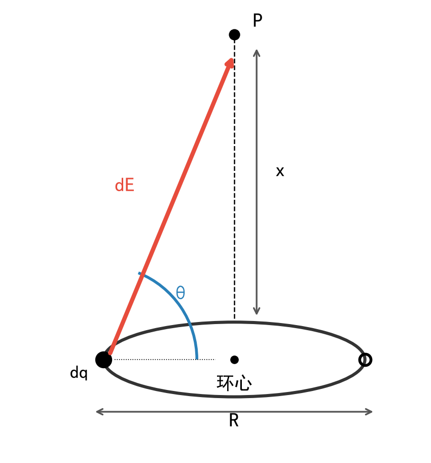
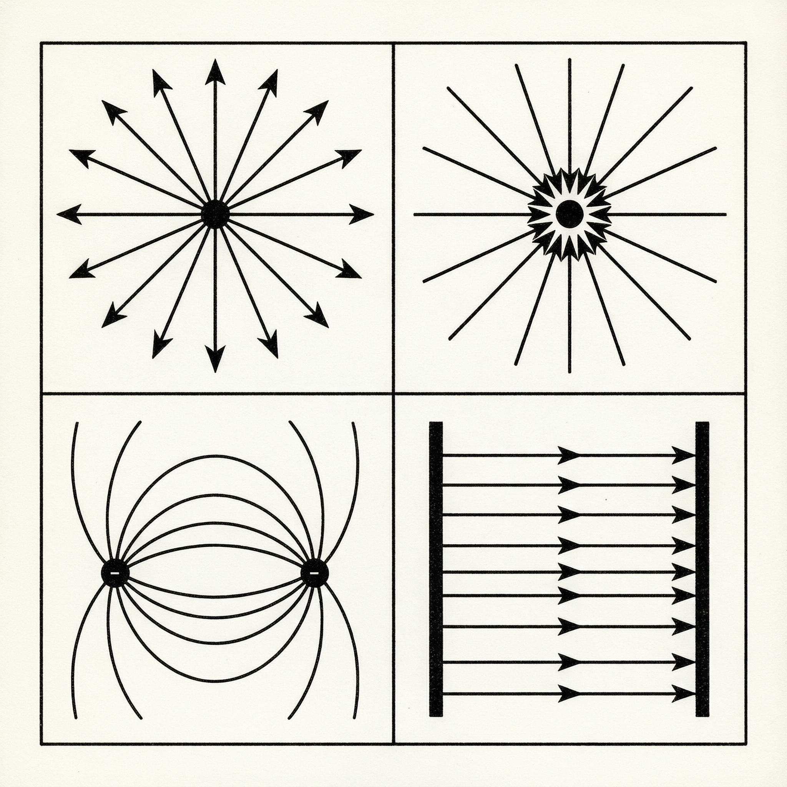
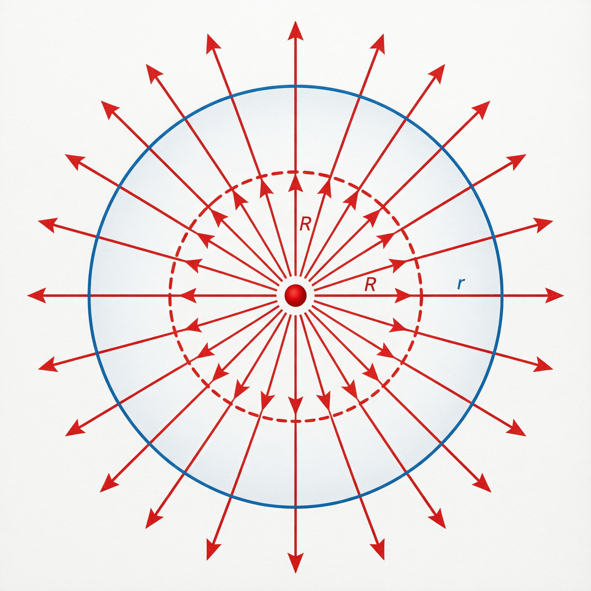
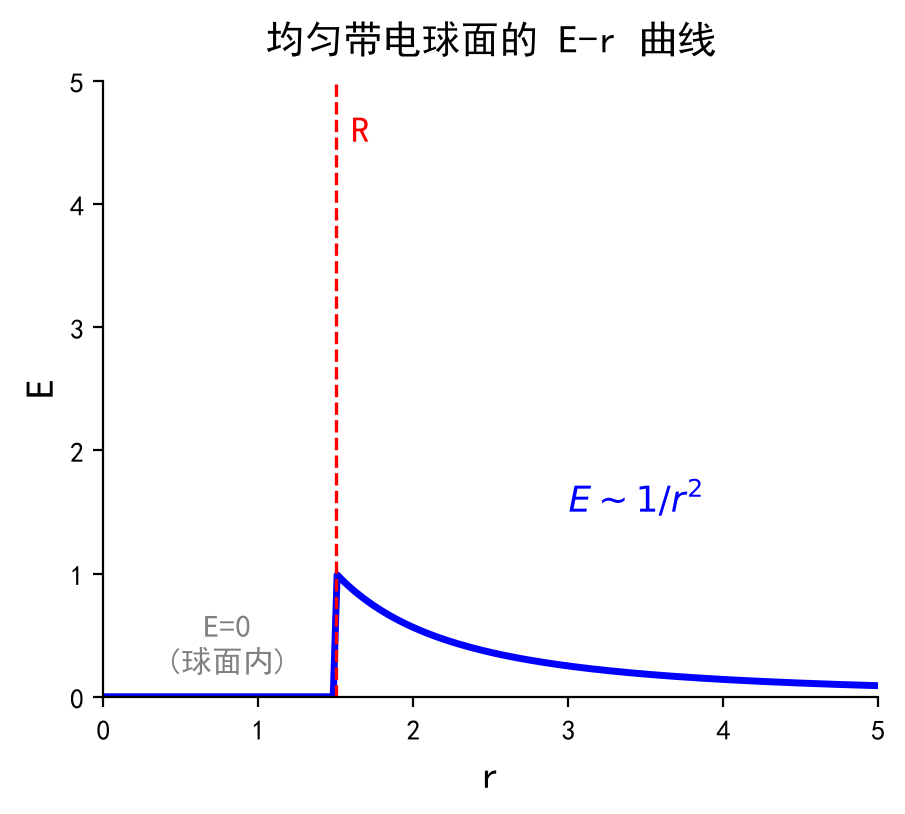
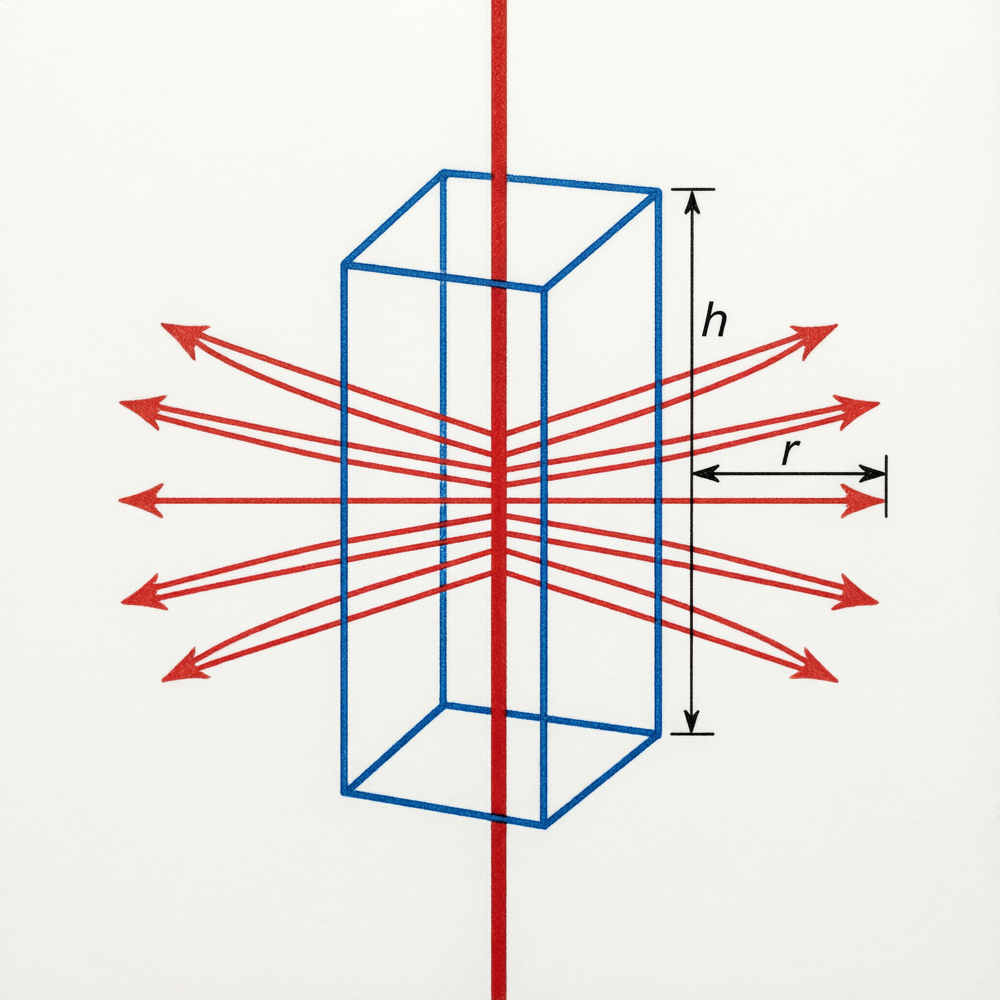
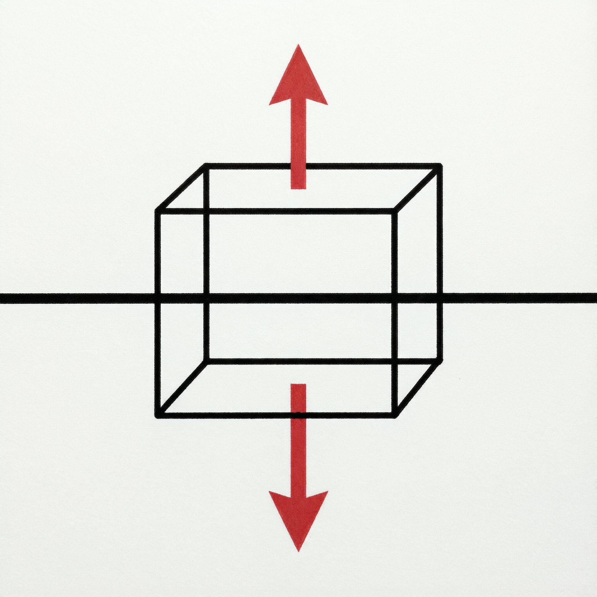
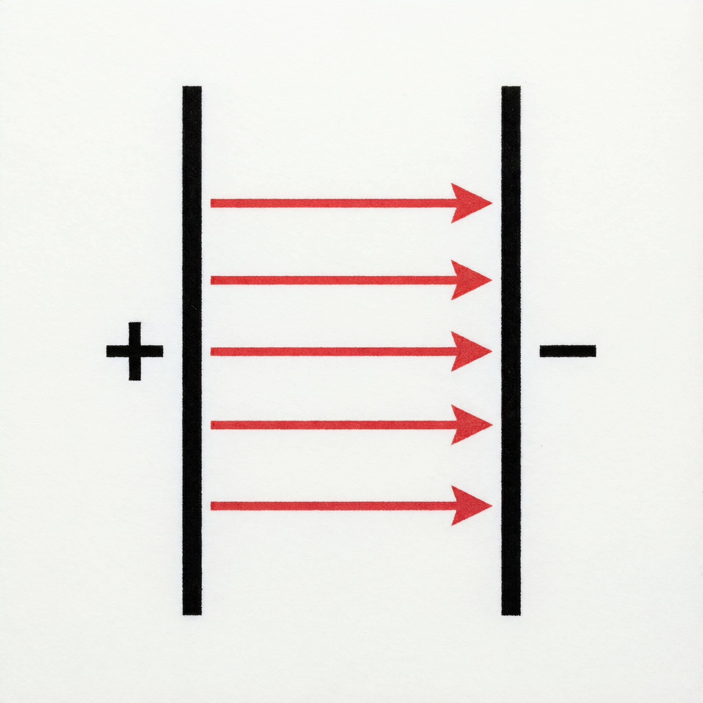
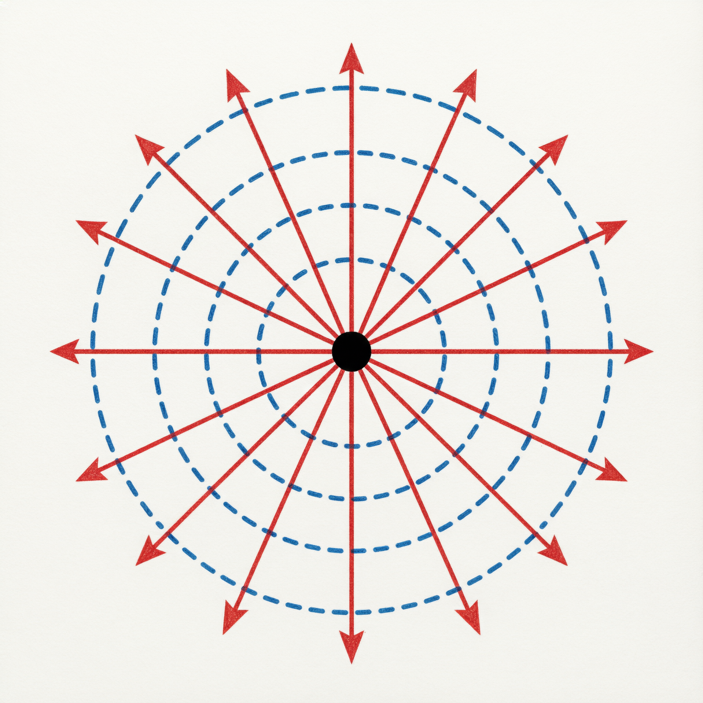
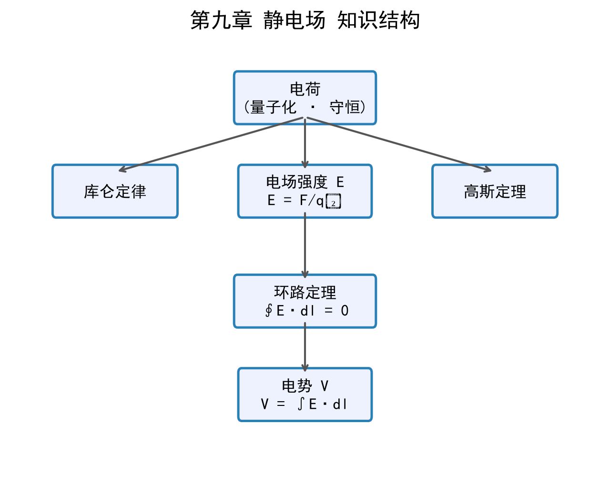

# 第九章 静电场 复习笔记

> 来源：《物理学教程（第4版）下册》马文蔚 第九章
> 涵盖：电荷与库仑定律 → 电场强度 → 高斯定理 → 环路定理与电势能 → 电势 → 电场与电势的微分关系

---

## 目录
- [9-1 电荷的量子化 电荷守恒定律](#9-1-电荷的量子化-电荷守恒定律)
- [9-2 库仑定律](#9-2-库仑定律)
- [9-3 电场强度](#9-3-电场强度)
- [9-4 电场强度通量 高斯定理](#9-4-电场强度通量-高斯定理)
- [9-5 静电场的环路定理 电势能](#9-5-静电场的环路定理-电势能)
- [9-6 电势](#9-6-电势)
- [9-7 电场强度与电势的微分关系](#9-7-电场强度与电势的微分关系)
- [典型习题精选](#典型习题精选)
- [知识全景图](#知识全景图)
- [核心铁律速查](#核心铁律速查)
- [公式速查表](#公式速查表)

---

## 9-1 电荷的量子化 电荷守恒定律

### 一、电荷的基本性质

自然界只存在**两种电荷**：正电荷和负电荷。同号相斥，异号相吸。

>[!note]+ 电荷的量子化
>任何带电体所带电荷量 $q$ 都是**元电荷** $e$ 的整数倍：
>
>$$q = ne \quad (n = \pm 1, \pm 2, \ldots)$$
>
>其中 $e = 1.602 \times 10^{-19} \, \mathrm{C}$（库仑），是电荷的最小单元。一个电子带 $-e$，一个质子带 $+e$。
>
>**为什么电荷是量子化的？** 因为物质由原子构成，原子中的电子和质子各自携带确定量的电荷，宏观带电体的电荷量必然是这些微观粒子电荷量的代数和，所以只能是 $e$ 的整数倍。

>[!warning]- 电荷量子化在宏观中不明显
>在宏观静电学中，$1 \, \mathrm{C}$ 的电荷约含 $6.24 \times 10^{18}$ 个元电荷，量子性被"淹没"。因此在经典电磁学中，我们**把电荷当作连续分布的量**来处理。

### 二、电荷守恒定律

> **电荷守恒定律**：在一个孤立系统中，无论发生什么物理过程，系统电荷的代数和保持不变。

这是自然界最基本的守恒定律之一。电荷不能创生也不能消灭，只能从一个物体转移到另一个物体。

---

## 9-2 库仑定律

### 一、库仑定律的内容

**真空中两个静止点电荷之间的相互作用力**，与它们电荷量的乘积成正比，与它们之间距离的平方成反比，作用力沿连线方向。

$$
\boxed{\boldsymbol{F}_{12} = \frac{1}{4\pi\varepsilon_0} \frac{q_1 q_2}{r^2} \boldsymbol{e}_{r12}} \tag{9-1}
$$

- **$\boldsymbol{F}_{12}$**：电荷 $q_1$ 对 $q_2$ 的作用力（矢量，N）
- **$\varepsilon_0 = 8.854 \times 10^{-12} \, \mathrm{C^2 \cdot N^{-1} \cdot m^{-2}}$**：真空电容率（真空介电常量）
- **$\frac{1}{4\pi\varepsilon_0} = k \approx 9.0 \times 10^9 \, \mathrm{N \cdot m^2 \cdot C^{-2}}$**：库仑常量
- **$r$**：两点电荷间的距离（m）
- **$\boldsymbol{e}_{r12}$**：从 $q_1$ 指向 $q_2$ 的单位矢量

>[!note]+ 库仑定律为什么有 $4\pi$？
>库仑定律中的 $1/(4\pi\varepsilon_0)$ 是**有理化单位制**的结果。这样写使得由库仑定律导出的高斯定理呈现简洁形式 $\oint \boldsymbol{E} \cdot \mathrm{d}\boldsymbol{S} = q/\varepsilon_0$，而无需在麦克斯韦方程组中到处出现 $4\pi$ 因子。本质上是一个**约定**，方便理论推导。

### 二、库仑力叠加原理

两个以上点电荷对某一点电荷的作用力，等于各点电荷单独存在时作用力的**矢量和**：

$$
\boldsymbol{F} = \sum_{i=1}^{n} \boldsymbol{F}_i = \sum_{i=1}^{n} \frac{1}{4\pi\varepsilon_0} \frac{q q_i}{r_i^2} \boldsymbol{e}_{ri}
$$

### 三、静电力 vs 万有引力

| 对比维度 | 静电力（库仑力） | 万有引力 |
|:---|:---|:---|
| 公式形式 | $F = k \frac{q_1 q_2}{r^2}$ | $F = G \frac{m_1 m_2}{r^2}$ |
| 比例常量 | $k \approx 9.0 \times 10^9$ | $G \approx 6.67 \times 10^{-11}$ |
| 力的性质 | ✅ 可吸引也可排斥 | ❌ 只有吸引 |
| 强度对比（电子-质子） | $F_e / F_g \approx 2.3 \times 10^{39}$ | 可忽略 |
| 是否保守力 | ✅ 是 | ✅ 是 |
| 屏蔽 | ✅ 导体可屏蔽 | ❌ 不可屏蔽 |

>[!danger]- 库仑定律的适用条件
>库仑定律**仅适用于真空中的静止点电荷**。若电荷在运动中、或介质中存在、或带电体不能视为点电荷，则不能直接使用，需要积分或借助高斯定理等方法。

---

## 9-3 电场强度

### 一、电场的概念

电荷周围存在**电场**，电场对放入其中的电荷有力的作用。电场是物质的一种特殊形态。

**电场强度**（描述电场强弱的物理量）：

$$
\boxed{\boldsymbol{E} = \frac{\boldsymbol{F}}{q_0}} \tag{9-2}
$$

- **$q_0$**：试验电荷（足够小，不改变原电场分布；带正电）
- 单位：$\mathrm{N \cdot C^{-1}}$ 或 $\mathrm{V \cdot m^{-1}}$

>[!note]+ 为什么用电场而不用"超距作用"？
>历史上曾认为电荷间的力是"超距作用"——不需要介质、瞬间传递。但法拉第提出**场的概念**：电荷在周围空间激发电场，电场再对其中其他电荷施力。现代物理学确认场是真实的物质存在，电磁场可以脱离电荷独立传播（电磁波）。

### 二、点电荷的电场强度

由库仑定律和电场强度定义，真空中点电荷 $q$ 激发的电场：

$$
\boxed{\boldsymbol{E} = \frac{1}{4\pi\varepsilon_0} \frac{q}{r^2} \boldsymbol{e}_r} \tag{9-3}
$$

- 正电荷：$\boldsymbol{E}$ 沿径矢向外（背离电荷）
- 负电荷：$\boldsymbol{E}$ 沿径矢向内（指向电荷）
- 大小与 $r^2$ 成反比

### 三、电场强度叠加原理

点电荷系在某点激发的电场强度等于各点电荷单独存在时在该点电场强度的**矢量和**：

$$
\boldsymbol{E} = \sum_i \boldsymbol{E}_i = \sum_i \frac{1}{4\pi\varepsilon_0} \frac{q_i}{r_i^2} \boldsymbol{e}_{ri} \tag{9-4}
$$

对于连续分布的带电体：

$$
\boxed{\boldsymbol{E} = \frac{1}{4\pi\varepsilon_0} \int \frac{\mathrm{d}q}{r^2} \boldsymbol{e}_r} \tag{9-5}
$$

- **矢量积分**：需要分方向分别积分
- $\mathrm{d}q$ 的取法：线分布 $\lambda \mathrm{d}l$，面分布 $\sigma \mathrm{d}S$，体分布 $\rho \mathrm{d}V$

### 四、电偶极子

**电偶极子**：两个等量异号点电荷 $+q$ 和 $-q$ 相距 $r_0$（$r_0$ 很小）。

**电偶极矩**（简称电矩）：

$$
\boxed{\boldsymbol{p} = q \boldsymbol{r}_0}
$$

- **$\boldsymbol{r}_0$**：从 $-q$ 指向 $+q$ 的矢量
- 单位：$\mathrm{C \cdot m}$

#### 电偶极子轴线延长线上的电场

在轴线上距中心 $x$（$x \gg r_0$）处：

$$
E = \frac{1}{4\pi\varepsilon_0} \frac{2p}{x^3} \quad \text{（方向与 } \boldsymbol{p} \text{ 相同）}
$$

#### 电偶极子中垂线上的电场

在中垂线上距中心 $y$（$y \gg r_0$）处：

$$
E = -\frac{1}{4\pi\varepsilon_0} \frac{p}{y^3} \quad \text{（方向与 } \boldsymbol{p} \text{ 相反）}
$$

>[!warning]- 电偶极子电场衰减规律（高频考点）
>点电荷电场 $\propto 1/r^2$，但电偶极子的电场 $\propto 1/r^3$！这是因为正负电荷的电场在远处大部分互相抵消，只残留一个"差分"效应。

### 五、连续带电体的电场强度计算

**例2：均匀带电圆环轴线上的电场**

设圆环半径 $R$，总电荷 $q$，线密度 $\lambda = q/(2\pi R)$。

$$
\boxed{E = \frac{1}{4\pi\varepsilon_0} \frac{qx}{(x^2 + R^2)^{3/2}}} \tag{9-3-2}
$$

- **$x$**：场点到环心的距离（沿轴线）
- 环心处 $x=0$：$E = 0$（对称性使各 $dE$ 完全抵消）
- 远处 $x \gg R$：$E \approx \frac{1}{4\pi\varepsilon_0} \frac{q}{x^2}$（退化为点电荷）
- 最大电场位置：$x = \pm \frac{\sqrt{2}}{2}R$（对 $E(x)$ 求导得极值点）

**例3：均匀带电薄圆盘轴线上的电场**

圆盘半径 $R$，面密度 $\sigma$：

$$
\boxed{E = \frac{\sigma}{2\varepsilon_0} \left(1 - \frac{x}{\sqrt{x^2 + R^2}}\right)} \tag{9-3-1}
$$

- **$x$**：场点到盘心的距离（沿轴线）
- 当 $x \ll R$（无限大平面近似）：$E = \frac{\sigma}{2\varepsilon_0}$（**常量！**均匀电场）
- 当 $x \gg R$（点电荷近似）：$E = \frac{q}{4\pi\varepsilon_0 x^2}$

>[!note]+ 圆盘→无限大平面的推导思路
>圆盘由许多细圆环叠加而成。对圆环取 $\mathrm{d}q = \sigma \cdot 2\pi r \mathrm{d}r$，每一环在轴线上产生 $\mathrm{d}E_x = \frac{x \mathrm{d}q}{4\pi\varepsilon_0 (x^2+r^2)^{3/2}}$，积分得总场。当 $x \ll R$，$\frac{x}{\sqrt{x^2+R^2}} \ll 1$，故 $E \approx \sigma/(2\varepsilon_0)$——这就是为什么**无限大均匀带电平面的电场是常数**。

---

## 9-4 电场强度通量 高斯定理

### 一、电场线

**电场线**是形象描述电场的虚拟曲线，其切线方向为 $\boldsymbol{E}$ 方向，密度表示 $|\boldsymbol{E}|$ 大小。

电场线的特点：
1. 始于正电荷，终于负电荷，**不闭合**
2. 任意两条**不能相交**（每点 $\boldsymbol{E}$ 方向唯一）
3. 电场线密度 $\frac{\mathrm{d}N}{\mathrm{d}S} = E$

### 二、电场强度通量

通过面 $S$ 的**电场强度通量**（电通量）：

$$
\boxed{\Phi_e = \int_S \boldsymbol{E} \cdot \mathrm{d}\boldsymbol{S} = \int_S E \cos\theta \, \mathrm{d}S} \tag{9-11}
$$

- **$\mathrm{d}\boldsymbol{S} = \boldsymbol{e}_n \mathrm{d}S$**：面积元矢量，方向为法线方向
- **$\theta$**：$\boldsymbol{E}$ 与 $\mathrm{d}\boldsymbol{S}$ 的夹角
- 闭合曲面：$\Phi_e = \oint_S \boldsymbol{E} \cdot \mathrm{d}\boldsymbol{S}$

**正负号规则**：

| 情况 | $\theta$ | $\cos\theta$ | $\mathrm{d}\Phi_e$ | 含义 |
|:---|:---|:---|:---|:---|
| 穿出闭合面 | $< 90^\circ$ | $>0$ | ✅ 正 | 电场线穿出 |
| 穿入闭合面 | $> 90^\circ$ | $<0$ | ❌ 负 | 电场线穿入 |
| 与面相切 | $= 90^\circ$ | $=0$ | 0 | 无电场线穿过 |

### 三、高斯定理

#### 推导思路

1. **球面对球心点电荷**：$\Phi_e = \frac{q}{\varepsilon_0}$
2. **任意闭合曲面对内部点电荷**：通量不变，仍为 $\frac{q}{\varepsilon_0}$
3. **外部电荷**：穿入 = 穿出，净通量为零
4. **叠加**：$\Phi_e = \sum \Phi_{ei} = \frac{1}{\varepsilon_0} \sum q_i^{\text{in}}$

#### 高斯定理的表述

> **真空中的高斯定理**：穿过任意闭合曲面（高斯面）的电场强度通量，等于该闭合曲面内所包围的电荷代数和除以 $\varepsilon_0$。

$$
\boxed{\oint_S \boldsymbol{E} \cdot \mathrm{d}\boldsymbol{S} = \frac{1}{\varepsilon_0} \sum_{i} q_i^{\text{in}}} \tag{9-14}
$$

>[!note]+ 深入理解高斯定理中的 $\boldsymbol{E}$ 和 $\sum q$
>- **$\boldsymbol{E}$** 是**所有电荷**（高斯面内外全部电荷）在高斯面上激发的合电场
>- **$\sum q$** 仅仅来自**高斯面内部**的电荷
>- 外部电荷虽然对 $\boldsymbol{E}$ 有贡献，但它们对通量的贡献为 0（穿入 = 穿出）

>[!danger]- 高斯定理适用条件（必考！）
>高斯定理本身**是普遍成立的**，不仅适用于静电场，也适用于变化的电场。但**用高斯定理求电场强度**需要满足对称性条件：
>
>| 能直接求 | 不能直接求 |
>|:---|:---|
>| ✅ 球对称（点电荷、均匀带电球壳/球体） | ❌ 电偶极子 |
>| ✅ 轴对称（无限长均匀带电直线/圆柱） | ❌ 有限长带电直线 |
>| ✅ 面对称（无限大均匀带电平面） | ❌ 有限大带电圆盘 |
>
>**原因**：只有当 $\boldsymbol{E}$ 的大小在高斯面上处处相等且与面元方向有固定的夹角关系时，才能将 $\oint \boldsymbol{E} \cdot \mathrm{d}\boldsymbol{S}$ 化简为 $E \times (\text{面积})$。

### 四、高斯定理应用（三大标准模型）

#### 模型1：均匀带电球面（球对称）

**已知**：球壳半径 $R$，总电荷 $Q$

**解**：取与球壳同心的球面为高斯面（半径 $r$）

- 球面内 $(r < R)$：高斯面内 $\sum q = 0$

  $$\oint \boldsymbol{E} \cdot \mathrm{d}\boldsymbol{S} = E \cdot 4\pi r^2 = 0 \quad \Rightarrow \quad \boxed{E = 0}$$

- 球面外 $(r > R)$：高斯面内 $\sum q = Q$

  $$\oint \boldsymbol{E} \cdot \mathrm{d}\boldsymbol{S} = E \cdot 4\pi r^2 = \frac{Q}{\varepsilon_0} \quad \Rightarrow \quad \boxed{E = \frac{1}{4\pi\varepsilon_0} \frac{Q}{r^2}}$$

**结论**：球面内部电场为零，外部等效于所有电荷集中在球心。

**$E$-$r$ 曲线**（注意 $r = R$ 处有**跃变**）：

#### 模型2：无限长均匀带电直线（轴对称）

**已知**：线密度 $\lambda$，求距直线 $r$ 处的 $E$

**解**：取以直线为轴、半径 $r$、高 $h$ 的圆柱面为高斯面

- 上、下底面：$\boldsymbol{E} \perp \boldsymbol{e}_n$，通量 = 0
- 侧面：$E$ 均匀，方向与侧面法线平行

$$\oint \boldsymbol{E} \cdot \mathrm{d}\boldsymbol{S} = E \cdot 2\pi r h = \frac{\lambda h}{\varepsilon_0} \quad \Rightarrow \quad \boxed{E = \frac{\lambda}{2\pi\varepsilon_0 r}}$$

**$E \propto 1/r$**（不是 $1/r^2$！一维对称导致衰减变慢）。

#### 模型3：无限大均匀带电平面（面对称）

**已知**：面密度 $\sigma$

**解**：取垂直穿过平面的圆柱面为高斯面（底面积 $S$）

- 侧面：$\boldsymbol{E} \perp \boldsymbol{e}_n$，通量 = 0
- 上下底面：$E$ 大小相等，方向与法线平行
- 高斯面内电荷：$\sigma S$

$$\oint \boldsymbol{E} \cdot \mathrm{d}\boldsymbol{S} = 2ES = \frac{\sigma S}{\varepsilon_0} \quad \Rightarrow \quad \boxed{E = \frac{\sigma}{2\varepsilon_0}}$$

**$E$ 与距离无关！** 这是无限大平面的独特性质。

#### 扩展：两带等量异号电荷的无限大平行平面

- **板间**：$E = \frac{\sigma}{\varepsilon_0}$（两板电场同向，叠加加强）
- **板外**：$E = 0$（两板电场反向，叠加抵消）

这就是平行板电容器的原理！

>[!warning]- 三大对称模型的对比（考试必考）
>
>| 对称类型 | 带电体 | $E$ 表达式 | 衰减规律 | 高斯面形状 |
>|:---|:---|:---|:---|:---|
>| 球对称 | 点电荷/球壳/球体 | $E = \frac{Q}{4\pi\varepsilon_0 r^2}$ | $\propto 1/r^2$ | 同心球面 |
>| 轴对称 | 无限长直线/圆柱 | $E = \frac{\lambda}{2\pi\varepsilon_0 r}$ | $\propto 1/r$ | 同轴圆柱面 |
>| 面对称 | 无限大平面 | $E = \frac{\sigma}{2\varepsilon_0}$ | 常量 | 垂直圆柱面 |

---

## 9-5 静电场的环路定理 电势能

### 一、静电场力做功的特点

试验电荷 $q_0$ 在点电荷 $q$ 的电场中从 $A$ 移动到 $B$，电场力做功：

$$
\boxed{W_{AB} = \frac{q q_0}{4\pi\varepsilon_0} \left( \frac{1}{r_A} - \frac{1}{r_B} \right)} \tag{9-15}
$$

>[!note]+ 为什么做功与路径无关？
>推导关键：在路径上任取位移元 $\mathrm{d}\boldsymbol{l}$，$\boldsymbol{e}_r \cdot \mathrm{d}\boldsymbol{l} = \mathrm{d}l\cos\theta = \mathrm{d}r$（径向位移增量）。
>因此 $W = \int \frac{qq_0}{4\pi\varepsilon_0 r^2} \mathrm{d}r$，被积函数**只与 $r$ 有关**，与路径形状无关——积分结果只取决于起点 $r_A$ 和终点 $r_B$。

**重要结论**：静电场力是**保守力**，静电场是**保守场**。这与万有引力、弹簧弹力性质相同。

### 二、静电场的环路定理

$$
\boxed{\oint_l \boldsymbol{E} \cdot \mathrm{d}\boldsymbol{l} = 0} \tag{9-17}
$$

- 含义：$\boldsymbol{E}$ 沿任意闭合路径的线积分（环流）为零
- 等价表述：静电场是**无旋场**
- 这是静电场的另一条基本定理（与高斯定理并列）

### 三、电势能

由于静电场力是保守力，可以定义**电势能** $E_p$：

$$
\boxed{W_{AB} = E_{pA} - E_{pB} = -\Delta E_p} \tag{9-18}
$$

- 电场力做正功 → 电势能减少
- 电场力做负功 → 电势能增加
- 电势能属于**电荷-电场系统**（如同重力势能属于物体-地球系统）
- 电势能是**相对量**，需要选择零势能参考点

>[!warning]- 电势能 vs 重力势能
>| 对比 | 重力势能 | 电势能 |
>|:---|:---|:---|
>| 场源 | 地球（质量） | 源电荷 |
>| 受力对象 | 物体（质量 $m$） | 试验电荷 $q_0$ |
>| 公式 | $E_p = mgh$ | $E_{pA} = q_0 \int_{A\infty} \boldsymbol{E} \cdot \mathrm{d}\boldsymbol{l}$ |
>| 零势能点 | 地面/海平面 | 通常选无限远处 |
>| 正负 | 总是正（取地面为0） | 可正可负（取决于电荷符号） |

---

## 9-6 电势

### 一、电势的定义

**电势**：单位正试验电荷在某点具有的电势能。

$$
\boxed{V_A = \frac{E_{pA}}{q_0}} \tag{9-19}
$$

取无限远处电势为零，则：

$$
\boxed{V_A = \int_A^{\infty} \boldsymbol{E} \cdot \mathrm{d}\boldsymbol{l}} \tag{9-21}
$$

- 物理含义：把单位正电荷从 $A$ 点移到无限远，电场力做的功
- 电势是**标量**，单位：**伏特（V）**，$1\,\mathrm{V} = 1\,\mathrm{J/C}$

### 二、电势差（电压）

$$
\boxed{U_{AB} = V_A - V_B = \int_A^B \boldsymbol{E} \cdot \mathrm{d}\boldsymbol{l}} \tag{9-22}
$$

- 电场力做功与电势差的关系：$W_{AB} = q U_{AB}$
- **电子伏特（eV）**：$1\,\mathrm{eV} = 1.602 \times 10^{-19}\,\mathrm{J}$（电子经过 1V 电势差获得的能量）

>[!note]+ 电势的参考点选择
>- 对**有限大**带电体：选无限远处 $V_\infty = 0$（最自然的选择）
>- 对**无限大/无限长**带电体：**不能选无限远为零电势**！需选有限远处的某点为参考点。（因为积分发散）
>- 实用中常取大地电势为零，任何导体接地后电势也为零。

### 三、点电荷电场的电势

$$
\boxed{V = \frac{1}{4\pi\varepsilon_0} \frac{q}{r}} \tag{9-24}
$$

- $q > 0$：$V > 0$，$r$ 越大 $V$ 越小（在无限远趋于 0）
- $q < 0$：$V < 0$，$r$ 越大 $V$ 越大（在无限远趋于 0，即电势"最高"）
- 电势 $\propto 1/r$（而电场 $\propto 1/r^2$）

### 四、电势叠加原理

点电荷系的电势 = 各点电荷单独存在时电势的**代数和**（标量叠加！）：

$$
\boxed{V = \sum_i \frac{1}{4\pi\varepsilon_0} \frac{q_i}{r_i}} \tag{9-25}
$$

连续带电体：

$$
\boxed{V = \frac{1}{4\pi\varepsilon_0} \int \frac{\mathrm{d}q}{r}} \tag{9-26}
$$

>[!warning]- 电势叠加 vs 电场叠加
>| | 电场 $\boldsymbol{E}$ | 电势 $V$ |
>|:---|:---|:---|
>| 量类型 | ✅ 矢量 | ✅ 标量 |
>| 叠加方式 | 矢量加法（方向重要！） | 代数加法（正负直接相加） |
>| 积分类型 | 矢量积分（需分解） | 标量积分（更简单） |
>| 计算公式 | $\boldsymbol{E} = \frac{1}{4\pi\varepsilon_0} \int \frac{\mathrm{d}q}{r^2} \boldsymbol{e}_r$ | $V = \frac{1}{4\pi\varepsilon_0} \int \frac{\mathrm{d}q}{r}$ |
>
>**策略**：能先求 $V$ 就先求 $V$，再用微分关系 $\boldsymbol{E} = -\nabla V$ 反推电场！

### 五、电势计算两种方法

#### 方法一：用电场积分（已知 $\boldsymbol{E}$ 时）

$$
V_A = \int_A^B \boldsymbol{E} \cdot \mathrm{d}\boldsymbol{l} + V_B
$$

- 适用：已知 $\boldsymbol{E}$ 的表达式（如已用高斯定理求出）
- 注意：选好参考点 $B$

#### 方法二：用电势叠加（已知电荷分布时）

$$
V = \frac{1}{4\pi\varepsilon_0} \int \frac{\mathrm{d}q}{r}
$$

- 适用：电荷分布已知，直接积分
- 优势：标量积分比矢量积分简单

### 六、典型例题

**例1：均匀带电圆环轴线上电势**

圆环半径 $R$，总电荷 $q$：

$$
\boxed{V = \frac{1}{4\pi\varepsilon_0} \frac{q}{\sqrt{x^2 + R^2}}}
$$

- 环心 $x = 0$：$V = \frac{1}{4\pi\varepsilon_0} \frac{q}{R}$
- 远处 $x \gg R$：$V \approx \frac{1}{4\pi\varepsilon_0} \frac{q}{x}$（点电荷）

**例2：均匀带电球面的电势**

球面半径 $R$，总电荷 $Q$：

- 球面外 $(r > R)$：$V = \frac{1}{4\pi\varepsilon_0} \frac{Q}{r}$（等同于点电荷）
- 球面内 $(r \leq R)$：$V = \frac{1}{4\pi\varepsilon_0} \frac{Q}{R}$（**常数！**球面内等电势）

>[!note]+ 球面内电势为什么是常数？
>已知球面内 $E = 0$（高斯定理），对球面内任意两点 $A$、$B$：
>$V_A - V_B = \int_A^B \boldsymbol{E} \cdot \mathrm{d}\boldsymbol{l} = 0$，故 $V_A = V_B$。
>球面内各处电势相等（等于球面上的电势值），球面是一个等势面。

**例3：无限长均匀带电直线的电势**

电荷线密度 $\lambda$，取距直线 $r_B$ 处为零电势点：

$$
\boxed{V = \frac{\lambda}{2\pi\varepsilon_0} \ln\frac{r_B}{r}}
$$

>[!danger]- 为什么无限长直线不能取无限远为零电势？
>若取 $V_\infty = 0$：$V = \frac{\lambda}{2\pi\varepsilon_0} \int_r^\infty \frac{\mathrm{d}r}{r} = \frac{\lambda}{2\pi\varepsilon_0} (\ln\infty - \ln r)$ → **发散！**
>这是因为无限长带电直线的电场 $\propto 1/r$，沿径向积分到无限远时 $\ln r \to \infty$ 发散。必须选有限远处的点为参考点。

---

## 9-7 电场强度与电势的微分关系

### 一、等势面

**等势面**：电场中电势相等的点构成的面。

等势面的性质：
1. 电场线与等势面**处处垂直**（$q\boldsymbol{E} \cdot \mathrm{d}\boldsymbol{l} = 0$，沿等势面移动不做功）
2. 等势面越密 → 电场越强
3. 两个等势面**不能相交**

### 二、电场强度与电势的微分关系

沿方向 $l$ 的电势变化率与电场强度的关系：

$$
\boxed{E_l = -\frac{\mathrm{d}V}{\mathrm{d}l}} \tag{9-28}
$$

- 负号：电场强度指向电势**降低最快**的方向
- 一维情况：$E_x = -\frac{\mathrm{d}V}{\mathrm{d}x}$

**直角坐标系中的梯度关系**：

$$
\boxed{\boldsymbol{E} = -\nabla V = -\left( \frac{\partial V}{\partial x}\hat{\boldsymbol{i}} + \frac{\partial V}{\partial y}\hat{\boldsymbol{j}} + \frac{\partial V}{\partial z}\hat{\boldsymbol{k}} \right)}
$$

>[!note]+ 为什么 $E_l = -\mathrm{d}V/\mathrm{d}l$ 有负号？
>考虑将单位正电荷从高电势移向低电势，电场力做正功，电能转化为动能。
>$\mathrm{d}V = V_B - V_A < 0$（电势降低），$-\mathrm{d}V > 0$。
>同时 $E_l$ 沿运动方向为正（做正功），所以 $E_l = -\mathrm{d}V/\mathrm{d}l$。
>**核心直觉**：电场使正电荷从高电势"滑向"低电势 —— 就像物体在重力场中从高处滑向低处。

### 三、应用示例

**例：由电势求电场 —— 均匀带电圆环**

已知轴线上电势 $V(x) = \frac{1}{4\pi\varepsilon_0} \frac{q}{\sqrt{x^2 + R^2}}$

$$
E = E_x = -\frac{\mathrm{d}V}{\mathrm{d}x} = -\frac{q}{4\pi\varepsilon_0} \cdot \frac{\mathrm{d}}{\mathrm{d}x} (x^2+R^2)^{-1/2} = \boxed{\frac{1}{4\pi\varepsilon_0} \frac{qx}{(x^2+R^2)^{3/2}}}
$$

与直接用电场叠加积分的结果完全一致，但计算量大幅减少！

>[!warning]- 计算策略总结
>**先电势后电场** 往往比直接求电场更简单：
>1. 用标量积分求 $V$（比矢量积分简单）
>2. 用 $E_l = -\mathrm{d}V/\mathrm{d}l$ 求 $E$
>
>这适用于电荷分布已知但对称性不足以用高斯定理的情况。

---

## 典型习题精选

### 题型一：高斯定理判断

**9-10**：高斯定理 $\oint_S \boldsymbol{E} \cdot \mathrm{d}\boldsymbol{S} = \sum q / \varepsilon_0$ 中的 $\boldsymbol{E}$ 由哪些电荷激发？

> **答案**：高斯面**内外所有电荷**共同激发。$\boldsymbol{E}$ 是全部电荷的合电场，但只有面内电荷对通量有贡献。

**9-11**：$\sum q$ 是什么？

> **答案**：仅高斯面**内部**电荷的代数和（净电荷）。

### 题型二：高斯定理计算

**9-14**：半径为 $R$ 的均匀带电球体（体密度 $\rho$），求内外电场。

**解**：
- $r < R$（球内）：高斯面内 $\sum q = \rho \cdot \frac{4}{3}\pi r^3$

  $$\oint \boldsymbol{E} \cdot \mathrm{d}\boldsymbol{S} = E \cdot 4\pi r^2 = \frac{\rho \cdot \frac{4}{3}\pi r^3}{\varepsilon_0} \Rightarrow \boxed{E = \frac{\rho r}{3\varepsilon_0}}$$

- $r > R$（球外）：高斯面内 $\sum q = \rho \cdot \frac{4}{3}\pi R^3 = Q$

  $$\boxed{E = \frac{1}{4\pi\varepsilon_0} \frac{Q}{r^2}}$$

>[!note]+ 球体内 $E \propto r$
>球体内电场强度随 $r$ **线性增长**（不是平方反比），这是因为内部高斯面包围的电荷 $\propto r^3$，而高斯面面积 $\propto r^2$，比值 $\propto r$。

### 题型三：电势计算

**9-20**：两个同心球面 $R_1$（带 $Q_1$）、$R_2$（带 $Q_2$），求电势分布。

**解**：用高斯定理 + 电势定义。

| 区域 | 电场 $E$ | 电势 $V$ |
|:---|:---|:---|
| $r < R_1$ | $E = 0$ | $V = \frac{1}{4\pi\varepsilon_0}\left(\frac{Q_1}{R_1} + \frac{Q_2}{R_2}\right)$ |
| $R_1 < r < R_2$ | $E = \frac{Q_1}{4\pi\varepsilon_0 r^2}$ | $V = \frac{1}{4\pi\varepsilon_0}\left(\frac{Q_1}{r} + \frac{Q_2}{R_2}\right)$ |
| $r > R_2$ | $E = \frac{Q_1+Q_2}{4\pi\varepsilon_0 r^2}$ | $V = \frac{Q_1+Q_2}{4\pi\varepsilon_0 r}$ |

### 题型四：电场与电势的微分关系

**9-24**：均匀带电圆盘，$R = 3.00 \times 10^{-2}\,\mathrm{m}$，$\sigma = 2.00 \times 10^{-3}\,\mathrm{C/m^2}$。

**解题思路**：
1. 先用电势叠加法求轴线上 $V(x)$
2. 再用 $E_x = -\mathrm{d}V/\mathrm{d}x$ 求电场
3. 代入数值计算

### 题型五：能量与功

**9-16**：$Q_1 = Q_3 = Q$ 固定，$Q_2$ 从 $O$ 移到无限远，求外力做功。

**解**：$W_{\text{外}} = -W_{\text{电场}} = Q_2(V_\infty - V_O) = -Q_2 V_O$

其中 $V_O$ 由 $Q_1$ 和 $Q_3$ 在 $O$ 点电势叠加求得：$V_O = \frac{1}{4\pi\varepsilon_0}\frac{Q}{d} + \frac{1}{4\pi\varepsilon_0}\frac{Q}{d} = \frac{Q}{2\pi\varepsilon_0 d}$

若 $Q_1 = Q_3 = Q$ 且 $Q_2$ 受力为零，则 $Q_2 = -Q/4$（联立库仑力平衡方程可得）。

---

## 知识全景图

---

## 核心铁律速查

| # | 铁律 | 说明 |
|:---|:---|:---|
| 1 | 库仑力是平方反比力 | $F \propto 1/r^2$，方向沿连线 |
| 2 | 电场强度定义 | $\boldsymbol{E} = \boldsymbol{F}/q_0$，与试验电荷无关 |
| 3 | 点电荷电场 | $E = \frac{1}{4\pi\varepsilon_0} \frac{q}{r^2}$，方向径向 |
| 4 | 电场叠加是矢量叠加 | $\boldsymbol{E} = \sum \boldsymbol{E}_i$，注意方向 |
| 5 | 电偶极子远场 $\propto 1/r^3$ | 比点电荷衰减快，因正负抵消 |
| 6 | 高斯定理：通量 $\propto$ 面内净电荷 | $\oint \boldsymbol{E} \cdot \mathrm{d}\boldsymbol{S} = \sum q^{\text{in}} / \varepsilon_0$ |
| 7 | 高斯面内无净电荷 → 通量为零 | 穿入=穿出；但 $\boldsymbol{E}$ 不一定为零 |
| 8 | 高斯定理求 $E$ 需对称性 | 球对称、轴对称、面对称才能直接求 |
| 9 | 均匀带电球面内 $E=0$ | 内部无电场，外部等效于点电荷 |
| 10 | 无限大平面 $E = \sigma/(2\varepsilon_0)$ | 常量，与距离无关 |
| 11 | 无限长直线 $E = \lambda/(2\pi\varepsilon_0 r)$ | $\propto 1/r$，轴对称 |
| 12 | 静电场力是保守力 | 做功与路径无关，只取决于起点和终点 |
| 13 | 环路定理 $\oint \boldsymbol{E} \cdot \mathrm{d}\boldsymbol{l} = 0$ | 静电场环流为零（无旋场） |
| 14 | 电场力做功 = 电势能减少 | $W_{AB} = E_{pA} - E_{pB} = q(V_A - V_B)$ |
| 15 | 电势是标量 | $V_A = \int_A^\infty \boldsymbol{E} \cdot \mathrm{d}\boldsymbol{l}$ |
| 16 | 电势叠加是代数叠加 | $V = \sum \frac{q_i}{4\pi\varepsilon_0 r_i}$（比矢量叠加简单） |
| 17 | 均匀带电球面内等电势 | $V = \frac{Q}{4\pi\varepsilon_0 R}$（常数，非零！） |
| 18 | 无限长模型不能取 $V_\infty = 0$ | 积分发散，须选有限远参考点 |
| 19 | 电场线 ⊥ 等势面 | 沿等势面移动不做功 |
| 20 | $\boldsymbol{E} = -\nabla V$ | 电场指向电势降落最快的方向 |
| 21 | 先 $V$ 后 $E$ 策略 | 标量积分→微分，往往比矢量积分简单 |
| 22 | 高斯定理比库仑定律更基本 | 高斯定理适用于变化的电场，库仑定律只用于静电场 |

---

## 公式速查表

| 公式 | 名称 | 适用条件 |
|:---|:---|:---|
| $\boldsymbol{F} = \frac{1}{4\pi\varepsilon_0} \frac{q_1 q_2}{r^2} \boldsymbol{e}_r$ | 库仑定律 | 真空中点电荷 |
| $\boldsymbol{E} = \frac{\boldsymbol{F}}{q_0}$ | 电场强度定义 | 任何电场 |
| $\boldsymbol{E} = \frac{1}{4\pi\varepsilon_0} \frac{q}{r^2} \boldsymbol{e}_r$ | 点电荷电场 | 真空中点电荷 |
| $\boldsymbol{E} = \frac{1}{4\pi\varepsilon_0} \int \frac{\mathrm{d}q}{r^2} \boldsymbol{e}_r$ | 电场叠加（连续体） | 任何电荷分布 |
| $\Phi_e = \int_S \boldsymbol{E} \cdot \mathrm{d}\boldsymbol{S}$ | 电通量定义 | 任何电场 |
| $\oint_S \boldsymbol{E} \cdot \mathrm{d}\boldsymbol{S} = \frac{\sum q^{\text{in}}}{\varepsilon_0}$ | 高斯定理（真空） | 普遍成立 |
| $\oint_l \boldsymbol{E} \cdot \mathrm{d}\boldsymbol{l} = 0$ | 环路定理 | 静电场 |
| $W_{AB} = q \int_A^B \boldsymbol{E} \cdot \mathrm{d}\boldsymbol{l}$ | 电场力做功 | 任何电场 |
| $V_A = \int_A^\infty \boldsymbol{E} \cdot \mathrm{d}\boldsymbol{l}$ | 电势定义 | 有限大带电体 |
| $V = \frac{1}{4\pi\varepsilon_0} \frac{q}{r}$ | 点电荷电势 | 真空中点电荷 |
| $V = \frac{1}{4\pi\varepsilon_0} \int \frac{\mathrm{d}q}{r}$ | 电势叠加（连续体） | 任何电荷分布 |
| $U_{AB} = V_A - V_B$ | 电势差（电压） | — |
| $E_l = -\frac{\mathrm{d}V}{\mathrm{d}l}$ | E-V 微分关系 | 任何静电场 |
| $\boldsymbol{E} = -\nabla V$ | E-V 梯度关系 | 任何静电场 |
| $E_{\text{球面内}} = 0$ | 均匀带电球面内部 | $r < R$ |
| $E_{\text{球面外}} = \frac{Q}{4\pi\varepsilon_0 r^2}$ | 均匀带电球面外部 | $r > R$ |
| $E_{\text{无限长线}} = \frac{\lambda}{2\pi\varepsilon_0 r}$ | 无限长均匀带电直线 | 轴对称 |
| $E_{\text{无限大面}} = \frac{\sigma}{2\varepsilon_0}$ | 无限大均匀带电平面 | 面对称 |
| $E_{\text{平行板间}} = \frac{\sigma}{\varepsilon_0}$ | 两带等量异号电荷平行板 | $d \ll$ 板线度 |

---

> **复习建议**：重点掌握高斯定理的三种对称模型（球/轴/面）的计算方法，理解电势与电场的积分和微分关系，熟练运用"先电势后电场"策略简化计算。考前务必默写核心公式并完成 9-14、9-20、9-24 三道综合题。
