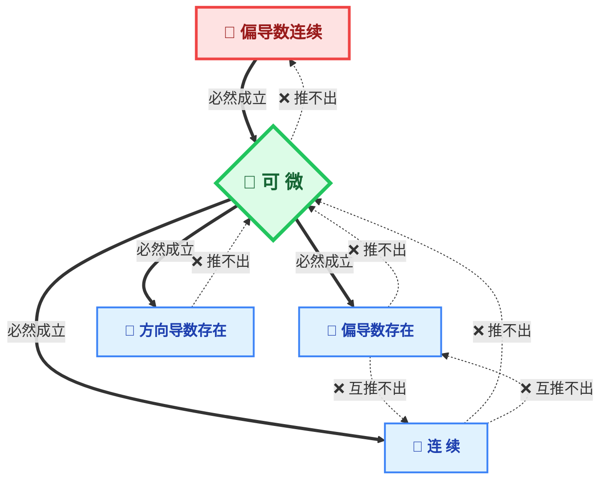

# 曲面法向量的隐函数梯度法推导

在多元微积分和曲面积分中，确定曲面的法向量是计算第一类和第二类曲面积分的核心步骤。对于显式方程 $z = z(x, y)$，利用**隐函数梯度法**可以极快地推导出其法向量 $\vec{n} = (-z_x, -z_y, 1)$。

---

## 梯度垂直于等值面

> [!important] **核心定理**
> 设多元函数 $F(x, y, z)$ 在点 $P$ 处可微，则该函数在该点的梯度向量 $\nabla F(P)$ 垂直于通过该点的等值面 $F(x, y, z) = c$。
> 
> 因此，我们可以把曲面看作是隐函数 $F(x, y, z) = 0$ 的一个等值面，该隐函数的**梯度向量**就是该曲面的**法向量 $\vec{n}$**。

---

## 详细推导步骤

### 第一步：构造隐函数方程
将显式方程 $z = z(x, y)$ 进行简单的移项，使其一侧为 $0$，从而构造出一个三元隐函数方程：
$$F(x, y, z) = z - z(x, y) = 0$$

### 第二步：求各偏导数（梯度的分量）
对构造出的 $F(x, y, z)$ 分别关于 $x, y, z$ 求偏导数：
- **对 $x$ 求偏导**（此时将 $y, z$ 视为常数，运用复合函数求导）：
  $$\frac{\partial F}{\partial x} = \frac{\partial}{\partial x}[z - z(x,y)] = 0 - z_x = -z_x$$
- **对 $y$ 求偏导**（此时将 $x, z$ 视为常数）：
  $$\frac{\partial F}{\partial y} = \frac{\partial}{\partial y}[z - z(x,y)] = 0 - z_y = -z_y$$
- **对 $z$ 求偏导**（此时将 $x, y$ 视为常数）：
  $$\frac{\partial F}{\partial z} = \frac{\partial}{\partial z}[z - z(x,y)] = 1 - 0 = 1$$

### 第三步：组合得到法向量
梯度的定义为各偏导数组成的向量，将其作为分量组合起来，即得到曲面的法向量 $\vec{n}$：
$$\vec{n} = \nabla F = \left( \frac{\partial F}{\partial x}, \frac{\partial F}{\partial y}, \frac{\partial F}{\partial z} \right) = (-z_x, -z_y, 1)$$


## 补充说明：移项方向的影响

如果当年我们在第一步移项时，改写为：
$$F(x, y, z) = z(x, y) - z = 0$$
此时求出的梯度（法向量）则为：
$$\vec{n}' = (z_x, z_y, -1)$$

> [!note] **方向对比与应用**
> - $\vec{n} = (-z_x, -z_y, 1)$：$z$ 分量为正，指向曲面的**上侧**（朝上）。
> - $\vec{n}' = (z_x, z_y, -1)$：$z$ 分量为负，指向曲面的**下侧**（朝下）。
> 
> 在**第一类曲面积分**中，因为面积微元 $\mathrm{d}S = |\vec{n}|\,\mathrm{d}x\mathrm{d}y = \sqrt{z_x^2 + z_y^2 + 1}\,\mathrm{d}x\mathrm{d}y$ 只涉及向量的**模长（平方和开方）**，负号在平方后消失，因此两种移项方式计算出的 $\mathrm{d}S$ 完全相同，标志性的根号因子也由此而来。


# 一、 连续与偏导数的定义

**1. 二元函数的连续性**

设函数 $z = f(x,y)$ 在点 $P_0(x_0, y_0)$ 的某一邻域内有定义。如果当点 $P(x,y)$ 趋于点 $P_0(x_0, y_0)$ 时，函数的极限存在，且等于函数在该点的值，即：

$$\lim_{(x,y) \to (x_0, y_0)} f(x,y) = f(x_0, y_0)$$

则称函数 $f(x,y)$ 在点 $(x_0, y_0)$ 处**连续**。

> **注：** 这里的趋近是指 $P$ 沿**任意路径**趋近于 $P_0$。

**2. 偏导数 (Partial Derivative)**

设函数 $z = f(x,y)$ 在点 $(x_0, y_0)$ 的某一邻域内有定义。固定 $y = y_0$，将 $x$ 视为唯一变量，若极限：

$$f_x(x_0, y_0) = \lim_{\Delta x \to 0} \frac{f(x_0 + \Delta x, y_0) - f(x_0, y_0)}{\Delta x}$$

存在，则称此极限为函数在点 $(x_0, y_0)$ 处对 $x$ 的偏导数。同理可定义对 $y$ 的偏导数 $f_y(x_0, y_0)$。

# 二、 全微分的定义

**可微 (Differentiability)**

设函数 $z = f(x,y)$ 在点 $(x_0, y_0)$ 的某一邻域内有定义。如果函数在该点的全增量 $\Delta z = f(x_0 + \Delta x, y_0 + \Delta y) - f(x_0, y_0)$ 可以表示为：

$$\Delta z = A\Delta x + B\Delta y + o(\rho)$$

其中 $A, B$ 是不依赖于 $\Delta x, \Delta y$ 的常数，$\rho = \sqrt{(\Delta x)^2 + (\Delta y)^2}$，且 $o(\rho)$ 是当 $\rho \to 0$ 时的高阶无穷小，即：

$$\lim_{\rho \to 0} \frac{o(\rho)}{\rho} = 0$$

则称函数 $f(x,y)$ 在点 $(x_0, y_0)$ 处**可微**。$A\Delta x + B\Delta y$ 称为函数在该点的**全微分**，记作 $dz$。

> **等价验证式：** 若函数可微，则必有 $A = f_x(x_0, y_0)$，$B = f_y(x_0, y_0)$。此时验证可微性即验证极限：
> 
> $$\lim_{\rho \to 0} \frac{\Delta z - [f_x(x_0,y_0)\Delta x + f_y(x_0,y_0)\Delta y]}{\rho} = 0$$

# 三、 连续、可导、可微的逻辑链条（核心考点）

对于多元函数，以下性质的推导呈**单向箭头**关系，绝对不可逆：

1. **偏导数连续 $\implies$ 可微** （这是可微的充分条件）
    
    - _定理：_ 若函数 $f(x,y)$ 的偏导数 $f_x$ 和 $f_y$ 在点 $(x_0,y_0)$ 的某邻域内存在，且在点 $(x_0,y_0)$ 处连续，则该函数在该点可微。
        
2. **可微 $\implies$ 偏导数存在** （这是可微的必要条件之一）
    
3. **可微 $\implies$ 函数连续** （这是可微的必要条件之二）
    

**常见反例与易错点：**

- 可微 **推不出** 偏导数连续（存在极度振荡但被“压制”的函数）。
    
- 偏导数存在 **推不出** 函数连续（十字交叉路径极限可能不同）。
    
- 偏导数存在 **推不出** 可微。
    

# 四、 施瓦兹定理 (Schwarz's Theorem)

**内容：**

设函数 $z = f(x,y)$ 在点 $(x_0, y_0)$ 的某一邻域内具有一阶及二阶连续偏导数，即 $f_{xy}$ 和 $f_{yx}$ 均存在且在 $(x_0, y_0)$ 处连续，则在该点必定有：

$$f_{xy}(x_0, y_0) = f_{yx}(x_0, y_0)$$

> **笔记批注：** 该定理保证了在二阶偏导数连续的前提下，混合偏导数的计算结果与求导顺序无关。做极值题计算 $B$ 时，可选择计算量较小的顺序求导。

# 五、 二元函数极值的充分条件 (Hessian 矩阵判定法)

**前提：** 设函数 $z = f(x,y)$ 在点 $P_0(x_0, y_0)$ 的某邻域内具有**连续的二阶偏导数**，且 $(x_0, y_0)$ 为驻点（即 $f_x(x_0, y_0) = 0, f_y(x_0, y_0) = 0$）。

令二阶偏导数在该点的值为：

- $A = f_{xx}(x_0, y_0)$
    
- $B = f_{xy}(x_0, y_0)$
    
- $C = f_{yy}(x_0, y_0)$
    

计算判别式 **$\Delta = AC - B^2$**，则有以下结论：

1. **当 $\Delta > 0$ 时，函数在该点取得极值：**
    
    - 若 **$A < 0$**，则取得**极大值**。
        
    - 若 **$A > 0$**，则取得**极小值**。
        
2. **当 $\Delta < 0$ 时，函数在该点没有极值**（该点为鞍点）。
    
3. **当 $\Delta = 0$ 时，判定方法失效**（需使用定义法或泰勒展开等其他方法另行判断）。


# 球坐标系

## 一、 球坐标系的三大核心参数

在三维空间中，球坐标系通过“一个距离，两个角度”唯一确定一个点 $P(\rho, \theta, \phi)$。

- **$\rho$ (极径)：** 点 $P$ 到原点 $O$ 的直线距离。
    
    - **范围：** $0 \le \rho < +\infty$
        
- **$\phi$ (天顶角)：** 原点到点 $P$ 的向量与 $z$ 轴正方向的夹角。
    
    - **范围：** $0 \le \phi \le \pi$
        
    - > **💡 几何直觉：** 负责“上下通吃”。从北极点 ($0$) 扫到南极点 ($\pi$)，在空间中切出一个半圆形的扇面。
        
- **$\theta$ (方位角)：** 点 $P$ 在 $xy$ 平面上的投影向量与 $x$ 轴正方向的夹角。
    
    - **范围：** $0 \le \theta \le 2\pi$
        
    - > **💡 几何直觉：** 负责“四周包抄”。以 $z$ 轴为门轴，推着 $\phi$ 扫出的半圆扇面旋转整整 $360^\circ$，从而无死角地填满整个三维空间。
        

## 二、 直角坐标与球坐标的转换关系

**1. 球坐标 $\to$ 直角坐标**

记住核心逻辑：先看 $z$ 轴投影，再看水平面投影。

- 水平面 ($xy$ 平面) 的投影半径：$r = \rho \sin\phi$
    
- $z$ 轴的坐标：$z = \rho \cos\phi$
    

将水平半径 $r$ 分解到 $x$ 轴和 $y$ 轴（利用极坐标规律：$x$ 绑 $\cos$，$y$ 绑 $\sin$）：

$$x = \rho \sin\phi \cos\theta$$

$$y = \rho \sin\phi \sin\theta$$

$$z = \rho \cos\phi$$

**2. 直角坐标 $\to$ 球坐标**

$$\rho = \sqrt{x^2 + y^2 + z^2}$$

## 三、 三重积分的体积微元 $dV$ (核心重难点)

在进行坐标代换时，直角坐标的微小长方体 $dV = dx dy dz$ 会变成球坐标下的“弯曲六面体”。

**体积微元公式：**

$$dV = \rho^2 \sin\phi \, d\rho d\theta d\phi$$

> **💡 几何解剖：神秘系数 $\rho^2 \sin\phi$ 是怎么来的？**
> 
> 它是弯曲六面体三个相互垂直的边长相乘的结果：
> 
> 1. **极径方向的边长：** 直接是向外延伸的增量 **$d\rho$**。
>     
> 2. **天顶角方向的弧长：** 半径为 $\rho$ 的大圆上的微小弧长，边长为 **$\rho d\phi$**。
>     
> 3. **方位角方向的弧长 (易错！)：** 水平扫过的弧长。注意它所在的圆面是水平切面，半径不是 $\rho$，而是水平投影半径 $\rho \sin\phi$。因此边长为 **$\rho \sin\phi d\theta$**。
>     
> 
> 三边相乘：$d\rho \cdot (\rho d\phi) \cdot (\rho \sin\phi d\theta) = \rho^2 \sin\phi \, d\rho d\theta d\phi$


> ⚠️ 原图缺失（球坐标体积元示意图，Obsidian 附件未导出）
## 四、 适用场景与实战技巧

在计算三重积分 $\iiint_{\Omega} f(x,y,z) dV$ 时，遇到以下特征应果断切换球坐标：

1. **积分区域 $\Omega$ 包含球面或锥面：**
    
    - 球面：$x^2 + y^2 + z^2 = R^2 \implies \rho = R$
        
    - 圆锥面：$z = \sqrt{x^2+y^2} \implies \phi = \frac{\pi}{4}$ （直接把边界变成了常数！）
        
2. **被积函数含有 $x^2 + y^2 + z^2$：**
    
    - 直接替换为 $\rho^2$，极大地简化积分计算。
        

**实战积分顺序：**

通常采用“先积分 $\rho$，再积分 $\phi$，最后积分 $\theta$”的顺序：

$$\iiint_{\Omega} f(\rho,\theta,\phi) \rho^2 \sin\phi \, d\rho d\phi d\theta$$

# 莱布尼茨判别法 (Leibniz's Test)

## 一、 适用对象：交错级数

必须是正负项严格交替出现的级数，标准形式为：

$$\sum_{n=1}^{\infty} (-1)^{n-1} u_n = u_1 - u_2 + u_3 - u_4 + \dots$$

或者 $\sum_{n=1}^{\infty} (-1)^n u_n$，其中所有的 **$u_n > 0$**。

## 二、 判别条件（定理内容）

若一个交错级数满足以下**两个条件**，则该级数必定**收敛**：

1. **单调递减（步子越迈越小）：**
    
    数列 $\{u_n\}$ 单调不减，即对于任意的 $n$，都有 **$u_n \ge u_{n+1}$**。
    
    _(注：在做题时，通常通过求导证明 $f'(x) < 0$ 来得到这一结论，就像你上一题做的那样，允许从某一项 $N$ 之后才开始递减。)_
    
2. **极限为零（最后停下脚步）：**
    
    一般项的极限趋于零，即 **$\lim_{n \to \infty} u_n = 0$**。
    

> **💡 几何直觉（为什么能收敛？）：**
> 
> 想象你在数轴上走动。
> 
> 第一步：向右走 $u_1$ 的距离。
> 
> 第二步：向左退 $u_2$。因为 $u_2 < u_1$，所以你不会退回到起点。
> 
> 第三步：向右走 $u_3$。因为 $u_3 < u_2$，你不会超过第一步的终点。
> 
> ……
> 
> 你的位置就在两个不断缩小的边界之间来回震荡，因为最后一步的步长趋于 0，所以你最终会被“夹逼”锁定在一个固定的点上（即级数的和 $S$）。

## 三、 余项估计（考研/期末常考的附加考点）

如果一个交错级数满足莱布尼茨条件，我们不仅知道它收敛，还能极其精确地估算它的误差！

假设我们只把前 $n$ 项加起来，记为部分和 $S_n$。用 $S_n$ 去代替整个无穷级数的真实和 $S$，产生的误差（截断误差）的绝对值 $|R_n|$，**严格小于等于被砍掉的第一个项的绝对值**：

$$|S - S_n| \le u_{n+1}$$

_大白话翻译：你砍掉后面的尾巴，造成的误差绝不会超过你没加上的第一项的大小！_

## 四、 易错避坑指南

1. **条件 2 不满足直接判死刑：**
    
    如果发现 $\lim_{n \to \infty} u_n \neq 0$，**不要犹豫，直接判定该级数发散！** （这是根据“级数收敛的必要条件是通项趋于0”得出的定理）。
    
2. **条件 1 不满足怎么办：**
    
    极其罕见的情况下，如果通项趋于 0，但忽大忽小不单调，莱布尼茨法**失效**，级数可能收敛也可能发散，需要用其他高级方法（狄利克雷判别法等），但常规考试极少涉及。
    
3. **莱布尼茨只能判“收敛”，不能判“绝对/条件收敛”：**
    
    莱布尼茨定理得出的是“本身收敛”。要判断是绝对收敛还是条件收敛，必须像你刚才那样，单独去给它**加个绝对值**，用正项级数的方法（比值法、比较法等）再算一遍。
    

# 空间直线方程全解

在三维空间中确定一条直线，最核心的两大数据是：

1. **已知点 $P_0(x_0, y_0, z_0)$**：直线经过的某一个锚点（起点）。
    
2. **方向向量 $\vec{s} = (l, m, n)$**：决定直线走向的向量。
    

## 一、 点向式（对称式）—— 最常用的标准形态

这就是你在上一题中遇到的形式。它直接把“点”和“方向”暴露在明面上，是最直观的方程。

**公式：**

$$\frac{x - x_0}{l} = \frac{y - y_0}{m} = \frac{z - z_0}{n}$$

**如何解读：**

- **看分母**：$l, m, n$ 直接组成了直线的方向向量 $\vec{s} = (l, m, n)$。
    
- **看分子**：让分子全部等于 0，解出来的 $x_0, y_0, z_0$ 就是直线上的已知点 $P_0(x_0, y_0, z_0)$。
    

> **💡 实战回放：**
> 
> 回头看你那道题：$\frac{x-1}{1} = \frac{y}{2} = \frac{z-4}{3}$
> 
> 稍微改写一下中间项，变成标准形态：$\frac{x-1}{1} = \frac{y-0}{2} = \frac{z-4}{3}$
> 
> 一秒提取信息：方向向量 $\vec{s} = (1, 2, 3)$，已知点 $P_0 = (1, 0, 4)$。

_(注：如果某个分母为 0，比如 $l=0$，数学上的默契规定分子也必须为 0，即写成 $x-x_0=0$，代表直线垂直于 $x$ 轴。)

在点向式（对称式）方程里，分母就是方向向量的三个分量 $l, m, n$。当某个分量为 $0$ 时，直线在该坐标轴方向上**没有移动**，所以方程不能按普通分式的写法处理。我们把这里的“相等”理解为**比例关系**：

$$
(x - x_0) : (y - y_0) : (z - z_0) = l : m : n
$$

举个最常出现的例子：$l = 0$，$m, n \neq 0$。方向向量为 $\vec{s} = (0, m, n)$，说明直线**垂直于 $x$ 轴**（在 $x$ 方向上的坐标永远不变）。

**写法规矩：**

我们约定，此时点向式要写成

$$
x - x_0 = 0,\qquad \frac{y - y_0}{m} = \frac{z - z_0}{n}
$$

即原本等于 $l=0$ 的那一项，**分子也必须为 0**，单独列出来变成 $x = x_0$；其余分母不为零的部分照常写成等比分式。

---

这样做的合理性也可以从参数式一眼看出。参数式永远不会出现分母：

$$
\begin{cases}
x = x_0 + 0 \cdot t = x_0 \\
y = y_0 + m t \\
z = z_0 + n t
\end{cases}
$$

因为 $l=0$，$x$ 变成常数 $x_0$，直线的确“卡”在与 $x$ 轴垂直的平面 $x = x_0$ 内。

---

**总结套路：**
- 只要分母是 $0$，就把对应的**分子也设为 $0$**（写成等式），其他部分照常。
- 如果是两个分量为 $0$，比如 $l = m = 0, n \neq 0$，直线平行于 $z$ 轴，方程写成 $x = x_0,\ y = y_0$（$z$ 任意）。
- 做题时，如果担心搞混，**直接转成参数式**最保险，永远不会遇到除零问题。

## 二、 参数式 —— 物理意义最强（动点方程）

点向式虽然直观，但在做“求交点”、“算距离”这种需要代入计算的题目时，分式很难算。这时候就需要“参数式”。

我们令点向式的三个分式等于同一个参数 $t$：

$$\frac{x - x_0}{l} = \frac{y - y_0}{m} = \frac{z - z_0}{n} = t$$

把 $x, y, z$ 单独解出来，就得到了**参数式**：

**$$ \begin{cases} x = x_0 + lt \ y = y_0 + mt \ z = z_0 + nt \end{cases} $$**

**如何解读：**

你可以把 $t$ 想象成“时间”。

- 当 $t=0$ 时，点在初始位置 $P_0(x_0, y_0, z_0)$。
    
- 随着时间 $t$ 增加，点顺着方向向量 $\vec{s}(l, m, n)$ 的方向匀速移动。
    
- 你给定任意一个 $t$ 值，都能立刻算出直线上对应的一个具体坐标。**极度适合代入平面方程求交点！**
    

## 三、 一般式（交面式）—— 最隐蔽的形式

直线是怎么来的？在空间中，**两个不平行的平面相交，交线就是一条直线**。

**公式：**

$$\begin{cases} A_1x + B_1y + C_1z + D_1 = 0 \quad (\text{平面 } \pi_1) \\ A_2x + B_2y + C_2z + D_2 = 0 \quad (\text{平面 } \pi_2) \end{cases}$$

**如何解读与破解：**

这种形式非常“恶心”，因为它把方向向量和已知点全藏起来了。遇到这种方程，我们通常必须把它**转化为点向式**。

转化步骤（俗称“化一般为对称”）：

1. **找方向向量 $\vec{s}$**：因为交线同时在两个平面上，所以交线垂直于两个平面的法向量。计算两平面法向量的**叉乘**即可：$\vec{s} = \vec{n_1} \times \vec{n_2}$。
    
2. **找一个已知点 $P_0$**：令其中一个坐标（通常令 $x=0$ 或 $z=0$），代入原方程组，解出另外两个坐标，凑出一个点。

以下是可直接粘贴到 Obsidian 笔记中的 Markdown 版本。Mermaid 图表由 Obsidian 内置渲染，反例卡片改用 Callout 块，无需外部库或样式。

# 多元函数微分学五大核心关系拓扑图




> [!tip] 读图指南
> 顺着粗实线箭头（往下）走绝对正确，逆着虚线走绝对错误。同级（底层三个）之间无任何关系。

---

## “推不出”的经典反例（打假档案）

> [!warning] 偏导数存在 ❌推不出 连续
> 偏导数只是 x 和 y 轴两条线上的事，管不了其他方向。
>
> **反例函数：**
> ```
> f(x,y) = xy / (x² + y²)
> (在原点补充定义为 0)
> ```
> 在原点偏导数都为 0，但极限不存在（撕裂的阶梯）。

> [!warning] 连续 ❌推不出 偏导数存在
> 函数虽然连在一起，但可能极度尖锐，没有切线。
>
> **反例函数：**
> ```
> f(x,y) = √(x² + y²)
> ```
> 这是一个倒立的圆锥，原点是个锥顶尖点，偏导数（斜率）不存在。

> [!bug] 可微 ❌推不出 偏导数连续
> 某一点完美贴合（可微），但旁边疯狂震荡。
>
> **反例函数：**
> ```
> f(x,y) = (x²+y²)sin(1/√(x²+y²))
> (在原点补充定义为 0)
> ```
> 在原点可微（增量趋于0），但在邻域内偏导数像正弦波一样震荡无极限。

## 偏导数连续 $\implies$ 可微
揭开这个定理的面纱，你会发现它本质上是一个“搭桥过河”的过程。

要弄懂为什么，我们只需要搞清楚两件事：**我们是怎么走到目标点的？** 以及 **连续性在这个过程中充当了什么“救命”的角色？**

### 1. 拆解目标：什么是“可微”？

要证明在 $(x,y)$ 处可微，就是要证明当我们斜向迈出一步（横向走 $\Delta x$，纵向走 $\Delta y$）时，高度的总变化量 $\Delta z$ 可以完美地拆成两部分：

$$\Delta z = [f_x \cdot \Delta x + f_y \cdot \Delta y] + o(\rho)$$

- 前半部分是用中心点 $(x,y)$ 的斜率算出来的“预测高度”（切平面上的高度）。
    
- 后半部分是“极其微小的误差”（比距离 $\rho = \sqrt{\Delta x^2 + \Delta y^2}$ 还要小的高阶无穷小）。
    

### 2. 核心操作：曼哈顿走法（搭桥）

我们要从起点 $(x, y)$ 斜着走到终点 $(x+\Delta x, y+\Delta y)$。

但是我们手里只有偏导数，偏导数只能在平行于坐标轴的方向上使用！怎么办？

**我们不斜着走，我们走“直角”！**

先把 $\Delta z$ 拆成两段路（先横着走，再竖着走）：

$$\Delta z = f(x+\Delta x, y+\Delta y) - f(x,y)$$

**强行在中间塞进去一个过渡点 $(x+\Delta x, y)$：**

$$\Delta z = \underbrace{[f(x+\Delta x, y+\Delta y) - f(x+\Delta x, y)]}_{\text{纵向走（只变 y）}} + \underbrace{[f(x+\Delta x, y) - f(x,y)]}_{\text{横向走（只变 x）}}$$

### 3. 请出救兵：拉格朗日中值定理

既然这两段路都只是**单变量**的变化，我们就可以用一元函数的“拉格朗日中值定理”了（某段路的真实高度差 = 这段路上某个点的真实斜率 $\times$ 走过的距离）。

- **横向走：** 存在一个介于 $x$ 和 $x+\Delta x$ 之间的点 $x_1$，使得：
    
    $$f(x+\Delta x, y) - f(x,y) = f_x(x_1, y) \cdot \Delta x$$
    
- **纵向走：** 存在一个介于 $y$ 和 $y+\Delta y$ 之间的点 $y_1$，使得：
    
    $$f(x+\Delta x, y+\Delta y) - f(x+\Delta x, y) = f_y(x+\Delta x, y_1) \cdot \Delta y$$
    

把它们拼起来，我们得到了真实的高度差：

$$\Delta z = f_x(x_1, y)\Delta x + f_y(x+\Delta x, y_1)\Delta y$$

### 4. 致命危机与“连续性”的救场

你看上面的式子，是不是已经很像可微的公式了？

但是！这里有一个**致命的麻烦**：

我们要的可微公式里，斜率必须是**中心点** $(x,y)$ 的斜率：$f_x(x,y)$ 和 $f_y(x,y)$。

而我们刚刚用拉格朗日算出来的斜率，是**旁边不知名位置**的斜率：$f_x(x_1, y)$ 和 $f_y(x+\Delta x, y_1)$。

**如果偏导数“不连续”会怎样？**

就像我们之前那个撕裂的奇葩函数，中心点斜率是 0，旁边稍微挪一点点，斜率可能突然变成无穷大。这样的话，你用旁边的斜率，根本代表不了中心点的斜率，等式瞬间崩溃，也就不可微了。

**这就是“偏导数连续”闪亮登场的时刻！**

“偏导数连续”意味着：**不管你在中心点周围怎么瞎转悠，只要你离中心点足够近，你的斜率就跟中心点的斜率几乎一模一样！**

因为偏导数连续，并且 $x_1, y_1$ 都在无限逼近 $(x,y)$，所以我们可以把旁边的斜率写成“中心点斜率 + 极小误差”：

- $f_x(x_1, y) = f_x(x,y) + \alpha$ （其中 $\alpha \to 0$）
    
- $f_y(x+\Delta x, y_1) = f_y(x,y) + \beta$ （其中 $\beta \to 0$）
    

### 5. 见证奇迹：完成拼图

把这两个带着“极小误差”的斜率代回刚才的等式：

$$\Delta z = [f_x(x,y) + \alpha]\Delta x + [f_y(x,y) + \beta]\Delta y$$

把它们展开重新分组：

$$\Delta z = \underbrace{f_x(x,y)\Delta x + f_y(x,y)\Delta y}_{\text{我们要的完美切平面增量}} + \underbrace{(\alpha\Delta x + \beta\Delta y)}_{\text{这玩意儿是高阶无穷小吗？}}$$

最后一步，验证尾巴是不是 $o(\rho)$：

$$\left| \frac{\alpha\Delta x + \beta\Delta y}{\rho} \right| \le |\alpha|\frac{|\Delta x|}{\rho} + |\beta|\frac{|\Delta y|}{\rho}$$

因为 $\Delta x$ 和 $\Delta y$ 都不可能超过斜边 $\rho$，所以 $\frac{|\Delta x|}{\rho} \le 1$，$\frac{|\Delta y|}{\rho} \le 1$。

所以误差 $\le |\alpha| + |\beta|$。

当 $\rho \to 0$ 时，根据连续性，$\alpha \to 0, \beta \to 0$。

所以这个尾巴完美地趋于 $0$，它就是名副其实的高阶无穷小 $o(\rho)$！

**大白话总结：**

为什么偏导数连续就能推出可微？

因为可微需要我们用**中心点**的斜率去预测周围的高度。拉格朗日中值定理帮我们搭了桥，但找来的却是**周围点**的斜率。只有当偏导数**连续**时，周围点的斜率才不会发疯，才能平滑地等同于中心点的斜率。这块平坦的“切平面”才算是真正建成了！


# 一阶全微分形式不变性原理

在隐函数求导时，我们敢于直接“对等式两边同时求全微分”，其背后由两层核心逻辑支撑：

## 一、 最朴素的直觉：等式两边的“同频共振”

假设有一个方程 $F(x,y,z) = C$（比如本题的 $e^{x+2y+3z} + xyz = 1$）。

这个方程的意义是：无论变量 $x, y, z$ 在空间中怎么变化，只要它们还满足这个等式，整个左边的计算结果就永远等于右边的常数 $1$。 既然等式两边永远**绝对相等**，那么当变量发生极微小的变化时，两边产生的**增量（微分）也必须绝对相等**。即：

$$d\left(F(x,y,z)\right) = d(C)$$

因为常数没有任何变化，它的微小增量为 0，所以必然有：$dF = 0$。

## 二、 核心魔法：什么是“一阶微分形式不变性”？

这才是我们这一步操作的“最高护身符”。

### 1. 常规认知（自变量的微分）

假如有一个函数 $u = f(x,y,z)$，且 $x, y, z$ 是三个完全独立、互不影响的**自变量**。 那么 $u$ 的全微分公式非常简单：

$$du = f_x dx + f_y dy + f_z dz$$

### 2. 颠覆认知（复合函数的微分）

现在情况变了。在隐函数 $F(x,y,z) = 0$ 中，$x, y, z$ 不是完全独立的！通常 $x, y$ 是自变量，而 $z$ **是受它们控制的因变量（即** $z = z(x,y)$**）**。 按照常理，既然变量关系变得这么复杂（出现了嵌套），算微分的时候是不是得用复杂的链式法则重新推导一套公式？

**伟大的数学定理告诉我们：不需要！** 就算 $z$ 是因变量，甚至就算 $x,y,z$ 全都是由另一个时间变量 $t$ 控制的中间变量，上面那个公式：

$$du = f_x dx + f_y dy + f_z dz$$

依然绝对成立！

### 3. 什么是“形式不变”？

一句话总结：**我们在写微分公式时，根本不需要去管** $x, y, z$ **到底谁是高高在上的自变量，谁是受人控制的因变量！大家一视同仁！** 全微分的“外观形式”永远保持原样。这就叫“一阶全微分形式不变性”。

## 三、 它是怎么秒杀“隐函数求导”的？

回到你的题目方程：$F(x,y,z) = e^{x+2y+3z} + xyz - 1 = 0$。

如果你用传统方法求 $\frac{\partial z}{\partial x}$，你必须时刻在脑子里绷紧一根弦：“对 $x$ 求导时，$x$ 是变量，$y$ 是常数，但遇到 $z$ 的时候，必须把 $z$ 当成复合函数，后面要记得乘一个 $z'_x$”。这极其容易漏掉项或者算错正负号。

**但有了“形式不变性”，一切都降维了：** 我们**不管三七二十一**，把 $x, y, z$ 当成三个平起平坐的独立变量，直接对 $F(x,y,z)$ 粗暴地写出全微分展开式：

$$F_x dx + F_y dy + F_z dz = 0$$

你看，这瞬间把一个复杂的“复合偏微积分问题”**，降维打成了初中生都会解的**“解一次方程问题”！ 只要你算出具体的表达式（就像上一题我们算出的 $dx + 2dy + 3dz = 0$），这就变成了一个极其简单的代数关系。 你想求 $dz$，就把 $dz$ 留在一边，其他的移项过去除一下就行了。

> **💡 终极领悟：** 教科书上的隐函数求导公式：$\frac{\partial z}{\partial x} = -\frac{F_x}{F_z}$ 和 $\frac{\partial z}{\partial y} = -\frac{F_y}{F_z}$。 其实就是从 $F_x dx + F_y dy + F_z dz = 0$ 里面，通过简单移项推导出来的而已。记住这个本质，你以后再也不用背那个带负号的隐函数公式了！

# 关于收敛区域的直观理解

通过观察 $f(x) = \frac{1}{1-x}$ 的图像，我们不仅能“看到”上一节提到的收敛区间，还能揭开高等数学中一个非常高级且迷人的概念：**解析延拓（Analytic Continuation）**。
### 1. “奇点”是一堵不可逾越的物理墙

看图像上 $x=1$ 的位置。蓝色的真实函数在那里有一个**垂直渐近线**（它冲向了无穷大）。在数学上，这个点叫作“奇点（Singularity）”。

幂级数 $\sum x^n$ 是从原点 $x=0$ 开始，向两边慢慢“生长”去贴合原函数的。当它向右生长到 $x=1$ 时，它“砰”地撞上了这堵垂直的墙。它无法越过这堵墙去描绘墙后面的世界，因此，**奇点到展开中心（原点）的距离，直接决定了收敛半径！** 这里距离是 1，所以收敛半径 $R=1$。

### 2. 对称性的“连坐”机制（为什么左边也停在了 -1？）

你再看图像的左边。原函数在 $x=-1$ 处非常平滑，函数值完美地等于 $\frac{1}{2}$（即 $\frac{1}{1 - (-1)}$），那里既没有断层也没有渐近线。

**但是，幂级数走到 $x=-1$ 时，却因为“动力耗尽”而开始发散（红线疯狂上下震荡）。**

为什么？因为**幂级数的收敛域必然是一个以展开点为中心的完美对称圆（或对称区间）**。既然它在右边 $x=1$ 处撞了墙，由于对称性，它在左边也最多只能走到 $x=-1$。左边的安全区是被右边的墙强行限制住的！

### 3. 解析延拓（上帝视角 vs 凡人视角）

这个图像完美诠释了什么是局部，什么是整体：

- **级数 $\sum_{n=0}^{\infty} x^n$ 就像是盲人摸象。** 它站在 $x=0$ 的位置，用泰勒展开的手段拼命去感受周围的形状。但受限于它的视力（收敛半径），它只能看到 $(-1, 1)$ 这个狭小区间内的风景。出了这个区间，它的感知彻底错乱（发散）。
    
- **函数 $f(x) = \frac{1}{1-x}$ 是上帝视角。** 这个简洁的公式描述了这条曲线贯穿整个宇宙（除了 $x=1$）的全貌。
    

把一个只能在局部起作用的级数表达式，通过数学法则“升维”成一个在全域都有意义的函数表达式（从 $\sum x^n$ 变成 $\frac{1}{1-x}$），这就叫作**解析延拓**。

**这就是图像告诉我们的终极秘密**：你之前在纸上算的收敛区间 $(-1, 1)$，不是数学家凭空捏造的规定，而是级数在逼近真相时，被 $x=1$ 处的悬崖无情逼停的必然结果。


<iframe src="file:///E:\2026obsidian笔记\2026\code_artifact (1).html" width="100%" height="600"></iframe>


# 两类曲面积分的联系
实际上，**这两类积分在物理本质和数学底层上是完全打通的，它们之间只差了一个“内积（点乘）”的桥梁。**

为了让你不仅在公式上懂，还能在直觉上“看”到它们是如何相互转换的，我为你准备了一个“穿透力”可视化探测仪。在操作之前，我们先用最通俗的大白话给它们“画个像”。

### 1. 两类积分的物理大白话

- **第一类曲面积分（对面积的积分）：** 就像是“给墙刷漆”。
    
    - 函数 $f(x,y,z)$ 代表每一处的**油漆厚度**（或者密度）。它是一个**标量**（只有大小，没有方向）。
        
    - 积分 $\iint_{\Sigma} f \, dS$ 算出来的，就是这面墙上总共消耗的**油漆质量**。
        
    - _特点：这面墙你从哪面看它、法向量朝哪，完全不影响油漆的质量。它与方向无关。_
        
- **第二类曲面积分（对坐标的积分）：** 就像是“风吹过渔网”。
    
    - 函数 $\mathbf{F}(P, Q, R)$ 代表每一处风的**流速**。它是一个**矢量**（既有大小，又有方向）。
        
    - 积分 $\iint_{\Sigma} \mathbf{F} \cdot d\mathbf{S}$ 算出来的，是单位时间内穿过这张渔网的总空气量（**通量**）。
        
    - _特点：风往东刮和往西刮，或者渔网正着摆和斜着摆，穿过网的风量是完全不同的！它强烈依赖于方向。_
        

### 2. 见证奇迹的时刻：它是如何转换的？

第二类积分（矢量）是如何退化成第一类积分（标量）的？秘密就在于：**风只有垂直吹向渔网的部分，才能穿过去！**


### 3. 公式上的完美大一统

通过刚才的互动，你应该发现了核心逻辑：

如果你把风速 $\mathbf{F}$ 强行投影到渔网的垂直方向（法向量 $\mathbf{n}$）上，你会得到一个纯粹的数值：**$\mathbf{F} \cdot \mathbf{n}$**（有效穿透流速）。

一旦变成了纯数值（标量），这就回到了“刷油漆”的逻辑！这面网上每一点的“油漆厚度”，刚好就等于当地的“有效穿透流速”。

把这个过程写成终极公式，就是这两类积分的**联系定理**：

$$\iint_{\Sigma} \mathbf{F} \cdot d\mathbf{S} = \iint_{\Sigma} (\mathbf{F} \cdot \mathbf{n}) \, dS$$

_(左边是第二类积分，右边是第一类积分)_

如果把向量拆解成坐标分量来看，会更加震撼：

设风速场 $\mathbf{F} = (P, Q, R)$

设渔网的单位法向量 $\mathbf{n} = (\cos\alpha, \cos\beta, \cos\gamma)$ （这三个余弦叫作方向余弦）

那么它们的点乘就是：

$\mathbf{F} \cdot \mathbf{n} = P\cos\alpha + Q\cos\beta + R\cos\gamma$

代入上面的大一统公式，就得到了教材上要求背诵的那个长篇大论：

$$\iint_{\Sigma} P \, dydz + Q \, dzdx + R \, dxdy = \iint_{\Sigma} (P\cos\alpha + Q\cos\beta + R\cos\gamma) \, dS$$

### 终极总结

- **遇到第一类积分（$dS$ 结尾）**：直接代入方程算面积/质量，不用管曲面的正反面。
    
- **遇到第二类积分（$dydz$ 结尾）**：其实它就是在第一类积分的被积函数里，**悄悄塞进了一个代表方向的“法向量 $\mathbf{n}$”**。所以在计算时，曲面取上侧还是下侧（法向量的正负号），将会直接决定最终结果的正负！

### 如何求$\cos\alpha, \cos\beta, \cos\gamma$ 

在微积分里，求 $\cos\alpha, \cos\beta, \cos\gamma$ 的本质，就是求这个曲面的**单位法向量 $\mathbf{n}$ 的三个坐标分量**。

我们分最常见的两种题型来拿捏它：

### 题型一：曲面方程是隐函数形式 $F(x,y,z) = 0$

（比如球面 $x^2+y^2+z^2-R^2=0$）

**第 1 步：求偏导，得到“法向量”**

分别对 $x, y, z$ 求偏导，这就构成了曲面的法向量（也叫梯度）：

$$\mathbf{N} = (F_x, F_y, F_z)$$

**第 2 步：求出法向量的“长度”**

用勾股定理求出这个向量的模长：

$$|\mathbf{N}| = \sqrt{F_x^2 + F_y^2 + F_z^2}$$

**第 3 步：归一化（除以长度），得到公式**

把法向量的每个坐标除以它的长度，就得到了这三个方向余弦：

$$\cos\alpha = \pm \frac{F_x}{\sqrt{F_x^2 + F_y^2 + F_z^2}}$$

$$\cos\beta = \pm \frac{F_y}{\sqrt{F_x^2 + F_y^2 + F_z^2}}$$

$$\cos\gamma = \pm \frac{F_z}{\sqrt{F_x^2 + F_y^2 + F_z^2}}$$

_(注：前面的 $\pm$ 号由题目决定的曲面方向来定，比如题目说“取外侧”或“取右侧”，你需要观察哪个正负号能满足题意。)_

### 题型二：曲面方程是显函数形式 $z = z(x,y)$ （考试最常考！）

（比如抛物面 $z = x^2 + y^2$）

这是题型一的特殊情况。我们可以人为把它移项，凑成隐函数：$F(x,y,z) = z(x,y) - z = 0$。

套用上面的三步走，你会直接得到一个极度精简的**终极背诵公式**：

因为 $F_x = z_x$， $F_y = z_y$， $F_z = -1$。

所以：

$$\cos\alpha = \pm \frac{z_x}{\sqrt{z_x^2 + z_y^2 + 1}}$$

$$\cos\beta = \pm \frac{z_y}{\sqrt{z_x^2 + z_y^2 + 1}}$$

$$\cos\gamma = \pm \frac{-1}{\sqrt{z_x^2 + z_y^2 + 1}}$$

### 💡 举个实战例子（秒懂正负号怎么取）

假设曲面是 $z = x^2 + y^2$，题目要求**取上侧**，求 $\cos\alpha$。

1. **算偏导：**
    
    $z_x = 2x$
    
    $z_y = 2y$
    
2. **算分母（长度）：**
    
    $\sqrt{z_x^2 + z_y^2 + 1} = \sqrt{4x^2 + 4y^2 + 1}$
    
3. **套公式写出结果：**
    
    $\cos\alpha = \pm \frac{2x}{\sqrt{4x^2 + 4y^2 + 1}}$
    
    $\cos\gamma = \pm \frac{-1}{\sqrt{4x^2 + 4y^2 + 1}}$
    
4. **定正负号（最关键的一步）：**
    
    题目说“**取上侧**”，意思是法向量是朝上指的，也就是 $z$ 轴分量必须是正的。
    
    这就要求 $\cos\gamma > 0$。
    
    但是我们算出来的 $\cos\gamma$ 的分子是 $-1$（负数），为了让整个式子变成正的，我们**必须取前面的负号**（负负得正）！
    
    既然整体决定了取负号，那么 $\cos\alpha$ 也得跟着取负号。
    

所以最终答案：

$$\cos\alpha = -\frac{2x}{\sqrt{4x^2 + 4y^2 + 1}}$$

总结一下：**求偏导 $\rightarrow$ 平方和开根号做分母 $\rightarrow$ 看题目要求的朝向决定正负号。** 就这么机械化三步！


# 🟢 格林公式 (Green's Theorem) 考场通关秘籍

## 一、 核心公式与物理直觉

**【公式本体】** 设闭区域 $D$ 由分段光滑的正向闭曲线 $L$ 围成，若 $P(x,y), Q(x,y)$ 在 $D$ 上具有连续的一阶偏导数，则有：

$$\oint_L Pdx + Qdy = \iint_D \left( \frac{\partial Q}{\partial x} - \frac{\partial P}{\partial y} \right) dxdy$$

**【三大核心要素（缺一不可）】**

1. **封闭：** 曲线 $L$ 必须是围成一圈的闭合曲线。
    
2. **正向：** 沿着曲线走，积分区域 $D$ 必须始终在你的**左手边**（通常外圈是逆时针，内圈是顺时针）。如果是顺时针，前面记得加个负号 `-`。
    
3. **无奇点（连续性）：** 偏导数在区域 $D$ 内必须处处存在且连续！**只要有分母为0的点（奇点）落在** $D$ **内，公式直接失效！**
    

**【物理直觉】** 宏观上的总环流（左边的边界积分） = 微观上所有小漩涡“旋度”的总和（右边的面积分）。

## 二、 考场三大标准战术 (SOP)

拿到一道第二类曲线积分题 $\int_L Pdx + Qdy$，请严格按以下分支执行：

### ⚔️ 战术一：直接套用（最基础）

- **触发条件：** 曲线 $L$ 封闭，且内部没有任何奇点。
    
- **执行动作：** 1. 检查方向，顺时针就在积分前添负号。 2. 计算 $\frac{\partial Q}{\partial x} - \frac{\partial P}{\partial y}$。 3. 化为二重积分计算。很多时候算出来是个常数 $C$，答案直接就是 $C \times (\text{区域 D 的面积})$。
    

### ⚔️ 战术二：补线法（专治“不封闭”）

- **触发条件：** 曲线 $L$ 不封闭（比如只是一个半圆弧，或者一段抛物线），且内部无奇点。
    
- **执行动作：**
    
    1. 添加一条最简单的辅助线 $L_1$（通常是沿 $x$ 轴、$y$ 轴或直线），使 $L + L_1$ 构成封闭回路。
        
    2. 对整个封闭回路用格林公式：$\int_{L + L_1} = \iint_D$。
        
    3. 移项求原积分：$\int_L = \iint_D - \int_{L_1}$。 _(注：辅助线_ $L_1$ _上的积分通常极其好算，因为一般都有_ $dx=0$ _或_ $dy=0$ _或_ $y=0$_)_。
        

### ⚔️ 战术三：挖洞法（专治“内部有奇点”）

- **触发条件：** 曲线 $L$ 封闭，但被积函数的分母在 $D$ 内部有零点（最常见的是原点 $(0,0)$）。
    
- **执行动作：**
    
    1. **不能**直接对大区域用格林公式！
        
    2. 在奇点周围，用一条极小的顺时针闭曲线 $l$（通常是极小的圆 $x^2+y^2=\varepsilon^2$ 或椭圆）把奇点“挖掉”。
        
    3. 此时在 $L$ 和 $l$ 围成的圆环区域内，没有奇点，格林公式成立。
        
    4. 对于很多题目，偏导数刚好满足 $\frac{\partial Q}{\partial x} = \frac{\partial P}{\partial y}$，导致二重积分部分为 0。
        
    5. 结论瞬间转化为：**外圈积分 = 内圈积分** 即 $\oint_L = \oint_{l_{逆时针}}$。
        
    6. 把小圆/小椭圆的参数方程代入计算即可。_(这就是我们刚刚做过的那道题的套路！)_
        

## 三、 格林公式的两个神级“副产品”

### 🌟 神技 1：巧求平面面积

如果令 $P = -y, Q = x$，那么 $\frac{\partial Q}{\partial x} - \frac{\partial P}{\partial y} = 1 - (-1) = 2$。 代入格林公式：

$$\oint_L -ydx + xdy = \iint_D 2 dxdy = 2A$$

所以，任意封闭曲线围成的面积公式为：

$$A = \frac{1}{2} \oint_L xdy - ydx$$

当题目给你一个极其复杂的参数方程（如星形线、叶形线），让你求面积，直接套这个公式！

### 🌟 神技 2：路径无关与恰当方程

如果在整个区域内，算出来 $\frac{\partial Q}{\partial x} - \frac{\partial P}{\partial y} \equiv 0$。 那么在这个区域里：

1. 任何闭合曲线积分都为 0。
    
2. 积分与路径无关（可以直接换成折线走）。
    
3. 表达式是全微分 $du = Pdx + Qdy$（可以用偏积分求原函数）。 _(这就是我们之前讨论的“微积分四位一体”大一统定理)_
# 高斯公式
## 1. 高斯公式的本质：降维打击

高斯公式的精髓在于它建立了一个连接：**封闭曲面上的“通量” = 封闭立体内的“源/汇总量”**。

- **直观理解：** 如果你把封闭曲面 $\Sigma$ 看作一个渔网，把向量场 $\mathbf{F}$ 看作流动的风，那么 $\iint_{\Sigma} \mathbf{F} \cdot d\mathbf{S}$ 就是单位时间内通过渔网的总风量（通量）。而高斯公式告诉我们，这个总风量等于立体内部每一个点产生的（或消耗的）风量的总和（即散度的体积分）。
    

## 2. 核心公式（标准形态）

设 $\Omega$ 为空间闭区域，$\Sigma$ 是 $\Omega$ 的边界曲面，取外侧。若 $P, Q, R$ 及其偏导数在 $\Omega$ 上连续，则：

$$\oiint_{\Sigma} P \, dydz + Q \, dzdx + R \, dxdy = \iiint_{\Omega} \left( \frac{\partial P}{\partial x} + \frac{\partial Q}{\partial y} + \frac{\partial R}{\partial z} \right) dV$$

> **关键点：**
> 
> - **$\oiint$：** 积分号上的圆圈必须是**封闭曲面**，如果题目给的是“开口”曲面，必须强制“补面”。
>     
> - **外侧：** 必须取曲面的**外侧**，如果题目给的是内侧，计算结果要变号。
>     
> - **散度：** $\nabla \cdot \mathbf{F} = \frac{\partial P}{\partial x} + \frac{\partial Q}{\partial y} + \frac{\partial R}{\partial z}$。这是将复杂的曲面积分化简为体积分的“魔法开关”。
>     

## 3. 必考的“套路”技巧

### ① 补面法（针对开口曲面）

如果题目给的 $\Sigma$ 不封闭（例如抛物面、球面的一部分），不能直接用高斯公式。

- **操作：** 自己加一个平面的“盖子” $\Sigma_1$，使得 $\Sigma + \Sigma_1$ 封闭。
    
- **逻辑：** $\oiint_{\Sigma+\Sigma_1} = \iiint_{\Omega} \text{div} \mathbf{F} \, dV$
    
- **求解：** 最终要求的 $I_{\Sigma} = \iiint_{\Omega} \text{div} \mathbf{F} \, dV - I_{\Sigma_1}$
    

### ② 挖洞法（针对奇点问题）

如果向量场 $\mathbf{F}$ 在区域内部有一个点（奇点）没有定义（比如 $\mathbf{F} = \frac{\mathbf{r}}{r^3}$ 在原点不连续），则不能直接套用高斯公式。

- **操作：** 在奇点处挖一个小球体，利用内外曲面法向量相反的性质，将不规则奇点处理掉。
    

## 4. 判别准则：什么时候该用高斯公式？

在考场上，当你看到以下情况时，应立刻联想到高斯公式：

1. **闭合曲面：** 看到 $\oiint$ 记号，或者题目明确说是“封闭曲面”。
    
2. **散度极简：** 先一眼扫一下 $\frac{\partial P}{\partial x} + \frac{\partial Q}{\partial y} + \frac{\partial R}{\partial z}$。如果算出来是常数（比如 $1, 3, 2z$），那高斯公式几乎一定是最优解，因为体积分会变得极其好算。
    
3. **曲面极其复杂：** 如果曲面方程非常复杂，但围成的区域 $\Omega$ 比较规整（如球体、柱体），用体积分处理空间区域往往比在曲面上投影简单得多。
    

## 5. 易错点排雷（考场自救指南）

- **符号陷阱：** 永远检查曲面法向量的方向。题目给的是内侧，必须加负号。补面 $\Sigma_1$ 的法向量必须指向封闭体的外部。
    
- **顺序陷阱：** 再次提醒，标准的 $P, Q, R$ 对应的是 $dydz, dzdx, dxdy$。如果题目乱写（如 $\int (x-y)dxdy + \dots$），**一定要重新调整顺序，千万不要直接对着下标求导！**
    
- **偏导数计算：** 如果 $P, Q, R$ 包含复杂的三角函数，计算散度时极其容易出错，写出来之后再核对一次。
    

**给你的建议：**

如果你遇到一道题，感觉直接算第二类曲面积分要投影好几次，且还要处理复杂的根式，**马上画图补面，上高斯公式**。它通常是解决“计算地狱”的最佳解药。

#  **斯托克斯公式（Stokes' Formula）** 
## 1. 核心公式（“环流-旋度”定理）

斯托克斯公式将**沿着闭合曲线的线积分**转化为**该曲线所围曲面上的旋度积分**。

$$\oint_{\partial \Sigma} Pdx + Qdy + Rdz = \iint_{\Sigma} \left( \frac{\partial R}{\partial y} - \frac{\partial Q}{\partial z} \right) dydz + \left( \frac{\partial P}{\partial z} - \frac{\partial R}{\partial x} \right) dzdx + \left( \frac{\partial Q}{\partial x} - \frac{\partial P}{\partial y} \right) dxdy$$

- **直观理解：** 曲线的环流（边缘的转动强度）等于曲面上所有微小涡旋（旋度）的叠加。
    
- **旋度算子（Curl）：** 积分右侧的三项正是旋度 $\text{rot} \, \mathbf{F} = \nabla \times \mathbf{F}$ 的三个分量。
    

## 2. 关键法则：右手定则（极重要！）

斯托克斯公式的成立，严格依赖于**曲线 $L$ 的方向**与**曲面 $\Sigma$ 的法向量方向**满足右手定则：

- **右手定则判断：** 右手四指弯曲方向顺着曲线积分路径 $L$ 的方向，大拇指所指的方向就是曲面 $\Sigma$ 必须选取的**法向量 $\vec{n}$ 方向**（即正侧）。
    
- **注意：** 如果题目指定的曲线方向与曲面法向量不符合右手定则，积分结果需要手动添加一个负号。
    

## 3. 必考的“套路”技巧

### ① 构造“好算”的曲面（偷换面法）

这是斯托克斯公式最强大的地方！公式的核心在于：**只要边界曲线 $L$ 不变，无论你用什么形状的曲面 $\Sigma$ 盖住它，积分值都是一样的。**

- **操作：** 如果题目给的曲线 $L$ 形状奇特，或者对应的曲面很难积分，你可以直接构造一个最简单的曲面（例如平铺在 $xy$ 平面上的圆片）来代替它。
    

### ② 与路径无关的判定（降维版）

如果旋度 $\nabla \times \mathbf{F} = 0$（即 $\frac{\partial R}{\partial y} = \frac{\partial Q}{\partial z}, \frac{\partial P}{\partial z} = \frac{\partial R}{\partial x}, \frac{\partial Q}{\partial x} = \frac{\partial P}{\partial y}$），则该积分在单连通区域内与路径无关。此时：

- 可以直接选择最简单的路径（如折线路径）计算。
    
- 也可以直接寻找原函数 $u(x, y, z)$，计算 $u(B) - u(A)$。
    

## 4. 什么时候该用斯托克斯公式？

1. **线积分算不动时：** 当曲线 $L$ 的参数化非常麻烦，或者线积分函数难以直接积分时。
    
2. **由“线”转“面”：** 题目明确给出的是空间闭合曲线，或者要求算环流（Circulation）。
    
3. **旋度运算简便：** 如果计算旋度 $\nabla \times \mathbf{F}$ 后，结果变得非常简单（例如常数或简单的多项式），那斯托克斯公式就是最优选择。
    

## 5. 易错点排雷（考场避坑）

- **非闭合曲线陷阱：** 斯托克斯公式**只能处理闭合曲线**。如果曲线不闭合，你需要自己加一段线段把曲线闭合起来，用“补线法”，最后再减去你补的那段积分。
    
- **法向量选取：** 务必在草稿纸上画一下曲线方向和法向量方向，确认是否符合右手定则。
    
- **单位法向量书写：** 确保代入公式的 $\cos \alpha, \cos \beta, \cos \gamma$ 与你选取的侧面相对应。
    

**学习建议：**

斯托克斯公式其实就是格林公式（Green's Formula）的三维推广。你可以把格林公式看作是斯托克斯公式在 $xy$ 平面上的特例。理解了这一点，你的知识体系就打通了！

# 微积分的统一大一统定律”。

### 1. 大一统的核心逻辑：边界 = 内部的累积

所有的这些公式（牛顿-莱布尼茨、格林、斯托克斯、高斯）本质上都是一句话：

**“区域边界上的效应，等于区域内部微观变化的累积。”**

| **公式**      | **维度** | **边界**          | **内部**                                                                    |     |
| ----------- | ------ | --------------- | ------------------------------------------------------------------------- | --- |
| **牛顿-莱布尼茨** | 1D     | 端点 ($b, a$)     | 导数 ($f'$)                                                                 |     |
| **格林公式**    | 2D     | 闭合曲线 ($L$)      | 旋度的二维投影 ($\frac{\partial Q}{\partial x} - \frac{\partial P}{\partial y}$) |     |
| **斯托克斯公式**  | 3D     | 闭合曲线 ($L$)      | 旋度在曲面上的累积 ($\nabla \times \mathbf{F}$)                                    |     |
| **高斯公式**    | 3D     | 封闭曲面 ($\Sigma$) | 散度在立体内的累积 ($\nabla \cdot \mathbf{F}$)                                     |     |

### 2. 格林公式：斯托克斯的二维“降维版”

格林公式是斯托克斯公式在平面上的投影。你完全可以把格林公式理解为：**把一个平面的“网”铺在 $xy$ 平面上，斯托克斯公式就退化成了格林公式。**

- **格林公式：** $\oint_{L} Pdx + Qdy = \iint_{D} \left( \frac{\partial Q}{\partial x} - \frac{\partial P}{\partial y} \right) dxdy$
    
- **斯托克斯公式：** $\oint_{L} Pdx + Qdy + Rdz = \iint_{\Sigma} \text{rot} \, \mathbf{F} \cdot d\mathbf{S}$
    

当曲面 $\Sigma$ 退化到 $xy$ 平面上时，法向量变成了 $\vec{k}=(0,0,1)$，此时旋度的 $z$ 分量（$\frac{\partial Q}{\partial x} - \frac{\partial P}{\partial y}$）正好就是格林公式的被积函数。

### 3. 大一统笔记：考试避坑与逻辑串联

为了帮你在大脑中建立牢固的连接，请记住这张“解题决策树”：

#### 场景一：看到闭合曲线 $L$

- **能用格林公式吗？** 如果是在平面上，且 $L$ 是闭合的，直接冲。
    
- **能用斯托克斯公式吗？** 如果是空间曲线，必须先确认它是闭合的，如果不闭合，先“补线”使之闭合。
    

#### 场景二：看到闭合曲面 $\Sigma$

- **能用高斯公式吗？** 必须闭合！如果不闭合，先“补面”使之闭合。
    
- **为什么要用它？** 因为体积分（散度）往往比曲面积分（通量）好算得多。
    

#### 场景三：判定与路径无关

- **平面内：** $\frac{\partial P}{\partial y} = \frac{\partial Q}{\partial x}$ $\iff$ 格林公式的右边等于 0 $\iff$ 与路径无关。
    
- **空间中：** $\nabla \times \mathbf{F} = 0$ $\iff$ 斯托克斯公式的右边等于 0 $\iff$ 与路径无关。
    

### 4. 终极心法：如何一眼识破“统一性”？

所有的公式右边都是一个“算子”对函数的运算：

- **牛顿-莱布尼茨：** 对 $f(x)$ 作用导数 $D$。
    
- **格林/斯托克斯：** 对向量场 $\mathbf{F}$ 作用旋度 $\text{curl}$（$\nabla \times$）。
    
- **高斯：** 对向量场 $\mathbf{F}$ 作用散度 $\text{div}$（$\nabla \cdot$）。
    

**总结：**

如果你在解题时感到迷茫，问自己三个问题：

1. **这是在处理边界吗？** （如果是，想线积分/面积分）
    
2. **这是在处理内部吗？** （如果是，想旋度/散度/体积分）
    
3. **维数对得上吗？** （2D 闭线配旋度投影，3D 闭面配散度体积）
    

只要掌握了这套逻辑，不管题目怎么变，你都能一眼看出它到底是在考哪一个公式的“变体”。这就是数学逻辑大一统的力量！


# 幂级数
### 一、 彻底看透“加括号陷阱”

要理解这个陷阱，我们必须回到级数收敛的**绝对核心定义**：

级数 $\sum u_n$ 收敛，等价于它的**部分和数列** $S_n = u_1 + u_2 + \dots + u_n$ 存在一个极限 $S$。

你可以把“部分和数列 $S_n$”想象成你在写算法题时极其常用的**前缀和数组**。级数收敛，就是这个前缀和数组走到最后，稳定在了一个固定的常数上，不再剧烈波动。

**1. 为什么“加括号后收敛，原级数不一定收敛”？**

看这个经典的格兰迪级数（Grandi's series）：$1 - 1 + 1 - 1 + 1 - 1 \dots$

我们来跑一下它的前缀和 $S_n$：

- $S_1 = 1$
    
- $S_2 = 1 - 1 = 0$
    
- $S_3 = 1 - 1 + 1 = 1$
    
- $S_4 = 0$
    
    它的前缀和数组是：`[1, 0, 1, 0, 1, 0...]`。它在 0 和 1 之间永远横跳，无法稳定下来，所以**原级数发散**。
    

但是，如果你给它加括号：$(1 - 1) + (1 - 1) + (1 - 1) \dots$

这等于强行把原本的项打包成了新项 $0 + 0 + 0 \dots$

此时新的前缀和变成了：`[0, 0, 0...]`。它极其稳定，所以**加括号后的新级数收敛**。

- **本质原因：** 加括号，等同于在原来的前缀和数组里**跳跃式地抽样**（比如只看 $S_2, S_4, S_6$）。抽出来的子序列可能收敛，但掩盖不了原序列在抽样点之间剧烈震荡的事实。
    

**2. 为什么“原级数收敛，加括号后一定收敛且和不变”？**

这就好比，如果你的整个前缀和数组 $S_n$ 最终已经死死地趋近于某一个确定的值（比如 $3.14$），那么不管你怎么跳跃式地去抽样（无论你怎么加括号打包），你抽出来的结果一定也是无限逼近 $3.14$ 的。大部队都已经稳定了，里面随便怎么分组，最终结果都不会变。

### 二、 积分审敛法 (The Integral Test)：离散与连续的降维打击

当你面对一个正项级数 $\sum u_n$，比值法失效（$\rho=1$），比较判别法又找不到合适的“标尺”时，就可以祭出积分审敛法了。

这个方法的本质是：**用一条连续的平滑曲线，去罩住离散的矩形面积。**

**1. 发动该技能的三个严苛条件：**

假设我们要判断级数 $\sum_{n=1}^{\infty} f(n)$ 的敛散性，你必须先证明函数 $f(x)$ 在 $[1, +\infty)$ 上满足：

- **连续 (Continuous)：** 曲线不能断开。
    
- **非负 (Positive)：** 曲线必须在 $x$ 轴上方。
    
- **单调递减 (Decreasing)：** 曲线必须一路往下走。
    

**2. 核心结论：**

如果满足上述三个条件，那么：

**无穷级数 $\sum_{n=1}^{\infty} f(n)$ 与广义积分 $\int_{1}^{+\infty} f(x) \, dx$ 同敛散！**

- **几何直觉：** 如果你把级数的每一项 $u_n$ 看作是宽度为 1、高度为 $u_n$ 的小矩形的面积。那么级数的总和，就是这些离散矩形面积的总和。因为曲线是单调递减的，你可以用这条平滑曲线从上方压住这些矩形（或者从下方托住）。既然它们被紧紧绑定在一起，那么曲线下的面积（积分）如果是有限的（收敛），矩形的总面积（级数）也就必定是有限的；反之亦然。
    

**3. 最经典的战绩：秒杀 $p$-级数**

考研和期末中最常考的调和级数 $\sum \frac{1}{n}$ 为什么发散？用积分法看一眼就知道了：

对应的函数是 $f(x) = \frac{1}{x}$（满足连续、非负、递减）。

求广义积分：$\int_{1}^{+\infty} \frac{1}{x} \, dx = [\ln x]_1^{+\infty} = +\infty - 0 = +\infty$。

既然积分发散，原级数必然发散。

如果把这种离散（级数）转连续（积分）的思维套用到具体的题目中，你能不能想到如何利用积分审敛法，来快速判断 $\sum_{n=2}^{\infty} \frac{1}{n \ln n}$ 这个看起来很棘手的级数的敛散性呢？


# 幂级数求和函数核心套路梳理

求解幂级数和函数 $S(x)$ 的前提：**必须先求出收敛域！** 所有的变形和等式都只在收敛域内成立。

## 零号兵器：绝对基准公式（必须刻在DNA里）

一切变形的万恶之源，就是等比级数求和公式：

$$\sum_{n=0}^{\infty} x^n = 1 + x + x^2 + \dots = \frac{1}{1-x} \quad (x \in (-1, 1))$$

注意：

1. 起点必须是 $n=0$（如果从 $n=1$ 开始，分子就是 $x$）。
    
2. 公比必须严格属于 $(-1, 1)$。
    

除此以外，还有四个常用展开式需要记住（可作为凑公式的备选）：

- $e^x = \sum_{n=0}^{\infty} \frac{x^n}{n!} \quad (x \in (-\infty, +\infty))$
    
- $\sin x = \sum_{n=0}^{\infty} (-1)^n \frac{x^{2n+1}}{(2n+1)!} \quad (x \in (-\infty, +\infty))$
    
- $\cos x = \sum_{n=0}^{\infty} (-1)^n \frac{x^{2n}}{(2n)!} \quad (x \in (-\infty, +\infty))$
    
- $\ln(1+x) = \sum_{n=1}^{\infty} (-1)^{n-1} \frac{x^n}{n} \quad (x \in (-1, 1])$
    

## 核心套路一：先导后积（专治“分母有 $n$”）

**适用特征：** 级数的系数分母含有 $n$（如 $\frac{1}{n}, \frac{1}{2n-1}$ 等）。 **底层逻辑：** 求导可以把 $x^n$ 变成 $n x^{n-1}$，这里的 $n$ 刚好可以和分母里的 $n$ 约掉！

**标准作战流程：**

1. **设函数：** $S(x) = \sum \dots$
    
2. **求导去分母：** 两边对 $x$ 求导，写出 $S'(x) = \sum (\dots)'$。
    
3. **化简求和：** 这时候级数通常会变成等比级数，利用零号基准公式求出 $S'(x)$ 的解析式。
    
4. **积分还原：** $S(x) = \int_0^x S'(t) \, dt + S(0)$。
    
    - _极其关键：_ 别忘了 $+ S(0)$！通常把 $x=0$ 代入原级数，能立刻看出 $S(0)$ 是多少。
        

_(刚刚我们解上一道题用的就是这套标准的“先导后积”流程)_

## 核心套路二：先积后导（专治“分子有 $n$”）

**适用特征：** 级数的系数分子含有 $n$（如 $n, 2n, n^2$ 等）。 **底层逻辑：** 积分可以把 $x^{n-1}$ 变成 $\frac{x^n}{n}$，分母新产生的 $n$ 刚好可以和分子里的 $n$ 约掉！

**标准作战流程：**

1. **配凑积分格式：** 如果分子是 $n$，你需要凑出 $x^{n-1}$。如果原式是 $\sum n x^n$，你需要先**向外提一个** $x$，变成 $x \sum n x^{n-1}$。令里面那部分为 $S_1(x)$。
    
2. **积分去分子：** 对 $S_1(x)$ 进行从 $0$ 到 $x$ 的积分：$\int_0^x S_1(t) \, dt$。此时分子上的 $n$ 被消去，化简为等比级数并求和。
    
3. **求导还原：** 把上一步求出来的和式，两边重新对 $x$ 求导，得到 $S_1(x)$。
    
4. **补全原式：** 别忘了把第一步提在前面的 $x$ 乘回去：$S(x) = x \cdot S_1(x)$。
    

**经典案例：** 求 $\sum_{n=1}^{\infty} n x^n$

- 提取 $x$：$S(x) = x \sum_{n=1}^{\infty} n x^{n-1}$。令 $S_1(x) = \sum_{n=1}^{\infty} n x^{n-1}$。
    
- 积分：$\int_0^x S_1(t) dt = \int_0^x \sum_{n=1}^{\infty} n t^{n-1} dt = \sum_{n=1}^{\infty} x^n = \frac{x}{1-x}$。
    
- 求导：$S_1(x) = \left( \frac{x}{1-x} \right)' = \frac{1}{(1-x)^2}$。
    
- 代回：$S(x) = x \cdot \frac{1}{(1-x)^2} = \frac{x}{(1-x)^2}$。
    

## 核心套路三：直接代数变形（凑公式法）

**适用特征：** 题目看起来长得像某个已知展开式，但 $x$ 的位置是个整体（比如 $x^2, -x$）。 **底层逻辑：** 换元法。

**经典案例：**

- $\sum_{n=0}^{\infty} (-1)^n x^{2n}$ $\implies$ 视为 $\sum_{n=0}^{\infty} (-x^2)^n$，公比为 $-x^2$。代入基准公式得到 $\frac{1}{1 - (-x^2)} = \frac{1}{1+x^2}$。
    
- $\sum_{n=0}^{\infty} \frac{x^{2n}}{(2n)!}$ $\implies$ 发现它长得像 $\cos x$ 的展开式，只不过没有了 $(-1)^n$ 的交错项。利用奇偶性构造：$\frac{e^x + e^{-x}}{2}$。
    

## ⚠️ 考场防翻车三大纪律

1. **缺项要补齐，起始项要看清：** 等比公式默认从 $n=0$ 开始求和。如果你的级数从 $n=1$ 开始，等比公式的结果分子是 $x$ 而不是 $1$（或者你算出总和后手动减去 $n=0$ 时那一项的值）。
    
2. **提** $x$ **还是乘** $x$**：** * 要用积分消分子 $n$，必须配凑出 $x^{n-1}$，多出来的 $x$ 要**提出来**。
    
    - 要用求导消分母 $n$，必须配凑出 $x^n$，缺少的 $x$ 就在两边同时**乘以** $x$。
        
3. **常数** $C$ **绝不缺席：** 先导后积时，最后一步的不定积分一定会产生常数 $C$。必须利用 $x=0$ 时的初始值 $S(0)$ 来确定 $C$！


# 一阶微分方程考场终极决策树

面对未知的一阶微分方程 $M(x,y)dx + N(x,y)dy = 0$，严禁盲目变形！请按照以下顺序从上到下执行扫描，一旦匹配成功，立刻套用对应算法“秒杀”。

## 第一层扫描：极简结构识别

### 节点 1：分离变量法（最优先）

- **触发特征：** 方程能否轻松化为 $f(x)dx = g(y)dy$ 的形式？即 $x$ 和 $y$ 能不能通过乘除法完全分居等号两侧。
    
- **执行算法：** 两边直接挂上积分号 $\int f(x)dx = \int g(y)dy + C$。
    
- **避坑：** 只要 $x$ 和 $y$ 是以加减法混杂（如 $x - y^2$），通常无法分离，直接进入下一层。
    

### 节点 2：齐次方程（看总次数）

- **触发特征：** 看方程里每一项的“总次数”是不是完全一样。比如 $x^2, xy, y^2$ 都是 2 次。
    
- **执行算法：** 1. 强行化成 $\frac{dy}{dx} = \phi(\frac{y}{x})$ 的形式。 2. 启动核心换元：令 $y = ux$，则 $dy = u dx + x du$。 3. 代入原式，方程必然退化为关于 $u$ 和 $x$ 的“可分离变量方程”（回到节点 1）。
    

## 第二层扫描：眼力与全微分

### 节点 3：凑全微分法（考场装逼/秒杀神技）

- **触发特征：** 只要扫到方程里包含 $x dy$ 和 $y dx$ 的交叉组合，或者恰好满足 $\frac{\partial M}{\partial y} = \frac{\partial N}{\partial x}$。
    
- **执行算法（必背捆绑包）：**
    
    - 看到 $xdy + ydx \implies$ 直接打包成 $d(xy)$
        
    - 看到 $xdy - ydx \implies$
        
        - 选除以 $x^2 \implies$ 凑 $d(\frac{y}{x})$
            
        - 选除以 $y^2 \implies$ 凑 $-d(\frac{x}{y})$
            
        - 选除以 $x^2+y^2 \implies$ 凑 $d(\arctan \frac{y}{x})$
            
    - 看到 $2xydy - y^2dx \implies$ 同除 $x^2$ 凑 $d(\frac{y^2}{x})$ _(经典例题)_
        
- **优势：** 一旦看出，跳过所有繁琐计算，直接两边积分出答案。
    

## 第三层扫描：次数非对称性分析（降维打击核心）

如果上面三招都失效了，不要慌，立刻统计方程中 $x$ 和 $y$ 的最高次幂。谁的次数低，谁就是“真正的因变量”。

### 节点 4.1：视 $y$ 为核心（标准一阶线性）

- **触发特征：** $y$ 在整个方程中最高只有 1 次，但 $x$ 的次数乱七八糟。
    
- **执行算法：** 两边除以 $dx$，强行整理成标准型 $\frac{dy}{dx} + P(x)y = Q(x)$。
    
- **绝杀公式：** $y = e^{-\int P(x)dx} \left[ \int Q(x) e^{\int P(x)dx} dx + C \right]$。
    

### 节点 4.2：视 $x$ 为核心（自变量反转法）

- **触发特征：** $x$ 在整个方程中最高只有 1 次，但 $y$ 的次数很高（比如刚才那道题出现的 $y^2$）。
    
- **执行算法：** 反其道而行之！两边除以 $dy$，强行把 $x$ 当做因变量，整理成标准型 $\frac{dx}{dy} + P(y)x = Q(y)$。
    
- **绝杀公式：** 把上面的公式里的 $x, y$ 互换直接套用！
    

### 节点 4.3：伯努利换元（高次降维）

- **触发特征：** 以 $\frac{dy}{dx}$ 来看，含有 $y$ 的高次项（如 $y^n$），且方程长得像 $\frac{dy}{dx} + P(x)y = Q(x)y^n$。
    
- **执行算法：** 令 $z = y^{1-n}$，方程必将瞬间崩塌为关于 $z$ 的一阶线性微分方程（回到节点 4.1）。
    

## 最终防线：官方积分因子

### 节点 5：规范场强行扭曲

如果前面的路全死了，或者你实在不想去凑公式，直接上这套机械化检验：

1. 算偏导：$P_y$ 和 $Q_x$。如果不等：
    
2. 算 $\frac{P_y - Q_x}{Q}$。如果结果**只含** $x$，那么存在只关于 $x$ 的积分因子 $\mu(x) = e^{\int \frac{P_y - Q_x}{Q} dx}$。
    
3. 算 $\frac{Q_x - P_y}{P}$。如果结果**只含** $y$，那么存在只关于 $y$ 的积分因子 $\mu(y) = e^{\int \frac{Q_x - P_y}{P} dy}$。
    
4. 把求出的 $\mu$ 乘到原方程两边，原方程直接变为恰当方程，直接积分求原函数。
    

**💡 总结心法：** “一看分离，二看齐；三寻捆绑凑微积。 若遇高次莫心急，低次为因高为自。 伯努利法平天下，积分因子来兜底。”


# 🌌 为什么偏导数相等能“一统天下”？

要回答这个问题，我们必须请出微积分世界里真正的幕后大BOSS，以及一个极其生动的物理模型。

## 👑 幕后大 BOSS：克莱罗定理（二阶混合偏导数相等）

这一切的源头，仅仅是一个极其简单的求导法则：**“先对** $x$ **求导再对** $y$ **求导，等于先对** $y$ **求导再对** $x$ **求导”**。

假设在空间中，真的存在那么一个**原函数** $u(x,y)$（我们可以把它想象成一座山的海拔高度）。 它的全微分是：

$$du = \frac{\partial u}{\partial x}dx + \frac{\partial u}{\partial y}dy$$

如果我们强行令 $P = \frac{\partial u}{\partial x}$， $Q = \frac{\partial u}{\partial y}$，那么 $du = Pdx + Qdy$。

现在，奇迹发生了：

- 我们把 $P$ 对 $y$ 求导：$\frac{\partial P}{\partial y} = \frac{\partial}{\partial y}\left(\frac{\partial u}{\partial x}\right) = \frac{\partial^2 u}{\partial y \partial x}$
    
- 我们把 $Q$ 对 $x$ 求导：$\frac{\partial Q}{\partial x} = \frac{\partial}{\partial x}\left(\frac{\partial u}{\partial y}\right) = \frac{\partial^2 u}{\partial x \partial y}$
    

根据高等数学的克莱罗定理（二阶混合偏导数连续时相等），这两个二阶导数必须一模一样！ **结论：只要存在原函数** $u(x,y)$**，就必定会诞生** $\frac{\partial P}{\partial y} = \frac{\partial Q}{\partial x}$ **这个代数结果！**

这就是“恰当方程”的由来——这个条件是原函数存在的**出生证明**。

## 🏔️ 物理直觉：拒绝“彭罗斯阶梯”

为什么原函数存在，就意味着“路径无关”和“闭环积分为零”呢？

想象一下，你在一座山上徒步，坐标是 $(x,y)$，$u(x,y)$ 就是你所在位置的**海拔高度**。

- $P(x,y)$ 代表你向东走一步（沿 $x$ 轴）海拔上升的速度（坡度）。
    
- $Q(x,y)$ 代表你向北走一步（沿 $y$ 轴）海拔上升的速度。
    

**1. 为什么与路径无关？** 你想从山脚的 A 点，走到山顶的 B 点。 不论你是直线爬上去，还是绕着盘山公路绕圈上去，你**最终的海拔提升量**只等于 $u(B) - u(A)$。 这就叫“第二类曲线积分与路径无关”。因为你积分积的是高度变化量，总变化量当然只看起点和终点！

**2. 为什么闭环积分为零？** 如果你从 A 点出发，无论怎么绕，只要最后又走回了 A 点（闭合曲线），你的海拔变化总量必须是 0。你不可能走着走着回到了原点，却发现自己变高了！ 这就叫“闭合曲线积分为 0”。

**🚨 反之：如果** $\frac{\partial P}{\partial y} \neq \frac{\partial Q}{\partial x}$ **会怎样？** 这就意味着原函数 $u(x,y)$ 不存在。 在几何上，这就形成了一个现实世界不可能存在的“彭罗斯阶梯”（Escher 楼梯，盗梦空间里的无限楼梯）。 在这个扭曲的空间里，你绕着楼梯走一圈回到原地，你的“高度”居然增加了！ 此时，你走一圈的做功不为 0（积分不为 0），走不同的路海拔变化也不一样（路径相关）。

## 🌪️ 宏观与微观的交汇：旋度 (Curl)

最后，我们用**格林公式**把这一切在宏观上缝合起来。

物理学中定义了一个概念叫做“旋度 (Curl)”，在二维平面上它就是：

$$\text{Curl} = \frac{\partial Q}{\partial x} - \frac{\partial P}{\partial y}$$

旋度代表了水流或者力场在这个点有没有“打漩涡”。

格林公式的本质是说：**宏观上的总环流（闭环曲线积分），等于微观上所有小漩涡（旋度）的叠加（二重积分）。**

$$\oint_L Pdx + Qdy = \iint_D \left( \frac{\partial Q}{\partial x} - \frac{\partial P}{\partial y} \right) dxdy$$

- 如果 $\frac{\partial P}{\partial y} = \frac{\partial Q}{\partial x}$（即旋度为 0）：说明整个水面平平稳稳，一个漩涡都没有（无旋场）。既然微观上没有漩涡，你在宏观上画任何一个圈，水流也不会带着你转圈做功，闭环积分必然是 0！
    

## 🎯 终极总结

$\frac{\partial P}{\partial y} = \frac{\partial Q}{\partial x}$**，表面上是一个代数算式，实际上它是大自然的“平权宣言”：**

1. 它宣告了 **海拔（原函数** $u$**）** 的存在（所以全微分成立）。
    
2. 它宣告了 **自然界没有无限循环的怪坡**（所以闭合积分为零）。
    
3. 它宣告了 **总做功只看首尾**（所以路径无关）。
    
4. 它宣告了 **微观上没有漩涡**（所以旋度为零）。
    

这就是为什么，只要这一个条件成立，那四个看似不同的定理就会同时触发！